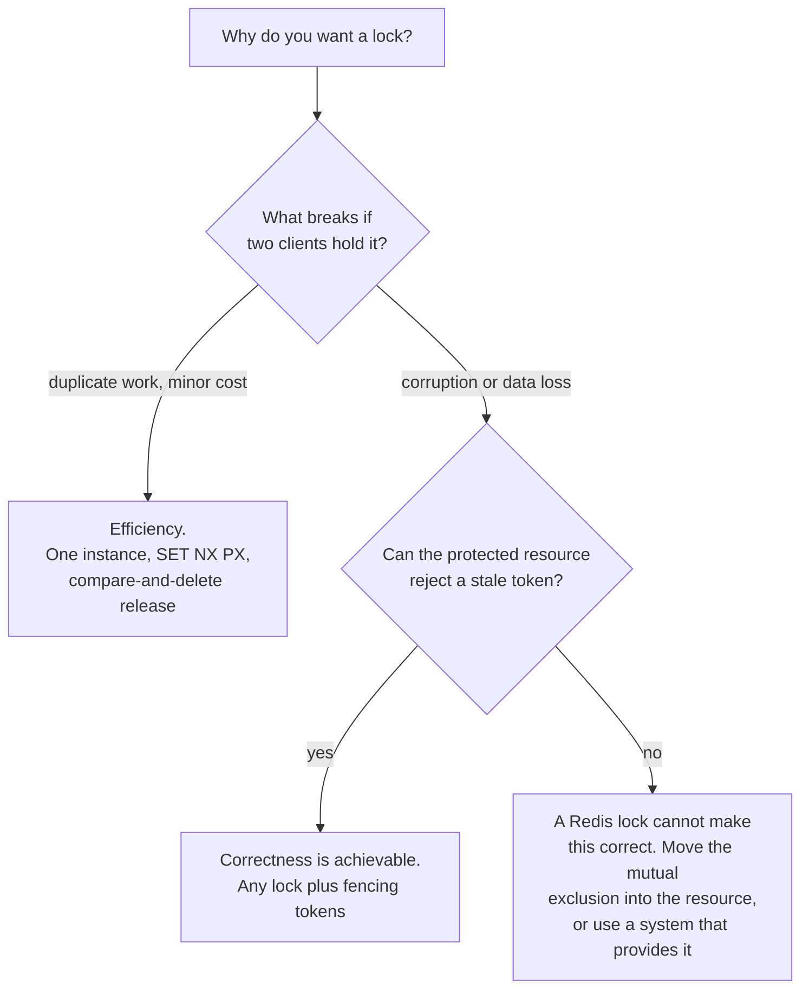

# Distributed Locks

Stage 3 compressed for lookup. [Lesson 4](../lessons/0004-naive-locking-mistakes.md) covers why one command is not a lock and [lesson 5](../lessons/0005-redlock-and-kleppmanns-critique.md) covers Redlock and the critique; this sheet is the algorithm, the arithmetic, and the decision.

## Start with the question that decides everything

Kleppmann's framing, and it comes before any algorithm. **Ask what happens if the lock fails.**

| | Efficiency | Correctness |
|---|---|---|
| A failure costs | Duplicate work. A few cents, or a duplicate email | Corrupted data, loss, permanent inconsistency |
| Then you need | A single instance with a TTL. Redlock's five servers are unnecessary cost and complexity | More than any lock service alone can give. See fencing, below |

Almost every argument about Redlock is really two people answering this question differently without saying so.

## The single-instance lock

```text
SET lock_key <unique_value> NX PX 30000
```

`NX` sets only if absent, `PX` gives an auto-release so a crashed holder does not block forever. The unique value is what makes release safe. Redis suggests 20 bytes from `/dev/urandom`.

Release must be a compare-and-delete, never a bare `DEL`:

```lua
if redis.call("get",KEYS[1]) == ARGV[1] then
    return redis.call("del",KEYS[1])
else
    return 0
end
```

Without the comparison, a client that stalled past its own expiry deletes whichever lock is now held by somebody else.

On one instance, with no crash, this is correct. It has two holes.

| Failure mode | What happens | Fixed by Redlock |
|---|---|---|
| The holder stalls past the TTL | GC pause, slow disk, descheduling, a slow call. The lock expires while the work continues, and a second client acquires it | **No** |
| The instance is a single point of failure | It crashes after granting, before replicating; a promoted replica has no record, and grants again | Yes |

The TTL is a guess about how long the critical section takes. Nothing detects it being wrong.

## Redlock

N independent masters, Redis suggests **5**, on separate machines so they fail independently.

1. Record the current time in milliseconds.
2. Try to acquire on all N in parallel, same key and same random value, with a **per-instance timeout small relative to the auto-release time**. For a 10 second lock, roughly 5 to 50 milliseconds, so an unreachable node cannot stall the attempt.
3. Compute the elapsed time.
4. The lock is held only if a **majority** granted it **and** the elapsed time is less than the auto-release time.

```text
validity = auto-release time - elapsed acquiring - a few ms for clock drift
```

That validity, not the TTL you asked for, is how long the holder actually has.

Two rules that are easy to skip and are part of the algorithm:

- **On failure, release the partial acquisitions immediately.** Do not wait for expiry, or the lock stays unavailable for no reason.
- **Retry after a random delay.** Synchronised retries produce a split brain where nobody wins. Sending the `SET` commands in parallel by multiplexing shrinks that window too.

### What it claims

| Property | Claim |
|---|---|
| Safety | Mutual exclusion. One holder at a time |
| Liveness A | Deadlock free. A crashed or partitioned holder's lock eventually frees |
| Liveness B | Fault tolerance. Locks work while a majority of nodes are up |

And the condition attached to the safety claim, in the documentation itself: mutual exclusion holds **only as long as the holder finishes within the validity time**, minus a margin for clock drift between processes.

That condition is the whole debate.

## The critique

Redlock removes the single point of failure and leaves the stall untouched. Multiplying instances does not bound how long a client's own pause can be.

**Fencing tokens** are the fix, and they do not live in the lock. Each grant carries a number that always increases. The **protected resource** records the highest token it has seen and rejects anything lower. A client that wakes from a pause holding token 33 is refused by a storage service that has already accepted 34.

Kleppmann's point is not that the algorithm has a bug. It is that without fencing at the resource, the code is "fundamentally unsafe, no matter what lock service you use". The lock protects access to the lock; only the resource can protect the resource.

His second argument is about assumptions. The realistic model for these algorithms is asynchronous with unreliable failure detectors, making no timing assumptions at all: processes may pause arbitrarily, packets may be delayed arbitrarily, clocks may be wrong. Redlock's safety margin comes from bounded clock drift and bounded delay, which is a stronger assumption than that model allows.

The debate is on record and has two sides; Redis's own documentation and Kleppmann's article are both listed below, and reading one without the other gives half of it.

## Deciding



The bottom-right box is the honest answer the arc is pointing at, and it is a design change rather than a lock configuration.

## Before shipping a Redis lock

- Which of efficiency or correctness this is, written down, with what a failure would actually cost.
- Release is a compare-and-delete against a unique value, not a `DEL`.
- The TTL is longer than the realistic worst case of the critical section, and somebody knows it is still a guess.
- If Redlock: five independent machines, a short per-instance timeout, partial acquisitions released immediately, and randomised retry.
- If correctness: a fencing token the protected resource actually checks. If it cannot check one, the lock is not making the system correct, whatever it is called.
- Nobody is treating "we run Redlock" as an answer to the pause failure mode, because it is not one.

## Sources

- [Docs: "Distributed locks with Redis", Redis](https://redis.io/docs/latest/develop/clients/patterns/distributed-locks/)
- [Article: "How to do distributed locking", Martin Kleppmann](https://martin.kleppmann.com/2016/02/08/how-to-do-distributed-locking.html)
- [Resources](../RESOURCES.md)
