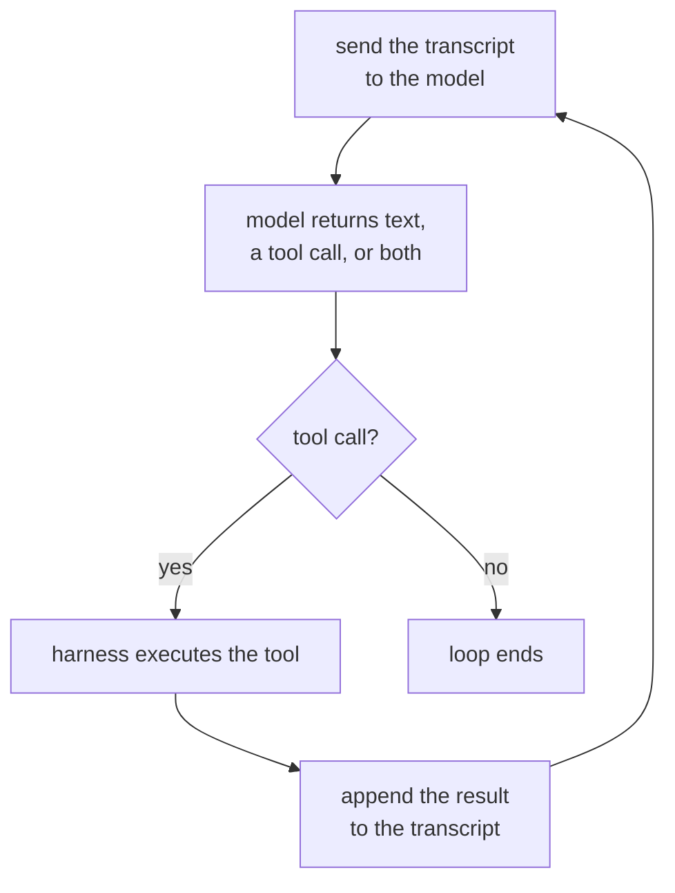

# Lesson 1. The Agent Loop

**Mission link:** "Write the agent loop for a stated task, and name what every message in its context is doing and what ends the loop" is the first bullet under Success looks like, and it starts with knowing what the loop even is.
**Primary source:** [Article: "Building Effective Agents", Anthropic Engineering](https://www.anthropic.com/engineering/building-effective-agents)
**Prerequisites:** none

## Know this

### What makes something an agent

An **agent** is a system that runs a language model in a loop with tools, letting the model decide which tool to call, when, and when to stop, rather than following a path the developer fixed in advance. The word gets attached to a lot of products that do not fit this: a chatbot with no tools is not an agent no matter how good its answers are, and a script that always calls the same three APIs in the same order is not an agent no matter how much it looks like one from the outside. What decides is control flow: does the model choose the next step, or did a developer choose it upfront?

### The loop, concretely

Strip away everything else and an agent is this cycle, repeated:

Each pass sends the full transcript so far to the model, gets back either a plain answer or a request to call a tool, executes that tool if one was requested, appends the result, and goes around again. Nothing about this cycle is specific to any one provider or framework: it is what "agent" means underneath the branding.

### Who does what: harness against model

Two different things are doing work in that diagram, and conflating them is where a lot of confused agent explanations come from. The **harness** is the code around the model: it holds the transcript, executes whatever tool call comes back, enforces limits like a turn budget, and decides when the loop truly ends. The model does not execute anything itself. It cannot reach out and call an API; it can only emit a request that the harness chooses to honor. The model chooses which tool and what arguments; the harness decides whether to run it, how, and with what it is allowed to touch. A model with excellent judgment behind a harness with no limits is still an unbounded loop, and a cautious harness cannot make a bad tool choice good.

### What ends the loop

A loop that never stops is not useful, so every agent has a stopping condition, usually more than one layered together:

1. **The model stops asking for tools.** It returns a plain-text answer with no tool call, which the harness reads as "done."
2. **A budget runs out.** Turn count, wall-clock time, or token spend hits a limit the harness enforces regardless of what the model wants next.
3. **An explicit stop signal.** Some harnesses give the model a dedicated "finish" tool, so stopping is itself a deliberate tool call rather than an absence of one.
4. **An error threshold.** Enough consecutive tool failures, and the harness gives up rather than let the model flail indefinitely.

The first is the model's decision; the rest are the harness overriding the model. A trajectory that runs forever without producing an answer is almost always a harness that only implemented the first one.

## Practice

1. ▢ A customer support system reads a message, classifies it into one of three fixed categories, and always calls the same category-specific API in response, regardless of what the model itself would have chosen to do. Is this an agent? Say why or why not.

Check

No. The sequence of steps was fixed by the developer in advance; the model's classification picks a branch, but it never chooses which tool to call or whether to call one at all. That is a workflow with a model embedded in it, not an agent. The test is control flow, not whether a model is involved somewhere.

2. ▢ Put the four steps of the agent loop in order: (a) the harness executes the requested tool, (b) the transcript is sent to the model, (c) the tool result is appended to the transcript, (d) the model returns a tool call.

Check

b, d, a, c: send the transcript, the model responds with a tool call, the harness executes it, the result is appended, and the cycle repeats from b.

3. ▢ Which of these best describes the harness's job?

    - a) Deciding which tool the agent should call next
    - b) Holding the transcript, executing tool calls, and enforcing limits the model cannot override
    - c) Generating the natural-language answer the user reads
    - d) Choosing the wording of each tool's description

Hint

The model decides what to ask for. The question is about what happens after it asks.

Check

**b)** Holding the transcript, executing tool calls, and enforcing limits the model cannot override. (a) is the model's job, not the harness's. (c) is also the model's output, not something the harness produces. (d) is a design decision made before the loop ever runs, not something the harness does at run time.

4. ▢ A trace shows twelve turns, each one a tool call and a result, ending on a thirteenth turn that is plain text with no tool call. What ended this loop, and whose decision was it?

Check

The model stopped asking for a tool: it returned an answer with nothing left to execute, so the harness read that absence as "done." That is the model's decision, not a budget or an error threshold cutting the loop off from outside.

## Real-world reps

- [ ] Pick one AI-branded product you use regularly. Decide, using the control-flow test from this lesson, whether it is actually an agent, a workflow with a model inside it, or a single prompt with no loop at all. Write your reasoning down in one sentence.
- [ ] Find a tool's documentation for an agentic coding assistant or similar product. List every stopping condition it mentions, and mark which ones are the model's decision and which are the harness overriding it.
- [ ] Tomorrow: if you have access to a trace or log from a running agent (a coding assistant's session log is enough), walk through it turn by turn and label each one: model call, tool execution, or result appended. Note where the loop ended and why.

## Going further

- [Article: "Building Effective Agents", Anthropic Engineering](https://www.anthropic.com/engineering/building-effective-agents)
- [Resources](../RESOURCES.md)

---

Not landing? Reread the primary source at the top, since this lesson compresses it and compression is where understanding leaks. Check the [glossary](../GLOSSARY.md) for any term that felt slippery.

If the lesson itself is unclear rather than the material, that is a defect: [open an issue](https://github.com/TokenCemetery/teach/issues).
