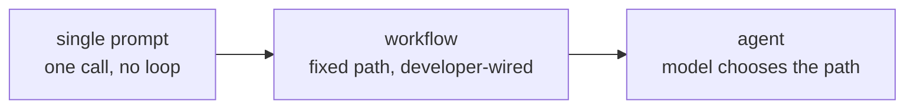

# Lesson 2. Agent, Workflow, or Just a Prompt

**Mission link:** "Choose between a single prompt, a fixed workflow, and an agent for a given task, and defend the choice against the cost of the option you rejected" is the second bullet under Success looks like.
**Primary source:** [Article: "Building Effective Agents", Anthropic Engineering](https://www.anthropic.com/engineering/building-effective-agents)
**Prerequisites:** [Lesson 1](0001-the-agent-loop.md), [Agent](../GLOSSARY.md), [Workflow](../GLOSSARY.md)

## Warm-up

1. ▢ Name the four steps of the agent loop, in order.

Check

Send the transcript to the model, the model returns a tool call, the harness executes it, the result is appended to the transcript, and the cycle repeats.

2. ▢ A system always calls the same three APIs in the same order, regardless of what a model embedded in it would have chosen. Agent or not?

Check

Not an agent. The developer fixed the control flow in advance; the model may still do useful work inside one of those steps, but it never chooses the path.

## Know this

### The spectrum, not a binary

Lesson 1 drew a hard line between agent and not-agent by control flow. In practice, "not an agent" covers a wide range, from a single unstructured prompt up through genuinely elaborate systems that are still fixed paths. Three points worth naming on this **autonomy spectrum**:

- **A single prompt.** One model call, one answer. No loop, no tools, nothing to orchestrate.
- **A workflow.** A developer-fixed sequence of model and tool calls. It may branch, loop, and call a model more than once, and it can look sophisticated: prompt chaining (one call's output feeds the next), routing (classify, then dispatch to a specialized path), parallelization, orchestrator-workers, evaluator-optimizer loops. Every one of these is still a workflow, because the developer wired the paths between calls; the model fills in content, not structure.
- **An agent.** The model itself chooses the next step, including whether there is a next step. Control flow is decided at run time by the model, inside whatever boundary the harness enforces.

Moving right buys flexibility for tasks whose shape cannot be predicted in advance. It costs predictability: a workflow does the same thing on the same input every time, and an agent does not have to.

### The case for staying left

The primary source's central argument is not "use agents." It is: find the simplest solution that works, and only increase complexity when it demonstrably improves outcomes on the tasks that matter. A workflow, even an elaborate one built from the patterns above, gives you a system whose behavior you can predict, test with fixed cases, and reason about without watching it run. An agent gives up that predictability in exchange for handling inputs the workflow's author did not anticipate. If the task's shape is known and stable, that trade buys nothing and costs reliability.

### When the trade is worth it

An agent earns its unpredictability when the number of paths a workflow would need starts exploding, or the right path genuinely cannot be known until the task is under way: open-ended research where the next query depends on what the last one returned, a coding task where the right file to look at next depends on what the last file said, a support ticket whose resolution path branches on details no fixed classifier will cleanly separate. The tell is not "this task is hard." It is "the number of branches a workflow would need to cover this is unbounded, or the branch depends on information only available mid-task."

### Defending the choice

Naming a choice is not the same as defending it. A defensible answer names what the rejected option would have cost: "a workflow here would need a branch per document type, and new types arrive weekly, so an agent's flexibility is worth its unpredictability" defends an agent. "This task always touches the same four systems in the same order, so an agent buys nothing a workflow does not already give me, at the cost of a run that might do something different next time" defends a workflow. Either answer that skips the cost of the rejected option is not yet a defense.

## Practice

1. ▢ A weekly report generator pulls the same five metrics from the same two systems, formats them the same way, and emails the same recipients, every week without exception. Where does this sit on the autonomy spectrum, and why?

Check

A workflow, likely not even one that needs a model at run time beyond formatting text. The path never varies and the inputs are known in advance, so an agent's ability to choose a different path each run buys nothing and only adds unpredictability.

2. ▢ Which of these is true of a workflow built from the orchestrator-workers pattern?

    - a) It is an agent, because it coordinates multiple model calls
    - b) The developer still fixed the sequence of calls in advance; the model fills in content inside each step, not the structure between them
    - c) It only qualifies as a workflow if it uses a single model call
    - d) It becomes an agent once it uses more than one tool

Hint

Reread what "control flow" means in this lesson: who decided the sequence, not how many calls or tools are involved.

Check

**b)** The developer still fixed the sequence of calls in advance. (a) and (d) both assume that complexity or tool count is what makes something an agent, when it is control flow. (c) is simply false: a workflow can and often does involve many model calls.

3. ▢ A support system needs to resolve tickets that, on inspection, branch into roughly forty distinct resolution paths, with new categories appearing every few months as the product changes. Defend a choice between a workflow and an agent for this, naming what the option you reject would have cost.

Check

An agent is the defensible choice: forty paths today and a growing set means a workflow's branch count is unbounded and requires ongoing maintenance every time the product changes, which is exactly the cost of staying with a fixed path here. The rejected workflow option would have cost continuous engineering effort to add branches, and would still fail silently on any ticket type nobody anticipated. The agent's cost, an unpredictable run, is smaller than that maintenance burden for this task.

4. ▢ A one-off script needs to convert a single spreadsheet into a formatted PDF, a task with exactly one path from input to output. Would building this as an agent be a defensible choice? Why or why not?

Check

No. A single path from input to output is a workflow, or arguably not even that: a single prompt or a plain script does the job. An agent adds the ability to choose a different path each run, which this task has no use for, and the loop's variability is pure cost with no corresponding benefit.

## Real-world reps

- [ ] Pick a task you or your team automates today. Place it on the autonomy spectrum from this lesson, and write one sentence defending the placement by naming what the option on either side would have cost.
- [ ] Find a product description or blog post that calls something an "agent." Check it against the control-flow test: does the system choose its own path, or did a developer wire a workflow and call it an agent for marketing reasons?
- [ ] Tomorrow: sketch, on paper or in a doc, the branch count a workflow would need for a task you consider agent-worthy. If you can enumerate the branches in under ten minutes, reconsider whether it needs to be an agent at all.

## Going further

- [Article: "Building Effective Agents", Anthropic Engineering](https://www.anthropic.com/engineering/building-effective-agents)
- [Guide: "A Practical Guide to Building Agents", OpenAI](https://cdn.openai.com/business-guides-and-resources/a-practical-guide-to-building-agents.pdf)
- [Resources](../RESOURCES.md)

---

Not landing? Reread the primary source at the top, since this lesson compresses it and compression is where understanding leaks. Check the [glossary](../GLOSSARY.md) for any term that felt slippery.

If the lesson itself is unclear rather than the material, that is a defect: [open an issue](https://github.com/TokenCemetery/teach/issues).
