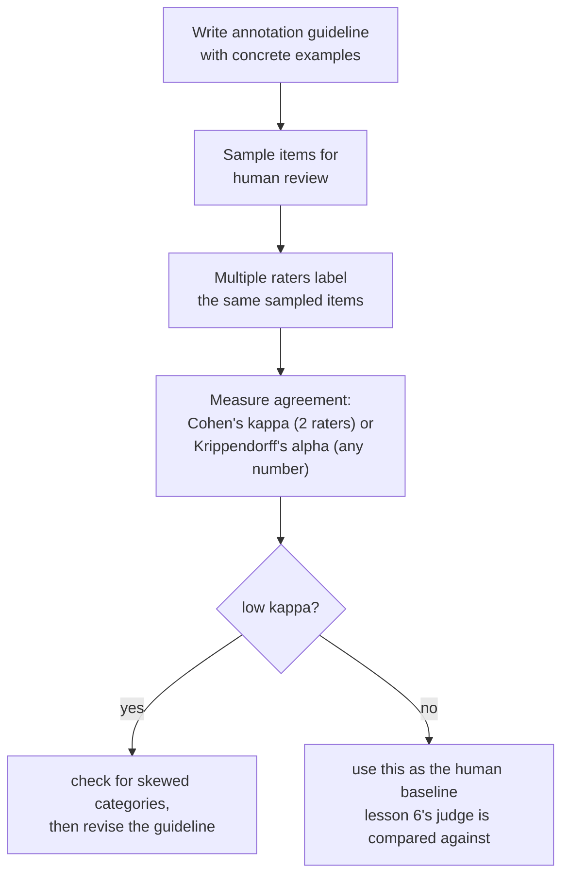

# Lesson 11. Human Evaluation as a Method

**Mission link:** Lesson 6 compared an LLM judge's verdicts against human raters, and warned that a judge's agreement rate has to be read against how often humans agree with each other, not against a perfect ceiling. That lesson never said how a human rating is actually produced, or how "how often humans agree with each other" gets measured precisely rather than eyeballed. This lesson is the method underneath both.
**Primary source:** [Article: "Cohen's kappa", Wikipedia](https://en.wikipedia.org/wiki/Cohen%27s_kappa)
**Prerequisites:** [Lesson 6](0006-judge-bias-and-human-agreement.md), [Data contamination](../GLOSSARY.md)

## Warm-up

1. ▢ A team measures their judge's agreement with human raters at 82%. Is that good enough to trust the judge, and what additional number do they need before answering that?

Check

82% alone doesn't say enough; they need the human-versus-human agreement rate on the same comparisons, since human raters don't agree with each other 100% of the time either. If humans agree with each other around 80 to 85% of the time, an 82% judge-human agreement is doing about as well as another human rater would.

2. ▢ What is verbosity bias, and name one way to mitigate it?

Check

A judge's tendency to prefer a longer response even when the extra length adds nothing over an equally or more correct, shorter one. Mitigations include instructing the judge explicitly not to reward length, writing grading criteria that name correctness and completeness rather than length, or checking whether the judge's preferences correlate suspiciously well with response length.

## Know this

### Raw agreement is inflated by chance, and inflated more the fewer categories there are

The simplest way to measure how often two human raters agree is the **joint probability of agreement**, the plain percentage of items they rated the same way. This number is misleadingly easy to read as "how reliable are these raters," but it doesn't separate genuine, shared judgment from two raters simply landing on the same answer by chance, and that chance floor rises fast as the number of rating categories shrinks: with only two or three options, raters confined to that small a set will agree with each other a lot even with no real agreement in judgment behind it at all.

### Cohen's kappa is what raw agreement was missing: a chance correction

**Cohen's kappa** corrects for exactly this: `κ = (p_o − p_e) / (1 − p_e)`, where `p_o` is the observed, raw agreement and `p_e` is the agreement two raters would be expected to reach by chance alone, estimated from how often each rater actually used each category. A kappa of 1 means perfect agreement; a kappa of 0 means the raters did no better than chance would predict, even if their raw agreement percentage looks high; a kappa can even go negative, when raters agree with each other less than chance alone would produce. This is the precise version of lesson 6's "compare against human-versus-human agreement, not a perfect ceiling" rule: kappa is what makes that comparison a real, chance-corrected number instead of an eyeballed guess.

### Kappa itself can mislead when one category dominates

Kappa isn't a free, universal fix. When one rating category is much more common than the others (a rare defect, an overwhelmingly typical "acceptable" response), kappa is known to systematically underestimate real agreement on the rare category, making it look worse than the raters' actual, shared judgment. This is exactly the kind of thing worth checking before trusting a single kappa number at face value: a low kappa on heavily skewed data doesn't automatically mean the raters disagree in practice, it can mean the correction itself is being pushed around by how unevenly the categories are distributed. For agreement across more than two raters, or across ordinal or interval ratings rather than fixed categories, Krippendorff's alpha generalizes the same chance-corrected idea to those cases.

### An annotation guideline is what keeps "the same judgment" a meaningful thing to ask for

Two careful raters can still disagree constantly if they're not rating against the same standard, which is exactly what an **annotation guideline** exists to fix: a written definition of each rating category, with concrete examples of borderline cases and how they were resolved, given to every rater before they start. A guideline that only names categories in the abstract ("rate helpfulness 1 to 5") leaves every rater to invent their own private standard, and low agreement that results from this isn't a fact about the raters, it's a fact about the missing guideline. Measuring agreement is diagnostic here too: persistently low agreement on a specific category is a sign to revise the guideline's definition of that category, not just to recruit better raters.

### A human label has a real cost, which is why it's rationed by sampling

Every human rating costs real money and real time: a rater has to be found, trained on the guideline, and paid per item or per hour, and measuring agreement at all requires paying for more than one rater per item, not one. This cost is exactly why human evaluation of a full eval set is rarely the plan; instead, a team **samples** a representative subset for human review, sized to catch a meaningful disagreement rate without paying to rate every single item, and uses that sample's measured agreement (both between humans, and between a judge and humans, as lesson 6 covered) as the standard the full-scale automated evaluation is checked against.

## Practice

1. ▢ Two raters agree on 90% of items, but there are only two possible rating categories and one of them is used 95% of the time. Should the team trust the 90% figure as strong evidence of genuine agreement?

Hint

Consider how likely two raters would be to land on the same answer purely by chance, given how few categories exist and how skewed their use is.

Check

Not without checking further. With only two categories and one used the overwhelming majority of the time, a high raw agreement percentage can be produced largely by chance rather than genuine shared judgment; Cohen's kappa, which corrects for exactly this, needs to be computed before treating 90% as meaningful.

2. ▢ A team computes Cohen's kappa on a rare-defect annotation task and gets a low value, even though the raters' guideline is detailed and they agree in discussion almost every time they compare notes. What should the team check before concluding the raters genuinely disagree?

Check

Whether the rare category's low prevalence is distorting the kappa calculation itself; kappa is known to underestimate agreement specifically when one category is much rarer than the others, so a low kappa here doesn't necessarily mean the raters' actual judgment disagrees as much as the number suggests.

3. ▢ Two raters are given only the category names ("good", "bad") with no further guidance, and their agreement rate is low. Is this evidence the raters are unreliable?

Check

Not necessarily. Without a written guideline defining each category with concrete, resolved examples, raters are left to invent their own private standards; low agreement in this situation is often a sign the guideline itself is missing or inadequate, not a fact about the raters' reliability.

4. ▢ Why does measuring inter-rater agreement require paying for more than one human rating per item, and how does this connect to why teams sample rather than rate an entire eval set by hand?

Check

Agreement is a comparison between raters, so it can only be measured where at least two raters labeled the same item; a single rating per item gives no basis for computing it. Since every additional rating costs real time and money, teams sample a representative subset for this kind of multi-rater review rather than paying to have every item in a full eval set rated by multiple humans.

5. ▢ Which claim correctly describes the relationship between raw agreement, Cohen's kappa, and category prevalence?

    - a) Raw percent agreement and Cohen's kappa always produce the same conclusion about rater reliability
    - b) Raw agreement can look high largely due to chance, especially with few categories; Cohen's kappa corrects for that chance level, but is itself known to underestimate agreement when one category is much rarer than the others
    - c) Cohen's kappa is only usable with exactly three or more raters, unlike raw percent agreement
    - d) A negative Cohen's kappa is mathematically impossible

Check

**b)** That's the precise, two-sided limitation this lesson establishes. (a) is false: raw agreement doesn't correct for chance, which is exactly why kappa can tell a different story. (c) is false: Cohen's kappa is specifically defined for two raters; Krippendorff's alpha is the generalization for more raters. (d) is false: kappa can go negative when raters agree less than chance alone would produce.

## Real-world reps

- [ ] For a human-rated task you have access to (or could set up cheaply), compute raw percent agreement and Cohen's kappa between two raters on the same sample, and check how far apart the two numbers are.
- [ ] Find or write a one-page annotation guideline for a rating task you care about, including at least two concrete borderline examples and how they should be resolved.
- [ ] Tomorrow: read the primary source's "Interpreting magnitude" section in full, and note what it says about why a fixed kappa threshold (like "above 0.6 is good") is harder to justify than it first appears.

## Going further

- [Article: "Cohen's kappa", Wikipedia](https://en.wikipedia.org/wiki/Cohen%27s_kappa)
- [Article: "Inter-rater reliability", Wikipedia](https://en.wikipedia.org/wiki/Inter-rater_reliability)
- [Resources](../RESOURCES.md)

---

Not landing? Reread the primary source at the top, since this lesson compresses it and compression is where understanding leaks. Check the [glossary](../GLOSSARY.md) for any term that felt slippery.

If the lesson itself is unclear rather than the material, that is a defect: [open an issue](https://github.com/TokenCemetery/teach/issues).
