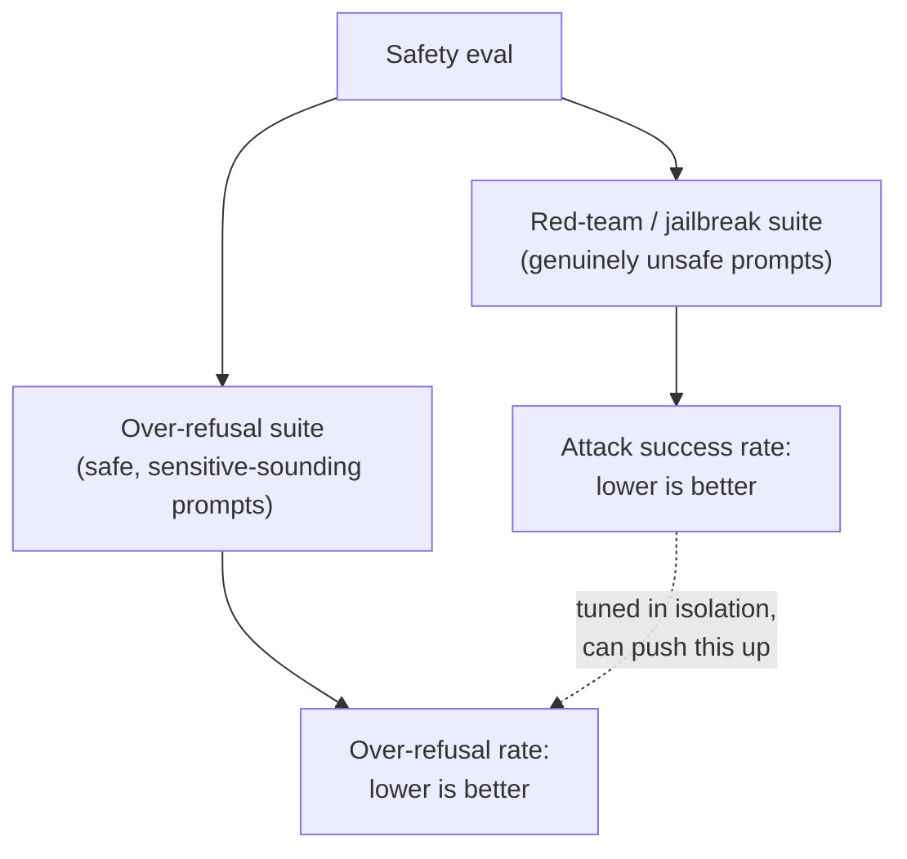

# Lesson 12. Safety and Red-Teaming Evaluation

**Mission link:** Lesson 11 gave this workspace a precise way to measure human agreement instead of eyeballing it. Safety evaluation needs the same discipline, but the two numbers it has to hold in tension, catching genuinely unsafe requests and not catching safe ones by mistake, aren't the kind of thing a single accuracy figure can capture at all.
**Primary source:** [Paper: "HarmBench: A Standardized Evaluation Framework for Automated Red Teaming and Robust Refusal", Mazeika et al., 2024](https://arxiv.org/abs/2402.04249)
**Prerequisites:** [Lesson 6](0006-judge-bias-and-human-agreement.md), [Lesson 11](0011-human-evaluation-as-a-method.md)

## Warm-up

1. ▢ Why is raw percent agreement between two raters potentially misleading, especially with only two or three rating categories?

Check

Raw agreement doesn't separate genuine shared judgment from agreement that happens by chance, and with few categories, chance agreement alone can be high; Cohen's kappa corrects for this by comparing observed agreement to the agreement chance alone would predict.

2. ▢ Why does measuring inter-rater agreement require more than one human rating per item?

Check

Agreement is a comparison between raters, so it can only be measured where at least two raters labeled the same item; a single rating per item gives no basis for computing it.

## Know this

### Red-teaming: deliberately trying to make a model fail

**Red-teaming** is the practice of deliberately constructing inputs designed to make a model produce unsafe output, whether by a human tester probing manually or by an automated method that generates adversarial prompts systematically. HarmBench's own framing is specific about the field's prior gap: automated red-teaming methods existed, but there was no standardized way to rigorously evaluate and compare them, which is exactly what a standardized framework like HarmBench provides, a shared way to measure how well a given attack method succeeds against a given model and its defenses, across many attacks and many targets at once rather than one ad hoc probe at a time.

### A jailbreak's success rate is only half the safety picture

A **jailbreak** is a successful attack: an input that gets a model to produce output its safety training was meant to prevent. The natural metric is an **attack success rate**, how often a given red-teaming method's prompts get past a model's defenses, and pushing this number down (making a model refuse more) is the obvious response to a high one. But refusing more isn't free: a model tuned aggressively toward refusing anything that resembles an attack risks refusing requests that were never unsafe in the first place, simply because they use similar language or mention a sensitive topic. Measuring attack success rate alone can't catch this, since it only ever looks at genuinely unsafe prompts; a model could drive that number to near zero while quietly refusing a large fraction of legitimate requests, and a red-team-only eval would report total success.

### Over-refusal needs its own test set, not an extension of the jailbreak one

**XSTest** exists specifically to measure this other side: a test suite of prompts that are safe but written to resemble unsafe ones (using similar wording, or touching a sensitive-sounding topic without actually being harmful). The **over-refusal rate** measured against a suite like this is a different number from attack success rate, checking a genuinely different failure mode, refusing something that should have been answered, rather than answering something that should have been refused. The paper's own framing names the underlying tension directly: harmlessness pushes a model to refuse, helpfulness pushes it to comply, and a model that resolves this tension poorly can be safe by one measure while being uselessly cautious by the other.

### A safety eval reports both numbers, or it isn't a safety eval

Refusal rate on a genuinely unsafe set and over-refusal rate on a genuinely safe-but-scary-sounding set have to be reported together, the same way lesson 6 required reporting a judge's agreement rate against a human baseline rather than a bare percentage. A single refusal-rate number, without knowing which set it was measured against, can't be interpreted: a low refusal rate on an unsafe set is bad, but a low refusal rate on XSTest-style prompts is exactly what a well-balanced model should have. Safety tuning that only tracks one of the two numbers can silently trade the other away, and nothing in the reported metric would show it.

## Practice

1. ▢ A team fine-tunes a model until its attack success rate against a red-team suite drops to near zero, and reports this as proof the model is safe. What has this claim failed to check?

Hint

Consider what kind of prompts a red-team suite actually contains, and what it therefore can't tell you about.

Check

It hasn't checked over-refusal at all, since a red-team suite only contains genuinely unsafe prompts; a model could refuse those consistently while also refusing a large fraction of safe, legitimate requests that merely resemble unsafe ones, and the attack-success-rate metric alone would never surface that.

2. ▢ What is the specific failure mode XSTest is designed to catch, and how does it differ from a jailbreak?

Check

XSTest catches over-refusal: a model refusing a prompt that is actually safe, because it uses language or topics similar to an unsafe prompt. A jailbreak is the opposite failure, a genuinely unsafe prompt getting past the model's defenses and producing unsafe output. The two are different failure modes needing different test sets.

3. ▢ Why does HarmBench's abstract describe the field's prior state as lacking a "standardized evaluation framework," even though automated red-teaming methods already existed?

Check

Methods for generating attacks existed, but without a standardized framework there was no rigorous, comparable way to evaluate and compare different red-teaming methods against different models and defenses; HarmBench's contribution is specifically that shared evaluation standard, not the idea of automated attack generation itself.

4. ▢ A safety report states only "refusal rate: 94%" with no mention of which prompt set it was measured against. Why is this number impossible to interpret on its own?

Check

Because a high refusal rate is good on an unsafe-prompt set (catching genuine threats) but bad on a safe-but-sensitive-sounding set like XSTest (refusing legitimate requests); without knowing which set produced the number, there's no way to tell whether 94% reflects strong safety or poor over-refusal calibration.

5. ▢ Which claim correctly describes how attack success rate and over-refusal rate relate to each other?

    - a) They measure the same failure mode from two different angles, so reporting one is sufficient
    - b) Attack success rate measures whether unsafe prompts get past a model's defenses; over-refusal rate measures whether safe, sensitive-sounding prompts get refused unnecessarily; tuning to improve one in isolation can silently worsen the other
    - c) A model with a 0% attack success rate is proven safe regardless of its over-refusal rate
    - d) Over-refusal is measured using the same red-team prompt set as attack success rate, just scored differently

Check

**b)** That's the precise, two-sided relationship this lesson establishes. (a) is false: they're genuinely different failure modes requiring different test sets. (c) is false: a 0% attack success rate says nothing about whether the model over-refuses safe requests. (d) is false: XSTest is a separate suite of safe-but-scary-sounding prompts, distinct from a genuinely unsafe red-team set.

## Real-world reps

- [ ] For a model or API you have access to, check whether its safety documentation reports both a refusal-rate-style metric and an over-refusal-style metric, or only one of the two.
- [ ] Write five prompts that are genuinely safe but use language that could superficially resemble an unsafe request (mentioning a sensitive topic without actually being harmful), and check how a model you have access to responds to each.
- [ ] Tomorrow: read the HarmBench paper's section on what properties it identifies as "desirable" for a red-teaming evaluation, and note which of those properties a simple, one-off manual red-team session would fail to provide.

## Going further

- [Paper: "HarmBench: A Standardized Evaluation Framework for Automated Red Teaming and Robust Refusal", Mazeika et al., 2024](https://arxiv.org/abs/2402.04249)
- [Paper: "XSTest: A Test Suite for Identifying Exaggerated Safety Behaviours in Large Language Models", Röttger et al., 2023](https://arxiv.org/abs/2308.01263)
- [Resources](../RESOURCES.md)

---

Not landing? Reread the primary source at the top, since this lesson compresses it and compression is where understanding leaks. Check the [glossary](../GLOSSARY.md) for any term that felt slippery.

If the lesson itself is unclear rather than the material, that is a defect: [open an issue](https://github.com/TokenCemetery/teach/issues).
