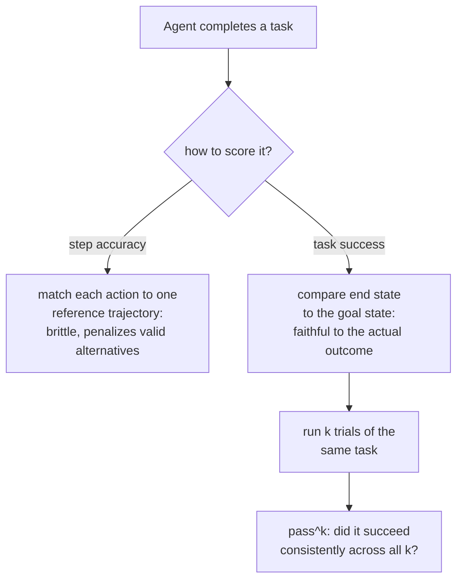

# Lesson 13. Evaluating Agents and Tool Use

**Mission link:** Lesson 4 established `pass@k` for code: execute the generated program and check its behavior, not its text, because a program can be phrased many different correct ways. An agent task raises the same problem one level up: it isn't one output to check, it's a sequence of tool calls and decisions across multiple turns, and the same "many valid paths, one correct outcome" problem applies to the whole trajectory, not just the final response.
**Primary source:** [Paper: "τ-bench: A Benchmark for Tool-Agent-User Interaction in Real-World Domains", Yao et al., 2024](https://arxiv.org/abs/2406.12045)
**Prerequisites:** [Lesson 4](0004-code-execution-metrics.md), [Held-out data](../GLOSSARY.md)

## Warm-up

1. ▢ Why does functional correctness (executing generated code against test cases) avoid the problem exact-match text comparison has for evaluating code?

Check

Two programs can be textually completely different, using different variable names, control flow, or algorithms, and still be equally correct; executing the code and checking its behavior against test cases judges what the program actually does, not how closely its text matches one reference solution.

2. ▢ What does `pass@k` measure, and why does directly re-sampling k completions and checking for a success make it high-variance?

Check

Whether at least one of k sampled completions passes. Directly re-sampling and checking is high-variance because whether that specific sample of k happens to include a success is itself random; the unbiased estimator formula avoids this by aggregating across a larger pool of samples mathematically rather than relying on one particular draw of k.

## Know this

### An agent task is judged on a trajectory, not a response

A single-turn eval scores one output. An **agentic** task instead produces a **trajectory**: a sequence of tool calls, intermediate decisions, and turns (often across a multi-turn conversation with a simulated user) that together are supposed to accomplish some real end goal, book a return, update a database record, resolve a support request under a policy. A metric built for scoring one response, an exact match, a BLEU score, even a single-turn LLM-as-judge call, has nothing to attach to here: there's no single output to compare, only a sequence of actions whose overall effect is what actually mattered.

### Task success asks about the outcome, not the path taken to it

The most faithful way to check a trajectory isn't to compare it, step by step, against one reference sequence of actions, it's to check whether the task actually ended in the right state. τ-bench's own evaluation approach makes exactly this choice: it compares the database's state at the end of a conversation against an annotated goal state, rather than scoring whether each individual tool call matched a predetermined reference trajectory. This is deliberate, and it's the trajectory-level version of lesson 4's functional-correctness principle: there can be more than one valid sequence of tool calls that reaches the same correct outcome, just as there can be more than one correct program, and scoring against one fixed reference trajectory would wrongly penalize a different, equally valid path to the same right answer.

### Step accuracy is a narrower, brittler question than task success

**Step accuracy**, checking whether each action in a trajectory matches a specific reference action, is a stricter and more fragile measurement than task success for exactly this reason: it can only ever credit the one path it was given as reference, which repeats exact match's original mistake (lesson 3) at the scale of a whole trajectory instead of a single output. Step accuracy still has its uses, isolating exactly which step in a long trajectory went wrong is valuable for debugging, but it isn't a substitute for asking the more important question a task-success metric answers: did the agent actually get the job done.

### One success doesn't mean the agent can be trusted to repeat it

Even a well-designed task-success metric, measured once, hides something a single-turn eval never had to worry about: whether the same agent, given the exact same task again, succeeds again. τ-bench's own findings make this concrete: on their benchmark, even a strong function-calling model succeeded on under half of tasks in a single trial, and its reliability across repeated trials of the *same* task was substantially worse still, well under a quarter in one domain. This is precisely why τ-bench introduces `pass^k` (read "pass hat k"), a metric for how reliably an agent succeeds across k repeated trials of one task, deliberately distinct from lesson 4's `pass@k`, which asks whether *at least one* of k independent samples succeeds. `pass^k` asks the harder, opposite-leaning question: does the agent keep succeeding, trial after trial, at the same task, rather than whether it can succeed once given enough tries.

### Why a per-response eval from earlier stages doesn't transfer here

A model can score well on a single-turn, per-response benchmark and still perform very differently once it's placed in a multi-turn, interactive agent setting, because sustained, multi-step decision-making under tool constraints and policy rules exercises a capability a single-response metric never touches at all. This is exactly the gap benchmarks purpose-built for agents (τ-bench, and multi-environment suites like AgentBench) exist to close: they don't just rescale an existing per-response metric, they measure something a per-response eval structurally cannot.

## Practice

1. ▢ An agent eval scores a trajectory by checking whether each tool call exactly matches a single reference sequence of calls, and penalizes an agent that reached the correct final outcome via a different, equally valid sequence of calls. What mistake does this repeat, from an earlier lesson?

Hint

Consider what exact-match text scoring penalizes that functional correctness does not.

Check

It repeats exact match's mistake (lesson 3/4) at the trajectory level: penalizing a genuinely correct result simply because it didn't match one specific reference form, here a specific sequence of actions rather than a specific string of text.

2. ▢ Why does τ-bench compare the database's end state to an annotated goal state, rather than scoring each step of the conversation against a reference trajectory?

Check

Because there can be more than one valid sequence of tool calls that reaches the same correct outcome; comparing only the end state credits any path that gets there correctly, while scoring against one fixed reference trajectory would wrongly penalize a different, equally valid path.

3. ▢ A model succeeds on a task 45% of the time in a single trial. Does this tell you how often it would succeed on that same task if asked to attempt it 8 times in a row?

Check

Not directly. A single-trial success rate doesn't measure consistency across repeated attempts at the same task; τ-bench's `pass^k` metric measures exactly that separate question, and their findings show reliability across repeated trials can be substantially worse than the single-trial success rate alone would suggest.

4. ▢ How does `pass^k` differ from lesson 4's `pass@k`, despite the similar name and notation?

Check

`pass@k` asks whether at least one of k independently sampled completions succeeds, a best-of-k question. `pass^k` asks whether an agent succeeds consistently across k repeated trials of the same task, a reliability question, closer to the opposite of "did it succeed at least once" than a restatement of it.

5. ▢ Which claim correctly describes how agent evaluation differs from a per-response eval?

    - a) An agent's trajectory should always be scored by exact match against one reference sequence of tool calls, since this is the most faithful measurement
    - b) A per-response metric has no single output to attach to in a multi-turn agent trajectory; task success (comparing the end state to a goal state) is more faithful than step accuracy, which repeats exact match's brittleness, and single-trial success doesn't measure the separate question of repeated-trial reliability
    - c) A model's strong performance on single-turn benchmarks reliably predicts its performance as a multi-turn agent
    - d) `pass^k` and `pass@k` measure the same thing and can be used interchangeably

Check

**b)** That's the complete picture this lesson establishes. (a) is false: task-success-style end-state comparison is specifically preferred over rigid step matching, for the same reason functional correctness beats exact match. (c) is false: agentic, multi-turn decision-making exercises capabilities a single-response benchmark never touches, which is exactly why dedicated agent benchmarks exist. (d) is false: `pass@k` is a best-of-k capability question; `pass^k` is a consistency-across-repeated-trials question.

## Real-world reps

- [ ] For an agent or tool-using system you have access to, check whether its evaluation (if any) scores task success (end state), step accuracy (matching a reference trajectory), or neither.
- [ ] If you can run the same task against an agent multiple times, try it 3 to 5 times and note whether it succeeds consistently or only some of the attempts.
- [ ] Tomorrow: read the primary source's description of its policy-guideline setup, and note how it evaluates whether an agent followed a domain-specific rule, not just whether it reached the correct database end state.

## Going further

- [Paper: "τ-bench: A Benchmark for Tool-Agent-User Interaction in Real-World Domains", Yao et al., 2024](https://arxiv.org/abs/2406.12045)
- [Paper: "AgentBench: Evaluating LLMs as Agents", Liu et al., 2023](https://arxiv.org/abs/2308.03688)
- [Resources](../RESOURCES.md)

---

Not landing? Reread the primary source at the top, since this lesson compresses it and compression is where understanding leaks. Check the [glossary](../GLOSSARY.md) for any term that felt slippery.

If the lesson itself is unclear rather than the material, that is a defect: [open an issue](https://github.com/TokenCemetery/teach/issues).
