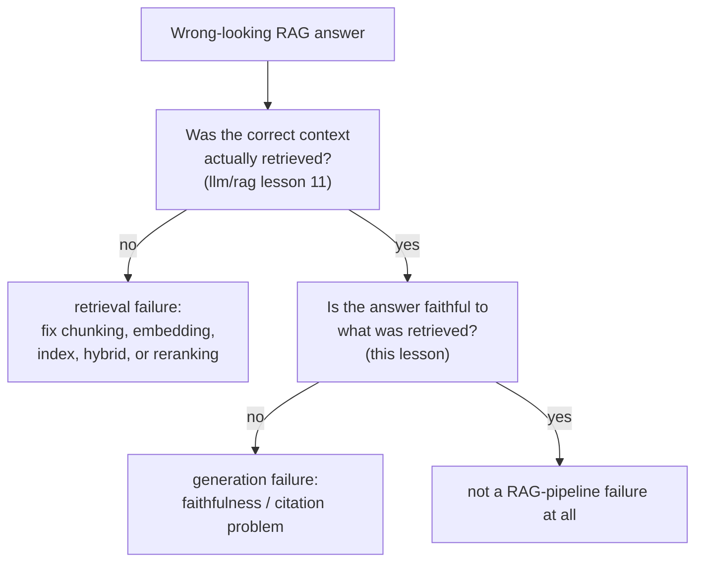

# Lesson 14. RAG-Specific Evaluation

**Mission link:** `llm/rag` lesson 11 taught diagnosing a retrieval pipeline stage by stage. Its lesson 13 went one step further and established that even perfect retrieval doesn't guarantee a faithful answer, then explicitly deferred building that faithfulness check to this workspace. This lesson delivers it, and shows that "faithful to the retrieved context" and "correctly attributed to a specific citation" are two different questions, not one.
**Primary source:** [Paper: "Ragas: Automated Evaluation of Retrieval Augmented Generation", Es et al., 2023](https://arxiv.org/abs/2309.15217)
**Prerequisites:** [`llm/rag` Lesson 11](../../rag/lessons/0011-diagnosing-the-pipeline.md), [`llm/rag` Lesson 13](../../rag/lessons/0013-what-generation-still-gets-wrong.md)

## Warm-up

1. ▢ An agent's trajectory is scored by comparing its end state to a goal state rather than matching each action to one reference sequence. Why is this the more faithful choice?

Check

There can be more than one valid sequence of actions that reaches the same correct outcome; comparing only the end state credits any path that gets there correctly, while scoring against one fixed reference trajectory would wrongly penalize a different, equally valid path.

2. ▢ Why can't `pass@k`-style repeated sampling tell you whether an agent is *reliable*, as opposed to merely *capable*?

Check

`pass@k` only asks whether at least one of k samples succeeds, a best-of-k capability question; it says nothing about whether the same agent, asked to repeat the identical task, would keep succeeding trial after trial, which is the separate reliability question `pass^k`-style metrics target instead.

## Know this

### Retrieval quality and generation quality are separate dimensions, and RAGAS is built to keep them separate

RAGAS's own framing states the challenge directly: evaluating a RAG system means considering the retrieval system's ability to surface relevant, focused context, separately from the generation model's ability to use that context faithfully, separately again from the quality of the generated text itself. Collapsing these into one end-to-end score (did the final answer look good) hides which half of the system, if either, actually needs fixing, exactly the same diagnostic problem `llm/rag` lesson 11 solved on the retrieval side alone. RAGAS is explicitly **reference-free**: none of its metrics require a human-written gold answer to compare against, which is what makes them cheap enough to run on every change instead of only when a human-labeled set happens to exist.

### Faithfulness (groundedness) asks whether a claim follows from what was retrieved

**Faithfulness**, also called **groundedness**, checks whether each claim in a generated answer is actually supported by the retrieved context it was supposed to be based on, as opposed to being fabricated, contradicted, or embellished with a plausible-sounding detail the context never contained. This is a claim-level check, not a whole-answer check: an answer can get most of its claims right while still slipping in one unsupported detail, and a faithfulness metric that only scores the answer as a whole misses exactly the kind of partial fabrication that's easiest to overlook on a casual read.

### Citation correctness is a stricter, separate question from faithfulness

**Citation correctness** asks something faithfulness doesn't: not just "is this claim supported by something in the retrieved context," but "does the specific passage cited for this claim actually support it." ALCE's own benchmark results make the gap concrete: even the best systems it tested lacked complete citation support for about half their claims on one of its test sets, meaning a claim can be true and grounded in the retrieved corpus somewhere while still being attributed to the wrong passage, or to no passage at all. A system can score reasonably on faithfulness (the claims are true, given the whole retrieved set) while still scoring poorly on citation correctness (the individual citations attached to those claims don't hold up), because the two are checking different things: whether an answer is grounded at all, versus whether its specific, checkable attributions are correct.

### Separating a retrieval failure from a generation failure means computing both numbers, not guessing from the output

`llm/rag` lesson 11 diagnosed a wrong-retrieval symptom by checking each pipeline stage in order. The generation side needs its own check computed independently, not inferred from how a bad answer reads: measure whether the correct context was actually retrieved (lesson 11's retrieval-quality metrics) and measure faithfulness to whatever context actually was retrieved (this lesson's metric), as two separate numbers on the same failing case. An answer built on badly retrieved context and an unfaithful answer built on perfectly retrieved context can look identical from the outside, wrong, but they call for completely different fixes, and only computing both numbers tells you which one you're looking at.

## Practice

1. ▢ A RAG system's answer contains one claim that isn't supported anywhere in the retrieved context, but every other claim in the answer is well-supported. Does scoring the answer as a whole ("mostly good") catch this?

Hint

Consider what a whole-answer score aggregates away.

Check

Not reliably. Faithfulness is a claim-level property; a single unsupported or fabricated claim can hide inside an otherwise well-supported answer, and a whole-answer score that averages across claims can miss exactly this kind of partial fabrication.

2. ▢ A system's answer is fully supported by the retrieved corpus overall, but the specific passage it cites for one claim doesn't actually contain that claim, a different retrieved passage does. Is this a faithfulness failure, a citation-correctness failure, or both?

Check

A citation-correctness failure, not necessarily a faithfulness one: the claim itself is grounded in the retrieved context somewhere, so it isn't fabricated, but the specific citation attached to it is wrong. This is exactly the gap between the two checks: faithfulness asks whether a claim is supported by the retrieved set at all, citation correctness asks whether the specific cited passage is the one that actually supports it.

3. ▢ Why is RAGAS's reference-free design specifically useful for running an eval on every change, rather than only occasionally?

Check

Because it doesn't require a human-written gold answer to compare against, it avoids the cost lesson 11 described for human evaluation (finding, training, and paying raters); a reference-free metric can be computed automatically and cheaply on every change, rather than only when a human-labeled comparison set happens to exist.

4. ▢ Two RAG answers are both wrong. One was built from badly retrieved context; the other was built from perfectly retrieved context but generated an unfaithful claim. Can you tell these two cases apart just by reading the final answers?

Check

Not reliably. Both can look identically wrong from the outside; separating them requires measuring retrieval quality (was the correct context actually retrieved, per `llm/rag` lesson 11) and generation faithfulness (was the answer faithful to whatever was retrieved, this lesson) as two independent numbers, rather than inferring the cause from the answer's surface appearance.

5. ▢ Which claim correctly describes the relationship between retrieval quality, faithfulness, and citation correctness?

    - a) A single end-to-end answer-quality score is sufficient to diagnose whether a RAG failure is a retrieval problem or a generation problem
    - b) Retrieval quality, faithfulness, and citation correctness are three separable checks; a system can score well on one while failing another, so diagnosing a RAG failure requires measuring them independently rather than inferring from the final answer
    - c) A claim that is faithful to the retrieved context is automatically correctly cited
    - d) RAGAS requires a human-written gold answer for every query it evaluates

Check

**b)** That's the precise, separable structure this lesson establishes. (a) is false: an end-to-end score can't distinguish a retrieval failure from a generation failure, which is exactly why `llm/rag` lesson 11 and this lesson each check their own side independently. (c) is false: ALCE's own findings show claims can be grounded overall while their specific citations are still wrong, roughly half the time in one of its test sets. (d) is false: RAGAS is explicitly reference-free, not requiring human-written gold answers.

## Real-world reps

- [ ] For a RAG system you have access to, pick one answer and check it against both dimensions separately: was the retrieved context actually correct (per `llm/rag` lesson 11's diagnostic), and is every claim in the answer faithful to that context.
- [ ] If the system attaches citations to its claims, spot-check a handful: does the cited passage actually contain the support for the claim it's attached to, or just something topically related?
- [ ] Tomorrow: read the primary source in full, and note how its faithfulness metric is actually computed (what it does with an LLM to check a claim against retrieved context) without requiring a human-written reference answer.

## Going further

- [Paper: "Ragas: Automated Evaluation of Retrieval Augmented Generation", Es et al., 2023](https://arxiv.org/abs/2309.15217)
- [Paper: "Enabling Large Language Models to Generate Text with Citations" (ALCE), Gao et al., 2023](https://arxiv.org/abs/2305.14627)
- [Resources](../RESOURCES.md)

---

Not landing? Reread the primary source at the top, since this lesson compresses it and compression is where understanding leaks. Check the [glossary](../GLOSSARY.md) for any term that felt slippery.

If the lesson itself is unclear rather than the material, that is a defect: [open an issue](https://github.com/TokenCemetery/teach/issues).
