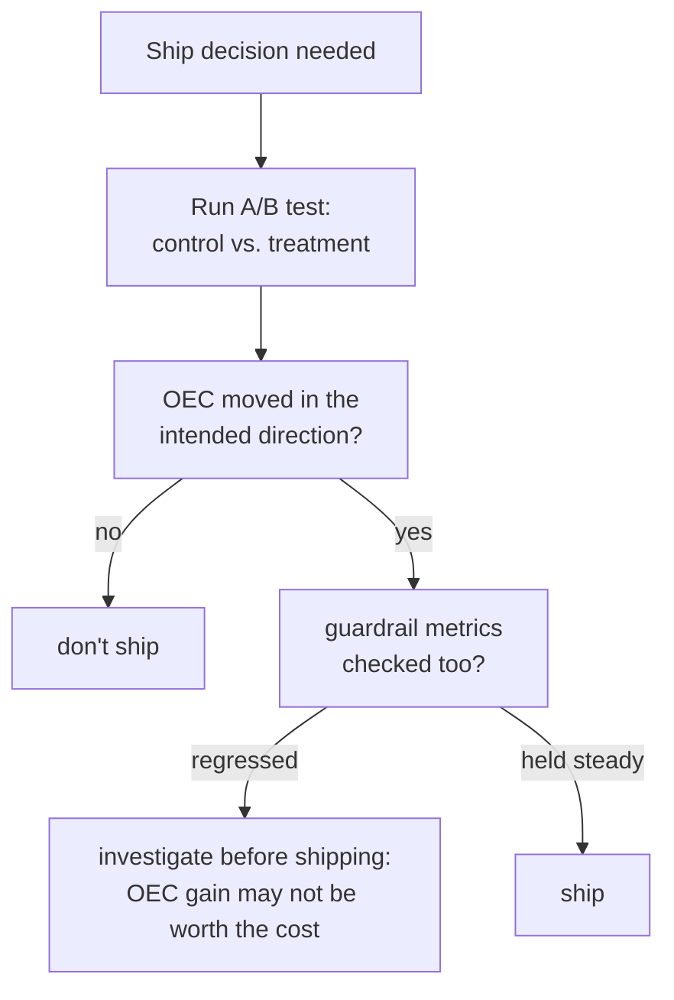

# Lesson 15. A/B Tests and Guardrail Metrics

**Mission link:** Lesson 9 taught telling a real offline score difference from noise. Everything through lesson 14 has still been offline: a fixed eval set, run once, scored once. Shipping a change to real users needs a live counterpart to that discipline, and it turns out to need the same lesson this workspace has repeated at every stage since safety: the metric you're optimizing and the metric that tells you if you broke something else have to be tracked as two separate numbers, not one.
**Primary source:** [Paper: "Seven Rules of Thumb for Web Site Experimenters", Kohavi et al., 2014](https://exp-platform.com/Documents/2014%20experimentersRulesOfThumb.pdf)
**Prerequisites:** [Lesson 9](0009-statistical-significance-vs-noise.md), [Lesson 12](0012-safety-and-red-teaming-evaluation.md)

## Warm-up

1. ▢ A safety report states only "refusal rate: 94%" with no mention of which prompt set it was measured against. Why is this number impossible to interpret on its own?

Check

A high refusal rate is good on a genuinely unsafe prompt set (catching real threats) but bad on a safe-but-sensitive-sounding set (over-refusal); without knowing which set produced the number, there's no way to tell which of these two very different situations it reflects.

2. ▢ Why does a score difference between two offline eval runs need to be checked against noise before it's treated as real?

Check

Two runs can differ by chance alone, from sampling variation in which examples were included or how the model happened to respond; a difference has to be measured against how much variation could plausibly arise by chance before it's trusted as a genuine effect of the change being tested.

## Know this

### An A/B test measures a live outcome, not a static eval score

An **A/B test** (an online controlled experiment) randomly splits real traffic between a **control** (the current system) and a **treatment** (the change being tested), and measures a live outcome, actual user behavior, actual production metrics, rather than a score computed once against a fixed offline eval set. Randomization is what makes this trustworthy: it's what allows any measured difference in outcome to be attributed to the change itself, rather than to some other difference between the two groups of users.

### The OEC is the one metric (or small combination) the experiment is actually trying to move

An experiment needs an **Overall Evaluation Criterion (OEC)**: the specific metric, or small weighted combination, the change is actually meant to improve. Kohavi's own guidance is specific about what makes a good OEC candidate: it has to be **movable**, sensitive enough that a real change would actually shift it within a feasible experiment, and it has to be **causally connected** to the outcome that actually matters, not just correlated with it. His own example makes the trap concrete: "number of photos viewed" is easy to move with a UI change but has little real causal effect on revenue; a metric like booking conversion rate sits closer to what the business actually cares about, even though it might move less dramatically.

### A guardrail metric is what you track without trying to move it

A **guardrail metric** is a metric the experiment isn't trying to optimize at all, but is watching specifically to make sure the change doesn't quietly damage it while chasing the OEC. This is the online version of exactly what lesson 12 required for safety (refusal rate and over-refusal rate, tracked as two separate numbers) and lesson 14 required for RAG (faithfulness and citation correctness, tracked as two separate numbers): an experiment reporting only its OEC's improvement, with no guardrail metric checked alongside it, can ship a change that improved the thing it was optimizing for while silently making something else worse, latency, safety incidents, complaint rate, with nothing in the reported result surfacing that trade-off.

### Optimizing the OEC in isolation is exactly how a guardrail gets broken without anyone noticing

The failure mode isn't hypothetical or rare: a change engineered to move an OEC has every incentive to do exactly that, and nothing about improving the OEC guarantees anything about a metric nobody was optimizing for or watching. A team that ships based on OEC improvement alone, without checking its guardrail metrics moved acceptably (or didn't move at all), is making the same mistake as reporting only attack success rate as "the safety eval," or only faithfulness without checking citation correctness: declaring success on the one number that was being watched, while a real cost accumulates on a different one nobody checked.

## Practice

1. ▢ A team picks "number of times a chatbot's suggestion button is clicked" as their OEC for a new feature, since it moves dramatically in early testing. What question from this lesson should they ask before trusting this as a good OEC?

Hint

Consider both properties Kohavi's guidance names for a good OEC, not just one of them.

Check

Whether the metric is only movable, or whether it's also causally connected to the outcome that actually matters (user satisfaction, task completion, revenue); a metric that's easy to move but has little real causal effect on the thing the business cares about is exactly the trap Kohavi's "photos viewed" example warns against.

2. ▢ A/B test results report a 12% lift in the OEC and nothing else. What's missing before this should be treated as a clean ship decision?

Check

Whether any guardrail metrics were checked, and whether they held steady rather than regressing. An OEC improvement reported alone can't rule out the change having quietly damaged something else the team wasn't optimizing for but still needs to protect.

3. ▢ Why is optimizing an OEC in isolation, with no guardrail metric tracked, described in this lesson as "exactly how a guardrail gets broken without anyone noticing"?

Check

Because a change engineered to move the OEC has every incentive to do so, but nothing about succeeding at that guarantees anything about a metric nobody was watching; without a guardrail metric tracked alongside the OEC, a real regression elsewhere can ship undetected, since the one number being reported looks like unambiguous success.

4. ▢ How does the OEC/guardrail-metric pairing in this lesson parallel lesson 12's refusal-rate/over-refusal-rate pairing?

Check

Both require reporting two separate numbers rather than one: lesson 12 required refusal rate and over-refusal rate together, since optimizing one in isolation (tuning harder toward refusal) can silently worsen the other. This lesson's OEC and guardrail metric follow the same structure, an optimized metric and a protected metric, tracked and reported independently rather than collapsed into one success signal.

5. ▢ Which claim correctly describes the relationship between an OEC and a guardrail metric?

    - a) A guardrail metric is just another name for the OEC, used interchangeably
    - b) The OEC is the metric (or small combination) the experiment is actually trying to move, chosen to be both movable and causally connected to the real outcome; a guardrail metric is tracked to catch unintended harm from optimizing the OEC, and reporting only the OEC's improvement can hide a real regression elsewhere
    - c) A metric only needs to be movable to be a good OEC candidate, regardless of its causal connection to the actual outcome
    - d) Randomization in an A/B test is optional as long as the OEC shows improvement

Check

**b)** That's the precise relationship this lesson establishes. (a) is false: an OEC is what's optimized, a guardrail metric is what's protected; conflating them defeats the purpose of tracking either. (c) is false: Kohavi's own guidance requires both movability and a real causal connection, not movability alone. (d) is false: randomization is exactly what allows a measured difference to be attributed to the change itself rather than some other difference between groups.

## Real-world reps

- [ ] For an A/B test you have access to (or one described in a case study), identify its OEC and check whether it names any guardrail metrics tracked alongside it.
- [ ] Pick one metric your team currently optimizes for and ask Kohavi's two questions of it: is it movable, and is it causally connected to what you actually care about, or just correlated with it?
- [ ] Tomorrow: read the primary source's other rules of thumb in full, and note which ones address running experiments well versus interpreting their results honestly.

## Going further

- [Paper: "Seven Rules of Thumb for Web Site Experimenters", Kohavi et al., 2014](https://exp-platform.com/Documents/2014%20experimentersRulesOfThumb.pdf)
- [Resources](../RESOURCES.md)

---

Not landing? Reread the primary source at the top, since this lesson compresses it and compression is where understanding leaks. Check the [glossary](../GLOSSARY.md) for any term that felt slippery.

If the lesson itself is unclear rather than the material, that is a defect: [open an issue](https://github.com/TokenCemetery/teach/issues).
