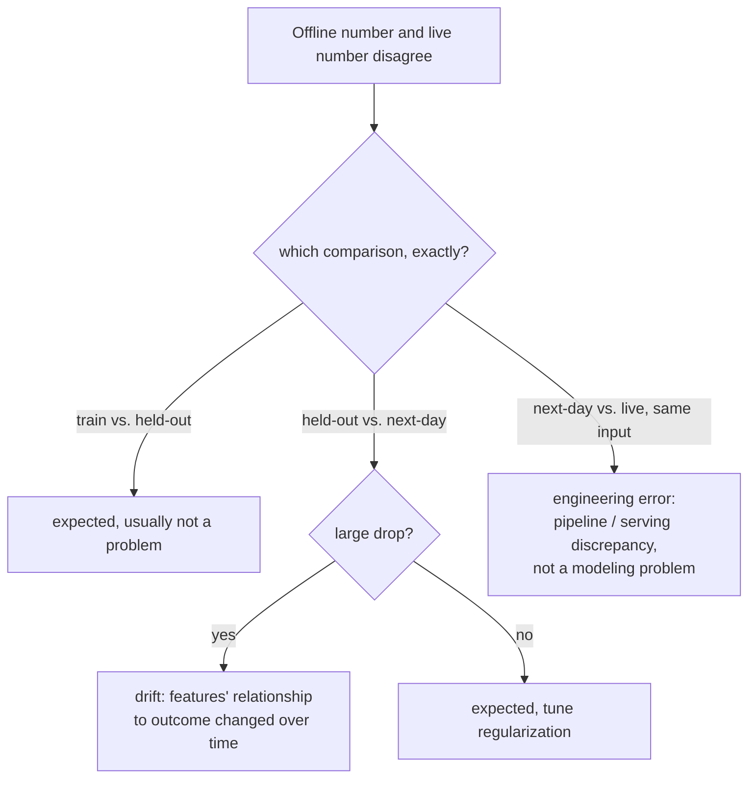

# Lesson 16. Production Telemetry and Drift

**Mission link:** Lesson 15 gave an A/B test its guardrail metric, a number watched continuously during the experiment so an OEC gain can't hide a quiet loss elsewhere. **Production telemetry** is the same discipline extended past the experiment's end: watching those numbers continuously, forever, once the change has shipped. This lesson is about what to do with the gap that opens up when a number you trusted offline stops matching what production is actually showing you.
**Primary source:** [Guide: "Rules of Machine Learning", Zinkevich, Google](https://developers.google.com/machine-learning/guides/rules-of-ml)
**Prerequisites:** [Lesson 9](0009-statistical-significance-vs-noise.md), [Lesson 15](0015-ab-tests-and-guardrail-metrics.md)

## Warm-up

1. ▢ What is a guardrail metric, and how does it differ from an OEC?

Check

An OEC is the metric an experiment is actually trying to move; a guardrail metric is a separate metric the experiment isn't optimizing at all, tracked specifically to catch the change quietly damaging something else while chasing the OEC.

2. ▢ Why does randomization in an A/B test matter for trusting a measured difference between control and treatment?

Check

Randomization is what allows any measured difference in outcome to be attributed to the change itself, rather than to some other, unrelated difference between the two groups of users.

## Know this

### An offline-versus-live gap has (at least) three different causes, not one

Google's own engineering guidance breaks a model's performance gap into three separate comparisons, each with a different likely cause, rather than treating "the offline number and the live number disagree" as a single problem. The gap between training performance and held-out performance is expected and not inherently a problem. The gap between held-out performance and "next-day" data (data collected after the held-out set) is also expected to some degree, but a *large* drop specifically points at features whose relationship to the outcome changes over time. The gap between that next-day performance and genuinely live, in-production performance is different in kind: if the exact same example produces a different result at serving time than it did offline, the guidance is direct that this indicates an **engineering error**, not a modeling problem at all, since an identical input is supposed to produce an identical output regardless of where it's evaluated.

### Drift is a specific one of those three causes, not a catch-all label

**Drift** is what a large held-out-to-next-day gap actually is: the real-world relationship between features and outcomes changing over time, so a model (or an eval) built on older data increasingly stops matching what's actually true now. Production telemetry's job is to make this visible continuously, comparing a live metric against its historical baseline on an ongoing basis, rather than waiting for a large enough symptom that someone notices it by chance. Catching drift early is directly a function of how fast it can do damage: a system whose quality would degrade badly within a day needs continuous, active monitoring, while one that degrades slowly over a quarter can be checked far less urgently, the same freshness reasoning that governs how often a model or a reference eval set actually needs to be refreshed at all.

### The third gap almost never means what people reach for first

When live results diverge from what identical offline evaluation would have predicted, for the exact same inputs, the instinct is often to blame the model, retrain it, or second-guess the eval. The Google guidance's framing cuts that off: an identical example should give an identical result whether it's scored offline or served live, so a discrepancy here specifically implicates the pipeline, a difference in how data is handled or features are computed between the training/eval path and the live serving path, not the model's actual judgment. Chasing a model fix for what's really a pipeline bug wastes exactly the kind of effort lesson 11 warned against spending on the wrong stage.

### Sanity-check before a model reaches production, and grade the alert to match the blast radius

Before a newly trained model is exported to serving at all, a basic sanity check against held-out data (catching an obviously broken model before it becomes user-facing) is worth treating differently from an alert on a model already live: an issue caught before export is worth an email, since nothing user-facing has happened yet; an issue on a model already serving real traffic can justify paging someone immediately, since the blast radius and urgency are completely different. Telemetry that treats every anomaly identically, regardless of whether it's pre-export or already user-facing, either pages too often to be useful or misses the cases that actually need someone paged right away.

## Practice

1. ▢ A team observes their live model performing noticeably worse than it did on last month's held-out eval, and the gap has been slowly widening over several weeks. Which of the three comparisons does this describe, and what's the likely cause?

Hint

Consider which comparison specifically involves a growing gap over time, rather than a one-time discrepancy on identical inputs.

Check

The held-out-versus-next-day comparison, and a large, widening gap here specifically points at drift: features whose relationship to the outcome is changing over time, making the older held-out set (and the model trained against it) progressively less representative of current reality.

2. ▢ A team finds that scoring the exact same input offline and observing what the live system actually returned for that same input produces two different results. What does this specifically indicate, and what should the team check first?

Check

An engineering error, not a modeling problem: an identical input is supposed to produce an identical output regardless of whether it's scored offline or served live. The team should check for a discrepancy in how data is handled or features are computed between the offline/training path and the live serving path, rather than assuming the model itself needs retraining.

3. ▢ Why does a team need to know how quickly their system's quality degrades without an update (its freshness requirement) before deciding how urgently to monitor for drift?

Check

Because how much damage drift can do, and how fast, determines how urgently it needs to be caught: a system that degrades badly within a day needs continuous, active monitoring, while one that only degrades meaningfully over a quarter can be checked on a far less urgent cadence, without wasting monitoring effort disproportionate to the actual risk.

4. ▢ A newly trained model fails a sanity check on held-out data before it's ever exported to serving. Should this trigger the same alert severity as a live, user-facing model showing a problem?

Check

No. An issue caught before export hasn't affected any real users yet and is appropriately handled with a lower-urgency alert (an email); an issue on a model already serving live traffic has a real, ongoing user-facing blast radius and can justify immediately paging someone, since the urgency and consequences of the two situations are genuinely different.

5. ▢ Which claim correctly describes how to interpret a gap between an offline number and a live number?

    - a) Any gap between an offline number and a live number is drift, and should be fixed by retraining the model
    - b) The gap has to be attributed to the right one of (at least) several distinct causes, training-vs-holdout variance, held-out-vs-next-day drift, or a next-day-vs-live engineering discrepancy, since each points at a genuinely different fix
    - c) A discrepancy between an offline score and a live result on the identical input is expected and requires no investigation
    - d) All production monitoring alerts should be paged with the same urgency regardless of whether the model has reached live traffic yet

Check

**b)** That's the precise, three-way distinction this lesson establishes. (a) is false: only a large held-out-to-next-day gap specifically indicates drift; other gaps have different causes and different fixes. (c) is false: an identical input producing a different result offline versus live specifically indicates an engineering error that needs investigating, not an expected discrepancy. (d) is false: an issue caught before a model is exported warrants a lower-urgency response than one already affecting live, user-facing traffic.

## Real-world reps

- [ ] For a model or system you have access to, check whether its monitoring distinguishes these three kinds of offline/online gaps, or treats any disagreement as one undifferentiated "something's wrong" signal.
- [ ] Estimate your own system's freshness requirement: how much would quality degrade if the model or reference eval set went unupdated for a day, a week, or a quarter, and does your monitoring cadence actually match that estimate?
- [ ] Tomorrow: read the primary source's surrounding rules on monitoring and feature engineering in full, and note what it recommends checking first when training-serving skew is suspected but not yet isolated to one of the three comparisons.

## Going further

- [Guide: "Rules of Machine Learning", Zinkevich, Google](https://developers.google.com/machine-learning/guides/rules-of-ml)
- [Resources](../RESOURCES.md)

---

Not landing? Reread the primary source at the top, since this lesson compresses it and compression is where understanding leaks. Check the [glossary](../GLOSSARY.md) for any term that felt slippery.

If the lesson itself is unclear rather than the material, that is a defect: [open an issue](https://github.com/TokenCemetery/teach/issues).
