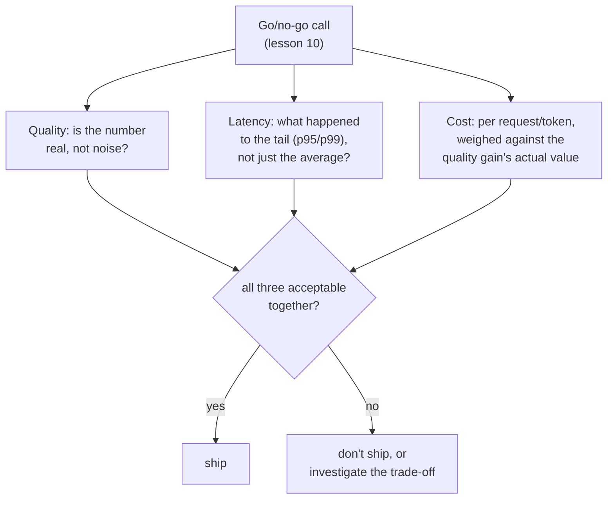

# Lesson 17. Cost and Latency as Eval Dimensions

**Mission link:** Lesson 10 taught defending a go/no-go call with a trustworthy quality number. That call has always had two more inputs waiting in the wings: what the change costs to run, and how fast it responds. Treating those as an afterthought, checked only once the quality number already looks good, is the same mistake lesson 15 warned against for an OEC reported without its guardrail metric: one number, celebrated in isolation, while a real cost accumulates somewhere nobody was measuring.
**Primary source:** [Paper: "The Tail at Scale", Dean and Barroso, 2013](https://www.barroso.org/publications/TheTailAtScale.pdf)
**Prerequisites:** [Lesson 10](0010-defending-the-go-no-go-call.md), [Lesson 15](0015-ab-tests-and-guardrail-metrics.md)

## Warm-up

1. ▢ What is an OEC, and what two properties does a good OEC candidate need?

Check

The specific metric (or small combination) an experiment is actually trying to move. A good candidate is movable, sensitive enough to shift within a feasible experiment, and causally connected to the outcome that actually matters, not merely correlated with it.

2. ▢ Why can reporting only an OEC's improvement, with no guardrail metric checked, hide a real regression?

Check

A change engineered to move the OEC has every incentive to do so, but nothing about succeeding at that guarantees anything about a metric nobody was watching; a guardrail metric is what's needed to catch that kind of unwatched damage.

## Know this

### An average latency number hides exactly the part that determines how fast a system feels

Latency's most important property for a real, interactive system isn't its average, it's its **tail**: the slowest fraction of requests, typically reported as a percentile like p95 or p99. A model change can leave the average response time almost unchanged while making the tail meaningfully worse, and a user's actual experience of "is this fast" is dominated by how often they hit that slow tail, not by the average across every request they never noticed being fast. Reporting only an average latency figure for a go/no-go call can hide a real, user-facing regression the same way an aggregate accuracy score can hide a skewed failure on one rare category, or a whole-answer faithfulness score can hide one unsupported claim.

### Fan-out makes the tail the thing that actually decides a real system's response time

At real scale, a single user-facing request often fans out to many backend calls, and the overall response only completes once *every* one of those calls has finished. This means the odds of hitting at least one slow component grow with how many components are touched: a component that's slow only rarely can still make a large fraction of fanned-out requests slow overall, since it only takes one of many parallel calls landing in the tail to make the whole request tail-latency-bound. This is exactly why measuring and defending against tail latency, not average latency, is the discipline a real production system needs, and why a go/no-go call for a component embedded in a larger system has to ask about its tail specifically.

### Cost has to be measured per unit of the thing being served, not treated as a fixed line item

Cost, like latency, isn't one flat number: a per-token cost differs for input versus output tokens, and a "better" model can cost meaningfully more per request while producing a quality gain that may or may not be worth that multiplier. Reporting a quality improvement without its cost per request (or per token, whichever unit actually maps to what's being served) leaves the go/no-go call unable to weigh the two against each other at all; a quality gain that costs ten times more per request needs to be worth roughly that much more to the people relying on it, not simply assumed worthwhile because it scored higher.

### Cost and latency belong inside the same go/no-go call lesson 10 already taught, not bolted on after

Nothing about this lesson asks for a new decision framework: lesson 10's discipline (a defended number, checked against noise, weighed against what it costs to be wrong) applies directly to cost and latency as it does to quality. The mistake this lesson corrects is treating cost and latency as a separate, secondary check performed only once a quality win already looks good, rather than as first-class inputs to the same go/no-go call from the start. A change that wins on quality, regresses on p99 latency, and costs three times as much per request hasn't been evaluated at all until all three numbers are on the table together, the same way an OEC's gain isn't evaluated at all until its guardrail metrics have been checked alongside it.

## Practice

1. ▢ A model change shows average latency unchanged, but a team hasn't checked its p99 latency. Why is "average latency unchanged" not enough to conclude the change is safe to ship?

Hint

Consider what an average can hide about the slowest fraction of requests.

Check

An unchanged average can coexist with a meaningfully worse tail (p95 or p99); since users' experience of "is this fast" is dominated by how often they hit the slow tail rather than by the average across every request, the average alone can't rule out a real, user-facing latency regression.

2. ▢ A user-facing request fans out to 50 backend calls, each of which is slow only 1% of the time. Why does this make the overall request far more likely to be tail-latency-bound than any single backend call's own 1% rate would suggest?

Check

The overall request only completes once every one of the 50 calls has finished, so it only takes one of those 50 independent calls landing in its own slow tail to make the whole request slow; with enough fanned-out calls, the chance that at least one lands in the tail climbs well above any single component's own rare-slowness rate.

3. ▢ A team reports a new model scores 8% higher on their quality eval, without mentioning its per-request cost. What's missing before this can inform a go/no-go decision?

Check

The cost per request (or per token) compared against the previous model's, so the quality gain can actually be weighed against what it costs to obtain; an 8% quality gain that costs ten times as much per request is a very different decision than the same 8% gain at roughly the same cost, and the reported number alone can't distinguish the two.

4. ▢ Why does this lesson describe folding cost and latency into the go/no-go call as "not a new framework," rather than introducing a separate decision process for them?

Check

Because lesson 10's existing discipline (a defended, trustworthy number, weighed against what it costs to be wrong) already applies directly to cost and latency; the mistake being corrected is treating them as an afterthought checked only after a quality win looks good, not needing an entirely new process to evaluate them.

5. ▢ Which claim correctly describes how cost and latency belong in a go/no-go call?

    - a) Only the quality metric needs to be defended with a trustworthy number; cost and latency are secondary checks performed only if the quality result looks promising
    - b) Cost and latency are first-class go/no-go inputs alongside quality, latency should be assessed by its tail (p95/p99) rather than only its average, and cost should be weighed per request or per token against the quality gain it buys
    - c) Average latency is always sufficient to characterize whether a system change is safe to ship
    - d) A quality improvement automatically justifies any increase in cost, since a higher score is the only thing that matters

Check

**b)** That's the complete, first-class treatment this lesson establishes. (a) is false: treating cost and latency as secondary, after-the-fact checks is exactly the mistake this lesson corrects. (c) is false: an unchanged average can hide a meaningfully worse tail, which is what actually dominates real user experience. (d) is false: a quality gain has to be weighed against what it costs, not assumed worthwhile regardless of the multiplier.

## Real-world reps

- [ ] For a model or system change you've evaluated (or one described in a report you have access to), check whether its latency was reported as an average, a percentile, or both, and whether cost per request was reported at all.
- [ ] For a "better" model or API you've considered adopting, look up its per-token cost (input and output separately) and estimate whether its quality gain, in your own judgment, is worth whatever cost multiplier it carries.
- [ ] Tomorrow: read the primary source's discussion of hedged and tied requests in full, and note what these techniques trade away (extra load, extra complexity) to reduce tail latency specifically.

## Going further

- [Paper: "The Tail at Scale", Dean and Barroso, 2013](https://www.barroso.org/publications/TheTailAtScale.pdf)
- [Resources](../RESOURCES.md)

---

Not landing? Reread the primary source at the top, since this lesson compresses it and compression is where understanding leaks. Check the [glossary](../GLOSSARY.md) for any term that felt slippery.

If the lesson itself is unclear rather than the material, that is a defect: [open an issue](https://github.com/TokenCemetery/teach/issues).
