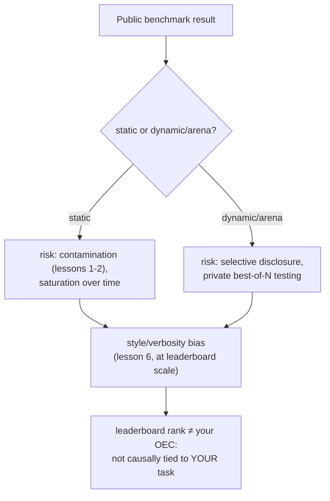

# Lesson 18. Public Benchmarks

**Mission link:** This workspace's whole arc has been building toward one thing: a number you can personally defend for your own model change. A public benchmark or leaderboard offers a number somebody else already computed, for a model somebody else built, against users who aren't yours. This lesson is about what that number is actually for, the specific ways it gets gamed, and why lesson 15's OEC discipline says a leaderboard rank fails the test a real decision metric has to pass.
**Primary source:** [Paper: "The Leaderboard Illusion", Singh et al., 2025](https://arxiv.org/abs/2504.20879)
**Prerequisites:** [Lesson 6](0006-judge-bias-and-human-agreement.md), [Lesson 15](0015-ab-tests-and-guardrail-metrics.md)

## Warm-up

1. ▢ What makes a metric a good OEC candidate, according to Kohavi's guidance?

Check

It has to be movable, sensitive enough to shift within a feasible experiment, and causally connected to the outcome that actually matters, not merely correlated with it.

2. ▢ What is verbosity bias, and name one way to mitigate it in an LLM-as-judge setup?

Check

A judge's tendency to prefer a longer response even when the extra length adds nothing over an equally or more correct, shorter one. Mitigations include instructing the judge explicitly not to reward length, or writing grading criteria that name correctness and completeness rather than length.

## Know this

### A static benchmark is a fixed, shared measuring stick, with all of lesson 1's problems built in

A static public benchmark (a fixed set of questions with fixed correct answers) exists to give the whole field one comparable number. But it inherits exactly the risks lesson 1 and lesson 2 already covered: the benchmark's own questions can end up scraped into a later model's pretraining data (contamination), and a benchmark that's been the target of enough tuning over enough time tends toward **saturation**, models reaching a ceiling score on it while still failing the same kind of task in the wild, because the benchmark stopped measuring the underlying skill and started measuring familiarity with the benchmark itself.

### A dynamic, arena-style benchmark trades one gaming vector for another

Live, preference-based arenas (a public site where real users compare two models' responses and vote) were built specifically to reduce the contamination risk a fixed question set carries, since the prompts and preferences come from ongoing use rather than a static, freezable set. But "The Leaderboard Illusion" documents a different, serious gaming vector this design opens up: providers testing many private variants of an unreleased model before choosing which single result to publish. Its own findings are concrete: the paper identifies 27 private LLM variants Meta tested in the run-up to releasing Llama 4, and reports that a small number of large, closed-model providers received a disproportionate share of the arena's total comparison data (an estimated 19 to 20 percent each for two major providers, versus roughly 30 percent shared across 83 open-weight models combined). Selective disclosure, testing many variants privately and publishing only the best-scoring one, turns a leaderboard into exactly the kind of target Goodhart's Law describes: once a measure becomes something to optimize against directly, it stops reliably measuring what it was built to measure.

### The same style bias lesson 6 taught for one judge call operates identically across an entire leaderboard

Lesson 6 covered verbosity bias in a single LLM-as-judge pairwise comparison. The identical failure mode shows up at leaderboard scale with human raters instead: when a major arena's own research controlled for response length and markdown formatting (headers, bold text, list structure), the rankings shifted meaningfully, with some models dropping and others rising once style's influence was factored out. This confirms lesson 6's mechanism generalizes past a single judge prompt: a rating process, whether one LLM judge or thousands of human voters, can reward how an answer is formatted and how long it is, independent of whether it's actually more correct or more useful.

### A leaderboard rank fails the OEC test lesson 15 already gave you

Lesson 15 named the two properties a real decision metric needs: it has to be movable, and it has to be causally connected to the outcome that actually matters. A public leaderboard rank is movable, arguably too movable, given a documented practice of privately testing variants until one scores well. What it lacks is the second property for your specific decision: it aggregates preferences across many different users, tasks, and use cases that are not your users, your task, or your use case, and (per this lesson's other findings) may not even reflect the exact model version you'd actually be served. A leaderboard position can be a reasonable first filter for which models are worth evaluating further; it is not a substitute for the defended, held-out, task-specific go/no-go number this entire workspace has been building toward.

## Practice

1. ▢ A model tops a static public benchmark, and later analysis finds the benchmark's exact questions appear in a web crawl the model was pretrained on. What does lesson 1's vocabulary call this, and what does it do to the benchmark's meaning?

Hint

Consider what happens to a benchmark's questions once they're scraped into a large pretraining crawl.

Check

This is data contamination. Once a benchmark's own questions (or close paraphrases) end up in training data, a high score can reflect the model having seen the questions before rather than possessing the underlying skill the benchmark was meant to measure.

2. ▢ A provider tests 20 private, unreleased variants of a model against a live preference arena, and publicly releases only the single variant that scored best. What does "The Leaderboard Illusion" call this practice, and what specific real example does the paper cite?

Check

Selective disclosure (testing multiple variants privately and choosing which score to publish). The paper's own concrete example is Meta testing 27 private LLM variants in the lead-up to the Llama 4 release.

3. ▢ An arena's own research finds that controlling for response length and markdown formatting changes the leaderboard ranking meaningfully. What earlier lesson's failure mode does this confirm, just operating at a different scale?

Check

Lesson 6's verbosity bias: a rating process (a single LLM judge there, thousands of human arena voters here) can reward length and formatting rather than actual correctness or usefulness, and the effect shows up identically whether the rater is one model or a whole crowd.

4. ▢ A team wants to skip building their own eval and instead ship whichever model currently tops a public leaderboard. What does lesson 15's OEC criteria say is missing from that decision?

Check

The causal-connection requirement: a leaderboard rank aggregates preferences across users, tasks, and use cases that aren't the team's own, so a high rank doesn't establish that the model is actually better for their specific task. It may also not even reflect the exact model version they'd be served, given documented selective-disclosure practices. A leaderboard rank can be movable, but movability alone doesn't make it a valid OEC for someone else's decision.

5. ▢ Which claim correctly describes how public benchmarks relate to this workspace's mission?

    - a) A dynamic, arena-style leaderboard is immune to gaming since it uses live user preferences instead of a fixed question set
    - b) Static benchmarks carry contamination and saturation risk, dynamic arenas carry selective-disclosure risk, both carry style bias at scale, and a leaderboard rank still fails the causal-connection test a real OEC needs for a specific decision
    - c) A model's leaderboard rank is a valid substitute for a task-specific go/no-go call, since it's already been measured rigorously by a third party
    - d) Style and verbosity bias only affect single LLM-as-judge setups, not large-scale human-preference arenas

Check

**b)** That's the complete picture this lesson establishes. (a) is false: dynamic arenas trade contamination risk for a documented selective-disclosure risk instead. (c) is false: a leaderboard rank isn't causally tied to a specific team's own task or users, which is exactly what an OEC requires. (d) is false: an arena's own research found style bias shifts rankings at full leaderboard scale, not just in a single judge call.

## Real-world reps

- [ ] For a model you're considering adopting, check whether its leaderboard position comes from a static benchmark or a dynamic arena, and whether either source discloses anything about contamination checks or private pre-release testing.
- [ ] If the model you're considering has a listed arena rank, check whether a style-controlled ranking is available for the same leaderboard, and see whether its position changes.
- [ ] Tomorrow: read the primary source in full, and note what remedies it proposes for the data-access asymmetry it documents between closed and open-weight providers.

## Going further

- [Paper: "The Leaderboard Illusion", Singh et al., 2025](https://arxiv.org/abs/2504.20879)
- [Article: "Does Style Matter?", LMArena](https://lmarena.ai/blog/style-control)
- [Resources](../RESOURCES.md)

---

Not landing? Reread the primary source at the top, since this lesson compresses it and compression is where understanding leaks. Check the [glossary](../GLOSSARY.md) for any term that felt slippery.

If the lesson itself is unclear rather than the material, that is a defect: [open an issue](https://github.com/TokenCemetery/teach/issues).
