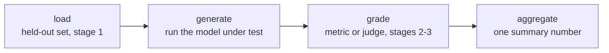

# Eval Harness: Frameworks and Reproducible Runs

Stage 4 compressed for lookup. [Lesson 7](../lessons/0007-eval-frameworks-and-harness.md) covers the four-stage shape every harness has and choosing between two established frameworks; [lesson 8](../lessons/0008-reproducible-runs.md) covers why the same eval can produce different numbers on different runs and what to log alongside a score. This sheet is the pipeline, the framework choice, and the reproducibility checklist.

## Why a harness, not a one-off script

Every design decision from stages 1 to 3, which data is held out, which metric or judge grades a response, how a score is aggregated, only matters if it's applied the same way every time. A harness formalizes that pipeline into reusable, auditable code, so a rerun months later applies the exact same held-out set and grading logic, rather than being reconstructed from memory.

## The four stages

| Stage | Can fail by | Consequence |
|---|---|---|
| Load | Using a contaminated or non-held-out eval set | The number means nothing, regardless of how careful the grading is |
| Generate | Running the wrong model version, or truncating outputs | Garbage no metric can rescue |
| Grade | A miscalibrated metric or judge (score compression, position/verbosity bias) | Corrupts scoring of otherwise-good outputs |
| Aggregate | Collapsing per-example scores into a single mean | Hides variance or a few catastrophic failures behind a number that looks solid |

Each stage can undermine the final number independently of the other three.

## Two frameworks, two jobs

| | openai/evals | lm-evaluation-harness (EleutherAI) |
|---|---|---|
| Built for | Defining a custom eval as code: a completion function plus a grading spec | Running a model against a large library of pre-built, standardized benchmarks via declarative task configs |
| Fits | A mission-specific task nobody has built an eval for yet | Reusing an existing benchmark, especially when comparability with published numbers matters |
| Doesn't fit | Reimplementing a standardized benchmark by hand (risks subtle differences that break comparability) | A genuinely new capability no benchmark measures yet |

The choice follows the same principle as choosing a metric (stage 2): match the tool to what the task actually needs.

## Why the same eval can give two different numbers

A model sampled at a nonzero temperature produces different completions on different runs, even against an identical prompt, so a different aggregate score each time is expected, not a bug. If grading also uses an LLM judge, that adds a second layer of sampling noise on top of the model-under-test's own variance. A single run's number is a sample from a distribution, not a fixed fact about the model.

## The determinism trade-off

| Choice | Buys | Costs |
|---|---|---|
| Temperature 0 (greedy) | Far more repeatable runs | May not reflect deployment, if the deployed system samples at a nonzero temperature |
| Sample at deployment temperature, report the spread | Honest reflection of real behavior | Less repeatable per single run; needs multiple samples per example (the same idea as stage 2's pass@k) |

A fixed random seed reduces variance between runs on the same setup, but is not a guarantee of bit-identical results across different hardware, library versions, or batch compositions, since floating-point computation isn't perfectly associative across all of those.

## What a defensible number logs alongside the score

- [ ] The random seed used for generation
- [ ] The generation temperature
- [ ] The model and framework versions
- [ ] The eval set's version
- [ ] When multiple samples were run: the spread across them, not only the mean

Without these, a later comparison (a rerun, a different checkpoint, a different eval cycle) can't distinguish a real change from ordinary pipeline variance.

## Before trusting a harness result

- The eval's four stages (load, generate, grade, aggregate) are each named explicitly, even if they currently live in one script.
- The framework choice (custom eval-as-code vs a standardized benchmark harness) matches whether a benchmark for this capability already exists.
- The temperature/determinism trade-off was a deliberate choice, not whatever the harness happened to default to.
- The score is reported alongside seed, temperature, versions, and eval set version, not as a bare number.

## Sources

- [Repo: openai/evals, OpenAI](https://github.com/openai/evals)
- [Repo: lm-evaluation-harness, EleutherAI](https://github.com/EleutherAI/lm-evaluation-harness)
- [Resources](../RESOURCES.md)
