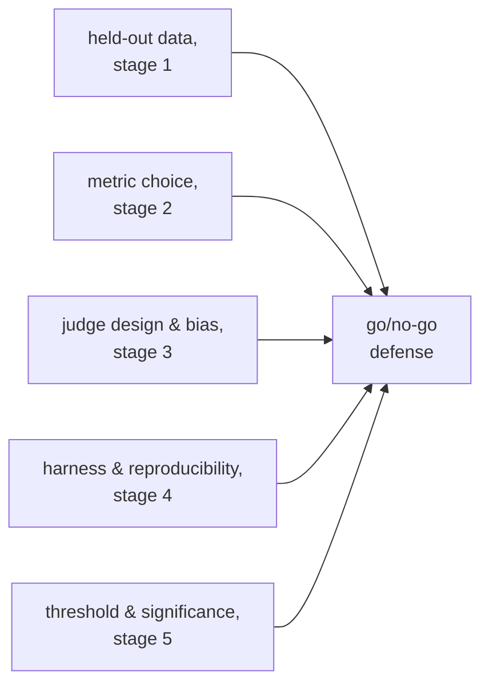

# Go/No-Go: Significance, Thresholds, and the Full Defense

Stage 5 compressed for lookup. [Lesson 9](../lessons/0009-statistical-significance-vs-noise.md) covers judging whether a score gap is real or noise; [lesson 10](../lessons/0010-defending-the-go-no-go-call.md) covers setting a threshold honestly and citing everything that makes the number trustworthy. This sheet is the noise formula, the paired-comparison grid, and the defense checklist.

## Is a gap real, or noise?

For a pass/fail-style score over *N* examples, with a true pass rate *p*, the standard error of the measured proportion is approximately:

```text
SE ≈ sqrt(p(1−p)/N)
```

A pass rate of 0.70 over 100 examples has `SE ≈ sqrt(0.70 × 0.30 / 100) ≈ 0.046`, about 4.6 points. Standard error falls with `sqrt(N)`, so a larger eval set shrinks it and makes a real difference easier to distinguish from chance, without the underlying true difference having changed at all.

| Gap vs combined SE | Read |
|---|---|
| Clearly larger | Suggestive of a real difference |
| Comparable to, or smaller than | Not yet distinguishable from noise; gather more data, don't guess |

## Paired comparison beats treating scores as independent

When the same eval examples run through both a baseline and a new variant, a **paired comparison** looks at where the two disagree (one got it right, the other didn't) instead of comparing the two raw pass rates separately. This cancels out example-level difficulty that affects both equally, and detects a real difference from less data than an independent-proportions comparison needs.


## Setting a regression threshold honestly

| Requirement | Why |
|---|---|
| Set before the eval runs | A threshold chosen after seeing the result can be, and tends to be, bent toward whatever answer was wanted |
| No tighter than the noise floor | A threshold demanding less regression than the standard error can resolve can't be honestly enforced; loosen it or grow the sample size |
| Tied to what the product needs | The right threshold reflects real cost of a regression or real value of an improvement, not a blanket preference for looseness |

An inconclusive result (a gap inside the noise) is evidence of not enough information yet, not a default toward either shipping or blocking. The honest move is more data: more examples, or a proper paired significance test on the disagreements.

## What a complete go/no-go defense cites



A call that states only a headline number, with none of the above, is a vibe with decimal places.

## Before defending a go/no-go call

- The regression threshold was written down before the eval ran, not chosen after seeing the result.
- The threshold is no tighter than the current sample size's standard error can resolve.
- The comparison used paired data (per-example agreement/disagreement), not two independent pass rates, wherever the same examples ran through both variants.
- An inconclusive gap was met with "gather more data," not a default ship or block decision.
- The defense names the held-out set's honesty, the metric choice, any judge's calibration and bias checks, the harness's reproducibility logging, and the statistical case, together, not just the score.

## Sources

- [Docs: "Define success criteria and build evaluations", Claude Platform Docs](https://platform.claude.com/docs/en/test-and-evaluate/develop-tests)
- [Paper: "Judging LLM-as-a-Judge with MT-Bench and Chatbot Arena", Zheng et al., 2023](https://arxiv.org/abs/2306.05685)
- [Resources](../RESOURCES.md)
