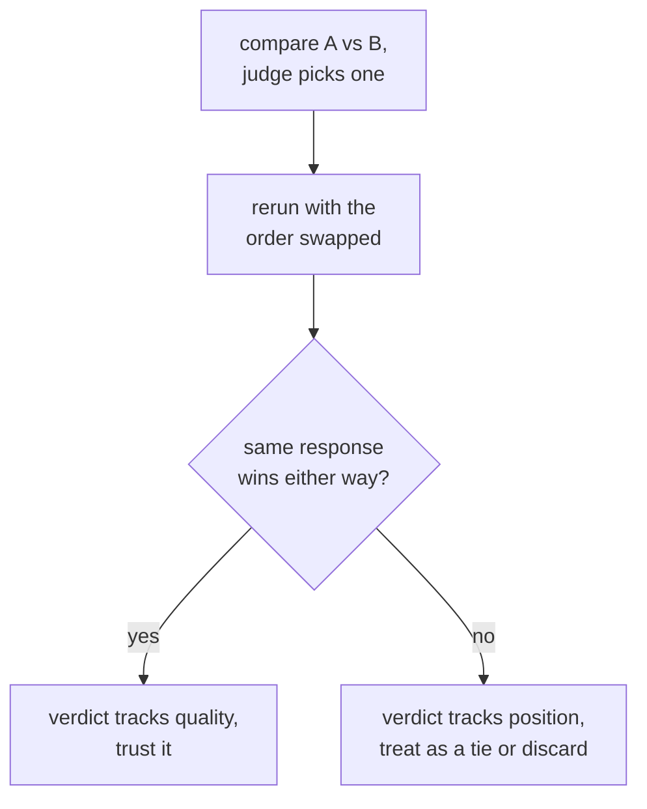

# LLM-as-Judge: Prompt Design, Calibration, and Bias

Stage 3 compressed for lookup. [Lesson 5](../lessons/0005-judge-prompt-design-and-calibration.md) covers writing a judge prompt and checking its calibration; [lesson 6](../lessons/0006-judge-bias-and-human-agreement.md) covers position bias, verbosity bias, and measuring agreement with human raters. This sheet is the design checklist, the failure modes, and the checks that catch each one.

## Designing a judge prompt

| Choice | Why it matters | Skipping it |
|---|---|---|
| Explicit criteria (correctness, completeness, tone, whichever apply) | Gives every judgment the same yardstick | A vague "which is better?" lets the judge invent its own rubric, differently each call |
| A reference answer, when one exists | Gives the judge something to check against | Without one, a fluent but wrong answer can read as convincing, especially on math or reasoning |
| Reasoning before the score | Forces the judgment to be justified, not a snap impression | A bare number is less consistent than one preceded by explanation |
| A structured, parseable output (a forced scale, or A/B/tie) | Easier to aggregate and audit | Free-form prose grading resists turning many judgments into one summary number |

## Calibration: does a score mean the same thing across examples

A judge is calibrated when its scores track real quality consistently, and its relative rankings agree with what human raters would say. The named failure is **score compression toward the ceiling**: the judge rates nearly everything an 8 or 9 regardless of real quality differences, erasing the distinctions an eval exists to catch.

Calibration is checked, not assumed: run the judge against a small set of examples a human has already rated, and measure agreement before trusting the judge on the larger, unlabeled set.

## Pairwise bias: two named failures, two direct checks

| Bias | What happens | Direct check |
|---|---|---|
| Position bias | The judge favors whichever response appears first (or, in some models, second), independent of quality | Rerun the same comparison with the two responses' order swapped; if the winner tracks position rather than content, discard or treat as a tie |
| Verbosity bias | The judge prefers a longer response even when the extra length adds nothing | Check whether the judge's preferences correlate suspiciously well with response length across many comparisons; name completeness and correctness explicitly in the criteria rather than length |

## Measuring agreement: the right bar is human-vs-human, not 100%

The fraction of comparisons where the judge's choice matches a human rater (or a majority of several) is **agreement**. Human raters don't agree with each other 100% of the time either, so the right comparison is judge-vs-human agreement against human-vs-human agreement on the same comparisons: a judge close to how often humans agree with each other is doing about as well as another human rater would. Measured only against a perfect ceiling, the same number looks like a shortfall it isn't.

## Before trusting a judge's verdict

- The prompt names explicit criteria, not a bare "which is better?"
- A reference answer is supplied wherever one exists, especially for math or multi-step reasoning.
- The judge's score distribution has been checked for compression toward the ceiling against a human-rated sample.
- A pairwise verdict has been re-run with order swapped before being counted as a real preference.
- The judge's preferences have been checked against response length, for a suspiciously strong correlation.
- Agreement is reported alongside the human-vs-human agreement rate it's being compared against, not alongside a bare 100%.

## Sources

- [Paper: "Judging LLM-as-a-Judge with MT-Bench and Chatbot Arena", Zheng et al., 2023](https://arxiv.org/abs/2306.05685)
- [Docs: "Define success criteria and build evaluations", Claude Platform Docs](https://platform.claude.com/docs/en/test-and-evaluate/develop-tests)
- [Resources](../RESOURCES.md)
