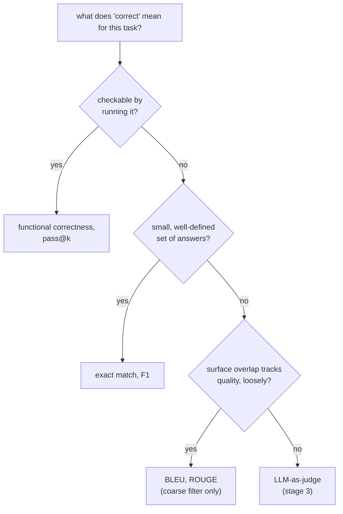

# Metrics: Choosing and Computing One

Stage 2 compressed for lookup. [Lesson 3](../lessons/0003-task-specific-metrics.md) covers exact match, F1, and BLEU/ROUGE; [lesson 4](../lessons/0004-code-execution-metrics.md) covers functional correctness, pass@k, and the decision principle that ties the four together. This sheet is the comparison table, the pass@k formula, and the decision rule.

## The four, side by side

| Metric | Compares | Fits | Blind to |
|---|---|---|---|
| Exact match | Prediction and reference, string for string (after light normalization) | A small, well-defined set of answers: classification, extraction, arithmetic | Any correct answer phrased differently from the reference |
| Token-level F1 | Prediction and reference as bags of tokens; precision, recall, harmonic mean | Extractive tasks like span-based QA, where some phrasing slack is expected | Word order, and whether overlapping words combine into a correct claim |
| BLEU / ROUGE | Generated text's n-gram overlap against one or more references | A coarse, cheap first-pass filter on open-ended text: translation, summarization | A valid paraphrase with few shared n-grams; correlates only loosely with quality |
| Functional correctness / pass@k | The code's actual behavior, run against test cases | Code, where correctness is behavioral, not textual | Nothing textual; it doesn't apply outside runnable output |

## Computing F1 from two token sets

Precision = shared tokens / prediction's token count. Recall = shared tokens / reference's token count. F1 = their harmonic mean.

Reference "the cat sat on the mat" (6 tokens) against prediction "a cat sat on the mat" (6 tokens) shares 5 tokens (`cat, sat, on, the, mat`; the reference's second `the` and the prediction's `a` are each unmatched): precision `5/6`, recall `5/6`, F1 `5/6 ≈ 0.83`.

## Computing pass@k

An LLM's code generation is stochastic, so `pass@k` asks: out of *k* sampled solutions, what is the probability at least one passes all tests? Generating exactly *k* samples and checking them is noisy for small *k*. The unbiased estimator instead generates a larger *n*, counts how many, *c*, are correct, and computes the probability analytically:

```text
pass@k = 1 − C(n−c, k) / C(n, k)
```

`C(n−c, k) / C(n, k)` is the probability a random draw of *k* solutions, without replacement, from the *n* generated, misses all *c* correct ones; 1 minus that is the probability at least one correct solution is included. This reuses every generated sample for any `k` up to `n`, rather than re-sampling per `k`.

Worked example, `n = 10`, `c = 3`:

| k | Calculation | Result |
|---|---|---|
| 1 | `1 − C(7,1)/C(10,1) = 1 − 7/10` | `0.3` (equals `c/n`, as expected when `k = 1`) |
| 5 | `1 − C(7,5)/C(10,5) = 1 − 21/252` | `≈ 0.917` |

## The decision principle

Match the metric to what "correct" means for the task, in this order:



## Before trusting a metric choice

- The task's notion of "correct" is stated explicitly, not assumed from habit or from what a library defaults to.
- Exact match or F1 is not being applied to a task with many equally valid phrasings (code, open-ended prose).
- BLEU/ROUGE is being used as a coarse filter, not cited as the final verdict on generation quality.
- A `pass@k` estimate reports which `k` was used and how many samples `n` it was computed from.

## Sources

- [Docs: Evaluate, Hugging Face](https://huggingface.co/docs/evaluate/index)
- [Paper: "Evaluating Large Language Models Trained on Code" (Codex), Chen et al., 2021](https://arxiv.org/abs/2107.03374)
- [Docs: "Define success criteria and build evaluations", Claude Platform Docs](https://platform.claude.com/docs/en/test-and-evaluate/develop-tests)
- [Resources](../RESOURCES.md)
