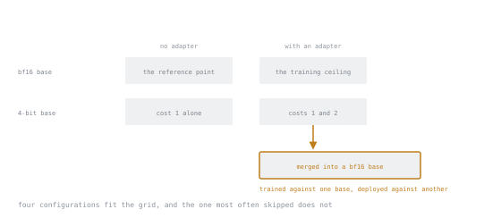

# Lesson 17. What QLoRA Actually Costs

**Mission link:** The mission says "explain the measured differences, not the advertised ones". This lesson is the measurement.
**Primary source:** [Paper: "QLoRA: Efficient Finetuning of Quantized LLMs", Dettmers et al., arXiv:2305.14314](https://arxiv.org/abs/2305.14314)
**Prerequisites:** [Lesson 16](0016-training-through-a-quantized-base.md)

## Warm-up

1. ▢ Why can a frozen 4-bit base still pass gradients?

Check

It is a constant in the graph. Propagating gradient requires reading it at high precision, not differentiating with respect to it, and no gradient is stored for it.

2. ▢ Which QLoRA component is genuinely CUDA-specific?

Check

Paged optimizers, which depend on NVIDIA unified memory. And they matter least for adapter training, where optimizer state is small.

3. ▢ Where do you merge an adapter trained against a 4-bit base?

Check

Into the full-precision base, then quantise afterwards if needed.

## Know this

### The paper's claim, stated precisely

QLoRA's headline result is that 4-bit NF4 adapter fine-tuning can match 16-bit fine-tuning performance on the tasks measured. It is a strong result and it is genuine.

It is also a claim about **a specific setup on specific benchmarks**. What it does not establish:

- That NF4 is free on *your* task. Instruction-following benchmarks are not your production distribution.
- That quantisation is free at every scale. Quantisation error is a fixed relative perturbation, and small models have less redundancy to absorb it, so degradation is generally more visible on small models than on large ones.
- That every 4-bit implementation is equivalent. Quantisation type, block size, whether double quantisation is on, compute dtype and kernel quality all vary.

Reading a paper's claim as "quantisation is free" is exactly the failure mode the mission's phrase *measured, not advertised* is aimed at.

### Separating the two costs

There are two distinct quality questions and conflating them makes results uninterpretable.

**Cost 1. The quantized base is a worse model, before any training.** Purely a property of the representation.

**Cost 2. Training against a quantized base yields a worse adapter.** A property of the training process, on top of cost 1.

Measure them separately:

| Configuration | Isolates |
|---|---|
| bf16 base, no adapter | The reference point |
| 4-bit base, no adapter | Cost 1, quantisation damage alone |
| bf16 base + adapter | The training ceiling |
| 4-bit base + adapter | Cost 1 and 2 combined |
| 4-bit-trained adapter merged into bf16 base | Whether cost 1 survives into the artifact |

Four of the five configurations are cells in one grid. The fifth is not, because it uses a different base for training than for deployment, and a configuration with no cell to sit in is an easy one to forget to run.

That last row is the interesting one and it is routinely skipped. You trained against a degraded base, but you can *deploy* against the full-precision one. Whether the adapter learned to compensate for quantisation error, and so is mismatched when the error disappears, is an empirical question with a real answer for your task. Measure it rather than assuming either way.

### How to measure it honestly

**Hold everything else fixed.** Same data, same split, same seed, same rank, alpha, learning rate, schedule and steps. One variable: base precision. A comparison with two changes in it is not a comparison.

**Use a task metric, not loss.** Loss is not comparable across configurations in the way you want, and it is not what you care about. Lesson 23 covers metric choice.

**Report a spread, not a point.** Run each configuration with three seeds. If your seed-to-seed variation is 2 points and your quantisation effect is 1 point, you have measured nothing, and this happens constantly. A single-seed comparison of two configurations is an anecdote.

**Measure speed and memory too.** They are the reason you are considering quantisation, so they belong in the same table as quality.

### A results table worth producing

| Config | Task metric | Peak memory | Sec/step |
|---|---|---|---|
| bf16 base + adapter | | | |
| NF4 base + adapter | | | |
| NF4 without double quant | | | |
| int4 rather than NF4 | | | |
| NF4, merged into bf16 for eval | | | |

Filling this in once, on a task you care about, is worth more than any amount of reading about quantisation. The final row in particular will tell you something you cannot look up.

### What to expect, so you can be surprised

Rough expectations from the literature and common practice, as a prior to be updated rather than a result:

- **Memory:** roughly 4× reduction on base weights. Reliable, it is arithmetic.
- **Speed:** slower per step, often noticeably. Dequantisation is real work.
- **Quality:** small degradation, frequently within seed noise on larger models, more visible on smaller ones and on tasks with narrow margins.
- **NF4 versus int4:** NF4 better at identical storage.
- **Double quantisation:** memory saving with negligible quality effect.

If your measurements disagree sharply with these, that is worth investigating rather than dismissing. The most common cause is an unoptimised kernel path on your backend, or a comparison where more than one thing changed.

### When to reach for QLoRA

**Use it when memory is the binding constraint**, meaning when a bf16 base plus activations does not fit and the alternative is not training at all, or training a smaller model. A 4-bit large model usually beats a bf16 small one.

**Do not use it when memory is not the constraint.** If bf16 fits, quantising costs you speed and a little quality for nothing. The tutorial reflex of always loading in 4-bit is a cost with no benefit when you had the memory anyway.

## Practice

1. ▢ State QLoRA's headline claim, then state what it does not establish.

Check

Claim: 4-bit NF4 adapter fine-tuning can match 16-bit fine-tuning performance on the benchmarks measured.

Does not establish: that this holds on your task and distribution, that it holds equally at small model scale, or that any 4-bit implementation is equivalent to the paper's.

2. ▢ Name the two separate quality costs and how you isolate them.

Check

Cost 1: the quantized base is a worse model before training, so measure the base with no adapter, quantized versus not.

Cost 2: training against a quantized base yields a worse adapter, so compare adapters trained on quantized versus full-precision bases, everything else held fixed.

3. ▢ You measure 71.2 for bf16 and 70.8 for NF4. Is quantisation costing you 0.4 points?

Check

Unknown. Without a seed spread you cannot tell 0.4 from noise, and seed-to-seed variation on a fine-tuning run frequently exceeds it.

Run three seeds per configuration and compare distributions. A single-seed difference of this size is not a result.

4. ▢ Which comparison is most often skipped, and what does it tell you?

Check

Evaluating a 4-bit-trained adapter merged into the full-precision base.

It tells you whether the quantisation cost has to survive into your deployed artifact at all. You trained cheaply, but nothing forces you to serve cheaply. It also reveals whether the adapter adapted to the quantisation error itself.

5. ▢ Your bf16 run fits in memory comfortably. Should you switch to 4-bit anyway?

Check

No. You would pay slower steps and a small quality risk to save memory you were not short of.

Quantisation is a response to a binding memory constraint. Applying it by reflex, because the tutorial did, is a cost with no corresponding benefit.

6. ▢ NF4 degrades your 1B-model task noticeably but the paper reported no degradation. Are you contradicting the paper?

Check

No. Quantisation error is a fixed relative perturbation and small models have less redundancy to absorb it, so degradation is generally more visible at small scale. Your task and metric also differ from the benchmarks measured.

Both results can be right. That is precisely why the mission asks for measured rather than advertised differences.

## Real-world reps

- [ ] Fill in the five-row comparison table on a task you care about. Three seeds per row.
- [ ] Measure peak memory and seconds per step for each row, alongside the quality number.
- [ ] Evaluate the 4-bit-trained adapter merged into the bf16 base. Write down whether it beat, matched, or lost to the 4-bit-served version.
- [ ] Tomorrow: write one paragraph stating what quantisation cost *you*, with numbers, and how it differs from what you expected.

## Going further

- [Paper: "QLoRA: Efficient Finetuning of Quantized LLMs", Dettmers et al., arXiv:2305.14314](https://arxiv.org/abs/2305.14314): read the limitations section
- [r/LocalLLaMA](https://www.reddit.com/r/LocalLLaMA/): the largest pool of practitioner measurements on consumer hardware, and worth testing your numbers against
- [Lesson 23. Metrics That Mean Something](0023-metrics-that-mean-something.md)

---

Not landing? Reread the primary source at the top, since this lesson compresses it and compression is where understanding leaks. Check the [glossary](../GLOSSARY.md) for any term that felt slippery.

If the lesson itself is unclear rather than the material, that is a defect: [open an issue](https://github.com/TokenCemetery/teach/issues).
