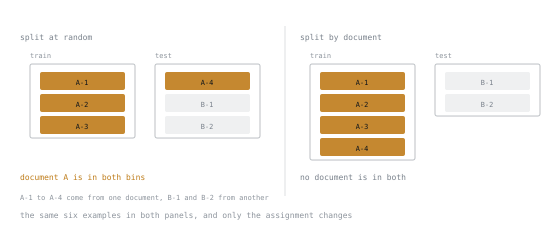

# Lesson 22. Contamination and Held-Out Design

**Mission link:** A held-out set you cannot trust is worse than none, because it produces confident wrong decisions.
**Primary source:** [Code: lm-evaluation-harness, EleutherAI](https://github.com/EleutherAI/lm-evaluation-harness)
**Prerequisites:** [Lesson 21](0021-building-the-dataset.md)

## Warm-up

1. ▢ Why deduplicate before splitting?

Check

A duplicate pair straddling the split puts a training example into the held-out set, so held-out performance measures memorisation.

2. ▢ What does fine-tuning teach badly?

Check

New facts, reasoning not already present, current information, and precise calculation. It teaches format, tone and consistency well.

3. ▢ Which checkpoint do you ship?

Check

The one at the held-out minimum, which presupposes a held-out set you can trust.

## Know this

### Two kinds of contamination

**Your contamination.** Test examples that also appear, exactly or nearly, in your training set. Entirely under your control, and entirely your fault when it happens.

**Inherited contamination.** Test examples that appeared in the base model's *pretraining* corpus. Not under your control, largely undetectable from outside, and the reason public benchmark scores should be read with suspicion. If a benchmark predates the base model and lives on the public web, assume some exposure.

The practical consequence: **a public benchmark is a weak signal for your decision.** It may measure recall of something the base already saw. Your own held-out data, freshly constructed, is the strong signal, and it is the one thing you can actually trust.

### Splitting properly

Random splitting is the default and it is frequently wrong. What you split *by* determines what generalisation you are measuring.

| Split by | Measures | Use when |
|---|---|---|
| Random example | Generalisation to new examples | Examples are genuinely independent |
| Group or entity | Generalisation to new entities | Multiple examples share a customer, document, author |
| Time | Generalisation to the future | Data has any temporal structure at all |

**Group leakage** is the classic silent failure. Ten examples derived from one source document, split randomly, put some in train and some in test. The model has seen that document's content and its held-out score reflects that. Split by document.

The same six examples are in both panels; only the assignment changes. On the left one document is in both bins, which is the leak, and no amount of held-out discipline elsewhere undoes it.

**Temporal leakage** is the other. Training on data that postdates your test period means the model has seen the future, and your score is optimistic in a way that cannot survive deployment. Any dataset with a time dimension should be split by time, and this is the split people most often skip because random is easier.

### Three splits, not two

- **Train.** What the model fits.
- **Validation.** What you use to choose checkpoints, rank, learning rate, and everything else.
- **Test.** Touched once, at the end, to estimate real performance.

The reason for three is that selecting against a set fits to it. Choose your checkpoint by validation, compare twenty configurations on validation, pick the best, and the validation score is now optimistic by an amount proportional to how many choices you made against it. That is why the test set exists and why it is used once.

**In practice people use two, then wonder why deployment underperforms their evaluation.** The gap is exactly the amount of selection they did.

### Detecting your own contamination

Deduplicate against the test set explicitly, not just within the training set:

1. Normalise: lowercase, collapse whitespace, strip punctuation.
2. Exact-match hash across train and test. Remove any collision from train.
3. Near-duplicate detection with MinHash or embedding similarity, using a threshold you have looked at by hand.
4. **Read the highest-similarity pairs yourself.** Thresholds are guesses; your eyes are the calibration.

Step 4 is the one people skip and it is the one that finds the real problems.

### Sizing the held-out set

Held-out sets are usually too small to support the conclusions drawn from them. The rough shape: distinguishing small differences requires many examples, and the number grows quadratically as the difference you care about shrinks.

| Difference you want to detect | Rough scale needed |
|---|---|
| 10 percentage points | Low hundreds |
| 5 percentage points | Several hundred to a thousand |
| 1 to 2 percentage points | Thousands |

So a 50-example held-out set can tell you whether the model works at all. It cannot tell you whether rank 32 beat rank 16 by two points, and treating it as though it can is a very common error.

The corollary: if you have 200 held-out examples, do not run a twelve-configuration sweep. The sweep's winner is mostly noise, and you have spent compute to select a random configuration.

### Paired comparison

When comparing two models, evaluate both on **the same examples** and compare per-example. Paired comparison removes the variance from example difficulty and detects smaller differences with fewer examples than comparing two independent averages. It costs nothing but bookkeeping.

Keep the per-example results, not just the aggregate. "Model B is 3 points better" is far less useful than "B fixed 14 examples A got wrong and broke 6 A got right", and the six are where you learn something.

## Practice

1. ▢ Distinguish your contamination from inherited contamination, and say what each implies.

Check

Yours: test examples also in your training set. Preventable, detectable, your responsibility.

Inherited: test examples in the base model's pretraining corpus. Not controllable, largely undetectable, and the reason public benchmark scores are weak evidence for your decision.

The implication is to trust freshly built private held-out data over any public benchmark.

2. ▢ Your dataset has 500 examples derived from 50 source documents. You split randomly and get 96% held-out accuracy. What is wrong?

Check

Group leakage. Examples from the same document are in both splits, so the model has seen that document's content and the score reflects recall.

Split by document: all examples from a document go to one side. Expect the honest number to be substantially lower.

3. ▢ Why three splits rather than two?

Check

Because selecting against a set fits to it. Every checkpoint choice and configuration comparison made on validation makes the validation score optimistic.

The test set is untouched until the end, so it gives an unbiased estimate. With only two splits, your reported number includes all your selection, which is precisely the gap people see between evaluation and deployment.

4. ▢ You have 80 held-out examples and want to know whether rank 64 beats rank 16. Can you?

Check

Not unless the difference is very large. Eighty examples can support detecting a swing of ten points or more; the difference between two reasonable ranks is usually a few points at most.

Either get more held-out data or accept that this question is unanswerable with what you have. Answering it anyway produces a confidently wrong decision.

5. ▢ Which split most often gets skipped, and what does skipping it cost?

   - a) Splitting the data by time when it has temporal order
   - b) Splitting the data randomly across all available examples
   - c) Splitting the data by output length into balanced buckets
   - d) Splitting the data by which annotator produced the label

Check

**a)** Splitting the data by time when it has temporal order.

Random is easier and is the default, so temporal structure gets ignored. The cost is training on data that postdates the test period: the model has seen the future, and the score cannot survive deployment.

6. ▢ Why is paired comparison better than comparing two averages?

Check

It removes variance due to example difficulty by comparing the two models on the same items, so it detects smaller differences with fewer examples.

It also produces the more useful artifact: which specific examples improved and which regressed. The regressions are where the learning is.

## Real-world reps

- [ ] Check your dataset for a grouping structure: document, customer, author, session. If one exists, re-split by it and compare the two held-out numbers.
- [ ] Run near-duplicate detection between train and test. Read the twenty highest-similarity pairs by hand.
- [ ] Split into three sets and write down the rule for what each may be used for. Then stick to it.
- [ ] Tomorrow: compute how many held-out examples you would need to detect the difference you actually care about. Compare to how many you have.

## Going further

- [Code: lm-evaluation-harness, EleutherAI](https://github.com/EleutherAI/lm-evaluation-harness)
- [Docs: Splitting datasets, Hugging Face Datasets](https://huggingface.co/docs/datasets/main/en/process)
- [Lesson 23. Metrics That Mean Something](0023-metrics-that-mean-something.md)

---

Not landing? Reread the primary source at the top, since this lesson compresses it and compression is where understanding leaks. Check the [glossary](../GLOSSARY.md) for any term that felt slippery.

If the lesson itself is unclear rather than the material, that is a defect: [open an issue](https://github.com/TokenCemetery/teach/issues).
