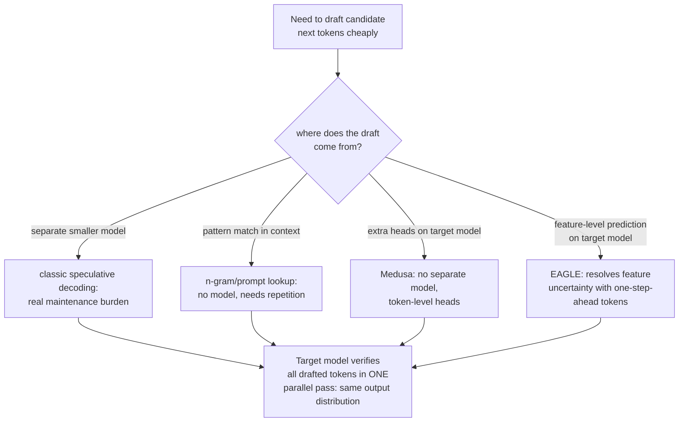

# Lesson 18. Speculative Decoding

**Mission link:** Stage 1 established why generating one token at a time is expensive: every step reloads the model's full weights from memory, and the arithmetic itself is cheap by comparison. **Speculative decoding** is the main latency lever this arc never mentioned, and it exploits exactly that imbalance: verifying several guessed tokens in one pass costs about what generating one token normally costs, so a correct guess is nearly free extra throughput.
**Primary source:** [Paper: "Fast Inference from Transformers via Speculative Decoding", Leviathan et al., 2022](https://arxiv.org/abs/2211.17192)
**Prerequisites:** [Lesson 1](0001-the-kv-cache.md), [Lesson 6](0006-throughput-latency-tradeoff.md)

## Warm-up

1. ▢ Why does decoding one token at a time reload the model's full weights from memory at every single step?

Check

Each new token depends on the previous one's output, so the model has to run its full forward pass again for every token, moving its parameters from memory to the compute unit each time, rather than being able to batch that memory movement across multiple steps.

2. ▢ How does batch size trade throughput against per-token latency?

Check

A larger batch lets the same weight-loading cost be amortized across more concurrent requests, raising total throughput, but each individual request's own tokens may take longer to arrive since the batch has to be processed together, raising per-token latency for any one request in it.

## Know this

### Verifying K tokens in parallel costs about what generating one token costs

Decoding is **memory-bandwidth-bound**: the dominant cost of one generation step is moving the model's weights from memory to the compute unit, not the matrix arithmetic itself, which is comparatively cheap. This means scoring several candidate next-token positions in one forward pass, checking whether a whole sequence of guesses was right, costs roughly the same as scoring just one, since the same weights get loaded either way. **Speculative decoding** exploits this directly: a small, cheap **draft model** proposes several tokens ahead, and the large **target model** verifies all of them in a single parallel pass, rather than generating them one at a time itself.

### The output is exact, not approximate

The paper's own framing is specific that this isn't a quality trade-off: its sampling method makes exact decoding from the large model faster, without changing the output distribution at all. Wherever the draft model's guess matches what the target model would have sampled anyway, it's accepted; wherever it doesn't, a corrective resampling step produces the same result the target model alone would have produced at that position. The end-to-end output is provably identical to running the target model by itself, token by token; only the wall-clock cost changes, since the target model's own expensive forward pass now gets to verify multiple draft tokens instead of producing just one.

### The draft doesn't have to come from a whole separate model

A draft model (a smaller, cheaper version of the target model) is the original design, but it comes with real operational cost: acquiring and maintaining an entire second model, kept compatible as the target model changes, is its own burden. **N-gram** (prompt-lookup) drafting sidesteps this by using no model at all: it looks for a span in the existing prompt or generated context that matches the last few tokens, and speculates that whatever followed that span before will follow again. This works well specifically when a task involves real repetition (editing code, referencing a long document) and buys nothing when there's no repetition to exploit, but it needs no model, no training, and no maintenance at all.

### Medusa and EAGLE draft from the target model itself instead of a separate one

**Medusa** removes the separate-draft-model burden a different way: instead of a whole second model, it adds extra decoding heads directly onto the target model, each one predicting one of the next several token positions in parallel from the same forward pass, with no separate model to acquire or keep synchronized at all. **EAGLE** refines this further: it observed that predicting at the level of the model's own internal features (its hidden representations) is more tractable than predicting raw tokens directly, but that feature-level prediction alone carries real uncertainty; EAGLE resolves that uncertainty by also feeding in the token sequence advanced by one time step, and its own reported results (2.7x to 3.5x latency speedup, roughly doubled throughput on a 70B model) explicitly confirm this comes while maintaining the same output distribution the target model alone would have produced.

### Every variant makes the same trade in a different place

Draft-model speculative decoding, n-gram drafting, Medusa, and EAGLE all accept some fraction of wasted verification (a rejected guess costs a little extra work for no benefit) in exchange for a real chance at generating several tokens per expensive forward pass instead of one. What differs between them is only where the draft actually comes from: a separate smaller model, pattern-matching the existing context, extra heads on the same model, or a feature-level predictor on the same model corrected by one-step-ahead tokens. None of them change what gets generated; all of them change how many of the target model's genuinely expensive forward passes it takes to generate it.

## Practice

1. ▢ Why does verifying 4 candidate tokens in one forward pass cost roughly the same as generating a single token normally, rather than 4 times as much?

Hint

Consider what actually dominates the cost of one decoding step in the first place.

Check

Decoding is memory-bandwidth-bound: the dominant cost is moving the model's weights from memory, which happens once regardless of how many candidate positions are scored in that same pass. Scoring 4 positions instead of 1 adds a comparatively small amount of extra arithmetic on top of a memory-movement cost that was going to be paid either way.

2. ▢ A team worries that speculative decoding trades output quality for speed, since it involves a smaller, less capable model guessing tokens. Is this concern accurate?

Check

No. The paper's method is specifically designed so the final output distribution is identical to running the target model alone; a correct draft guess is accepted, and an incorrect one is corrected by resampling, so the end result matches what the target model would have produced by itself, with no quality trade-off, only a latency change.

3. ▢ Why might n-gram (prompt-lookup) drafting be a better fit for a code-editing task than for open-ended creative writing?

Check

N-gram drafting speculates that a span matching the last few tokens will be followed by whatever followed it before elsewhere in the context; code editing and similar repetitive tasks have much more of this kind of literal repetition to exploit than open-ended creative writing does, where n-gram drafting would rarely find a matching span to speculate from.

4. ▢ What specific problem does Medusa solve relative to the original draft-model approach, and what does EAGLE add on top of Medusa's approach?

Check

Medusa removes the burden of acquiring and maintaining a separate draft model, by adding extra decoding heads directly onto the target model instead. EAGLE further improves prediction accuracy by drafting at the level of the model's internal features rather than raw tokens, resolving the extra uncertainty that comes with feature-level prediction by also incorporating the token sequence advanced by one time step.

5. ▢ Which claim correctly describes what's common across draft-model, n-gram, Medusa, and EAGLE speculative decoding?

    - a) Each variant trades some output quality for additional speed, in different amounts
    - b) All of them draft candidate tokens cheaply, from different sources, then let the target model verify them in one parallel pass that costs about what generating one token costs, preserving the exact output distribution the target model alone would produce
    - c) Only the original draft-model approach preserves the exact output distribution; the newer variants are approximations
    - d) N-gram drafting requires training a small neural network on the target model's own outputs

Check

**b)** That's the shared mechanism and guarantee across every variant this lesson covers. (a) is false: every variant preserves the target model's exact output distribution; none of them trade quality for speed. (c) is false: Medusa and EAGLE both explicitly report matching the target model's output distribution, same as the original approach. (d) is false: n-gram drafting needs no model or training at all, only pattern matching against the existing context.

## Real-world reps

- [ ] For a serving stack you have access to (vLLM or otherwise), check whether it supports speculative decoding, and if so, which variant (draft model, n-gram/prompt-lookup, or a head-based method).
- [ ] For a workload you're familiar with, judge whether it has enough literal repetition (code, structured documents) for n-gram drafting to help, or whether a draft model or head-based method would be a better fit.
- [ ] Tomorrow: read the primary source's section on acceptance rate in full, and note what determines how often the draft model's guesses actually get accepted, and how that acceptance rate translates into an actual speedup.

## Going further

- [Paper: "Fast Inference from Transformers via Speculative Decoding", Leviathan et al., 2022](https://arxiv.org/abs/2211.17192)
- [Paper: "Medusa: Simple LLM Inference Acceleration Framework with Multiple Decoding Heads", Cai et al., 2024](https://arxiv.org/abs/2401.10774)
- [Paper: "EAGLE: Speculative Sampling Requires Rethinking Feature Uncertainty", Li et al., 2024](https://arxiv.org/abs/2401.15077)
- [Resources](../RESOURCES.md)

---

Not landing? Reread the primary source at the top, since this lesson compresses it and compression is where understanding leaks. Check the [glossary](../GLOSSARY.md) for any term that felt slippery.

If the lesson itself is unclear rather than the material, that is a defect: [open an issue](https://github.com/TokenCemetery/teach/issues).
