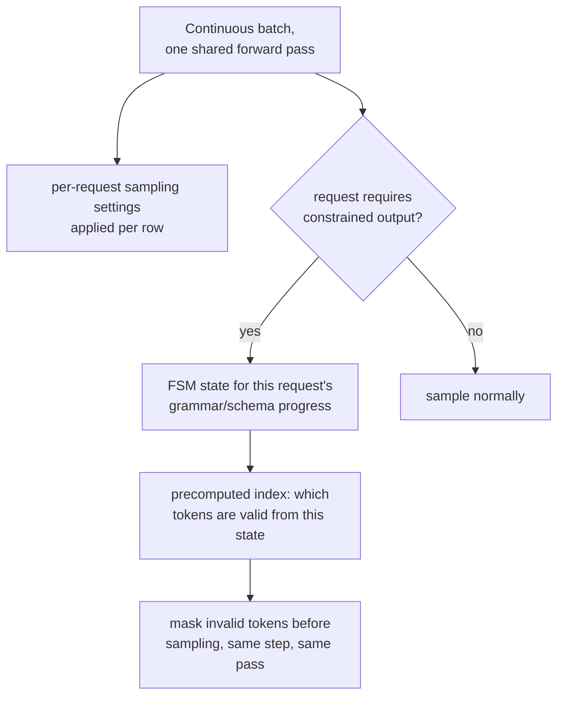

# Lesson 19. Sampling and Constrained Decoding at Serve Time

**Mission link:** Stage 2 established continuous batching: many requests share one forward pass so the server's expensive weight-loading cost is amortized across all of them. This lesson covers two things that pass has to do per request, not uniformly across the whole batch: apply each request's own sampling settings, and, when asked, guarantee a request's output is always valid JSON or matches a grammar, without adding real per-token cost to get there.
**Primary source:** [Paper: "Efficient Guided Generation for Large Language Models" (Outlines), Willard and Louf, 2023](https://arxiv.org/abs/2307.09702)
**Prerequisites:** [Lesson 4](0004-static-vs-continuous-batching.md), [Lesson 18](0018-speculative-decoding.md)

## Warm-up

1. ▢ Why does continuous batching beat static batching for a mixed-length request stream?

Check

Static batching waits for every request in a fixed batch to finish before starting a new one, wasting GPU time on slots whose requests already completed. Continuous batching instead adds and removes individual requests from the running batch as they arrive and finish, keeping the batch full of active work rather than idling on already-finished slots.

2. ▢ Why does verifying several candidate tokens in one parallel pass cost about what generating one token normally costs?

Check

Decoding is memory-bandwidth-bound: the dominant cost of a step is moving the model's weights, which happens once regardless of how many candidate positions get scored in that same pass, so scoring several instead of one adds comparatively little extra cost.

## Know this

### Sampling settings live per request, inside one shared batch

Each request in a continuous batch can ask for its own temperature, top-k, and top-p (lesson 18's llm/transformers-level concepts, applied here at serve time), and the serving engine has to apply the right settings to each row of the batch's shared forward pass, not one uniform setting for everyone sharing that step. This is a real per-request bookkeeping cost layered on top of the batch, since two requests sitting side by side in the same forward pass can end up sampling from their next-token distributions in completely different ways.

### Constrained decoding: masking invalid tokens, the same idea causal masking already used

**Constrained (guided) decoding** guarantees a request's output always matches a required structure, valid JSON, a specific grammar, by masking out every token that would violate that structure before sampling happens at all, the same underlying idea as masking a future position's score before softmax: forbidden options get driven out of contention rather than being sampled and then checked afterward. The difference is what decides the mask: a causal mask is the same fixed pattern every time; a grammar constraint's mask changes at every step, since which tokens are valid next depends on how much of the required structure has already been produced.

### An FSM-based index is what keeps this cheap per token

The naive way to build that per-step mask, checking every token in the vocabulary against the grammar fresh at each step, would add real, possibly serious overhead to every single token generated. The primary source's actual contribution is reframing constrained generation as transitions between the states of a **finite-state machine**, which lets an **index** be built once, ahead of time, over the model's entire vocabulary: for each FSM state, which tokens are valid transitions is precomputed rather than recomputed from scratch at every step. This is what the paper means by adding little overhead to token generation while still guaranteeing the output's structure exactly, rather than trading a slow, correct implementation against a fast, unreliable one.

### The guarantee is structural, not a hope that the model behaves

Because invalid tokens are masked out of the distribution before sampling, not corrected after the fact, the output's structure is guaranteed by construction: there's no way for the model to produce invalid JSON or a grammar violation, since the tokens that would produce one were never eligible to be sampled at that step. This is a stronger guarantee than prompting a model to "please output valid JSON" and hoping, the same way lesson 3's causal mask (in the architecture this workspace serves rather than derives) makes attending to the future structurally impossible rather than merely discouraged.

### The real cost is a per-token constant, not a per-request afterthought

Because the FSM index is precomputed once per grammar (or schema) rather than per request, the per-token cost of enforcing it at serve time is a small, roughly constant amount of extra bookkeeping applied to the same forward pass every other token already needed, not a separate expensive step. This is exactly the kind of cost a defended latency budget (stage 6) has to account for explicitly: a workload that constrains a meaningful fraction of its requests should measure that constant overhead the same way it measures reranking's cost (a different workspace's decision framework, but the same discipline) rather than assuming structured output is free just because the guarantee itself is strong.

## Practice

1. ▢ Two requests sit in the same continuous batch's forward pass, one with temperature 0.2 and one with temperature 1.0. Can the server apply one shared sampling setting to both, the way it applies one shared set of weights to both?

Hint

Consider what varies per request versus what's shared across the whole batch.

Check

No. The model weights are shared across the whole batch, but sampling settings are per-request; the server has to apply each row's own temperature (and top-k/top-p) to that row's own next-token distribution within the same shared forward pass, not one uniform setting for every request in it.

2. ▢ Why does the naive approach to constrained decoding, checking every vocabulary token against the grammar fresh at each step, risk adding serious overhead?

Check

Checking a potentially large vocabulary against the grammar's current requirements from scratch at every single generated token is real, repeated work on top of the model's own forward pass; without precomputing anything, this cost is paid in full at every step rather than being reduced to a fast lookup.

3. ▢ What does the Outlines paper's finite-state-machine reframing let it precompute, and why does that keep per-token overhead low?

Check

It lets an index be built once, ahead of time, over the model's vocabulary, mapping each FSM state to the tokens that are valid transitions from it. At generation time, checking which tokens are allowed becomes a lookup into this precomputed index rather than a fresh check against the grammar from scratch, which is what keeps the added overhead small.

4. ▢ Why is masking invalid tokens before sampling a stronger guarantee than prompting a model to produce valid JSON and checking the result afterward?

Check

Masking makes an invalid token structurally impossible to sample in the first place, since it's removed from the distribution before sampling happens at all; a model merely instructed to produce valid output can still fail to follow the instruction, since nothing prevents it from sampling an invalid token, it's just been asked not to.

5. ▢ Which claim correctly describes sampling and constrained decoding at serve time?

    - a) Sampling settings are shared across an entire batch, the same as the model weights
    - b) Sampling settings apply per request within a shared batch, and constrained decoding masks invalid tokens before sampling using a precomputed finite-state-machine index, keeping the per-token cost small and the structural guarantee absolute rather than merely encouraged
    - c) Constrained decoding checks the model's output against the grammar after generation completes, retrying if it's invalid
    - d) An FSM-based index has to be rebuilt from scratch at every generated token

Check

**b)** That's the precise mechanism and guarantee this lesson establishes. (a) is false: sampling settings are specifically per-request, unlike the shared model weights. (c) is false: constrained decoding masks invalid tokens before sampling, not after generation completes. (d) is false: the whole point of the FSM index is that it's built once and reused as a fast lookup at every step, not recomputed each time.

## Real-world reps

- [ ] For a serving stack you have access to, check whether it supports per-request sampling parameters in a batched request stream, and whether it offers any constrained or guided decoding option (JSON schema, grammar, or regex).
- [ ] If it supports constrained decoding, measure the added per-token latency of a constrained request against an unconstrained one on the same prompt, and check whether that overhead is small enough to ignore for your workload's budget.
- [ ] Tomorrow: read the primary source's section on context-free grammars in full, and note what kind of structure (beyond JSON Schema's usual regular constraints) a full CFG can enforce that a simple regex-based constraint can't.

## Going further

- [Paper: "Efficient Guided Generation for Large Language Models" (Outlines), Willard and Louf, 2023](https://arxiv.org/abs/2307.09702)
- [Resources](../RESOURCES.md)

---

Not landing? Reread the primary source at the top, since this lesson compresses it and compression is where understanding leaks. Check the [glossary](../GLOSSARY.md) for any term that felt slippery.

If the lesson itself is unclear rather than the material, that is a defect: [open an issue](https://github.com/TokenCemetery/teach/issues).
