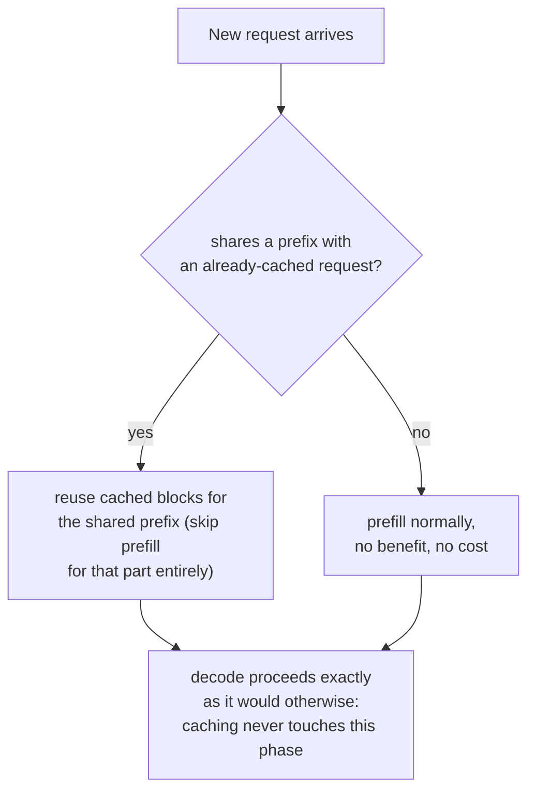

# Lesson 20. Prefix Caching

**Mission link:** Lesson 11 showed parallel samples of the *same* request sharing one prompt's cached blocks through their block tables. **Prefix caching** is that identical sharing mechanism, applied across requests that were never related to begin with, whenever they happen to start with the same tokens, a system prompt, a long document, an earlier turn of the same conversation.
**Primary source:** [Docs: "Automatic Prefix Caching", vLLM Project](https://docs.vllm.ai/en/latest/features/automatic_prefix_caching.html)
**Prerequisites:** [Lesson 11](0011-pagedattention.md), [Lesson 5](0005-request-scheduling.md)

## Warm-up

1. ▢ In PagedAttention, what lets two different sequences' block tables point at the same physical block?

Check

Because a sequence reaches its cache indirectly through its block table rather than assuming a fixed physical layout, two block tables can point at the same physical block whenever its content is identical, most commonly a shared prompt prefix, until one sequence's generation diverges and triggers a copy-on-write.

2. ▢ Why is prefill compute-bound while decode is memory-bandwidth-bound?

Check

Prefill processes an entire prompt in one large, parallel forward pass, so there's enough work per byte read to keep the GPU's compute busy. Decode computes only one new token per step, so each step's memory traffic dominates the small amount of new compute.

## Know this

### The same block-sharing idea, but across requests that were never related

Lesson 11's block sharing applied within one request: several parallel samples of the same prompt, all pointing their block tables at the same physical blocks for the identical prompt they share. **Prefix caching** (vLLM calls its version **Automatic Prefix Caching**, APC) is the identical mechanism applied more broadly: whenever a *new*, otherwise unrelated request happens to start with the same tokens as something already cached, its block table can point at those existing blocks too, skipping the computation of the shared part entirely rather than reprocessing it from scratch.

### Two workloads where this is a large, not marginal, win

The primary source names two cases where prefix caching provides a large benefit specifically because the shared prefix is both long and reused constantly. **Long document query**: many different questions are asked against the same long document (a manual, a report); without caching, every single question would reprocess the entire document's prefill from scratch, while with caching, the document is prefilled once and every subsequent question reuses that cache, paying only for its own short question and the document's already-cached prefix. **Multi-round conversation**: each new turn in a chat session would otherwise require reprocessing the entire conversation history again; caching lets each new turn reuse everything already processed in earlier turns, paying only for what's actually new.

### The gain lands specifically on prefill, never on decode

The source is explicit about this limit: prefix caching only reduces the time spent processing queries, the prefill phase, and does not reduce the time spent generating new tokens, the decode phase, at all. This follows directly from what prefill and decode each actually cost: prefill's cost comes from computing the KV cache for tokens that were already there to be read, which caching can skip entirely for an identical prefix; decode's cost comes from the sequential, memory-bandwidth-bound nature of generating each new token one at a time (lesson 18's problem, which is what speculative decoding addresses instead), work that has nothing to do with any prefix and that caching a shared prefix can't touch at all.

### When it doesn't help, it doesn't hurt either, it just doesn't apply

Prefix caching provides no benefit, but also no cost, in two situations: when a workload spends most of its time generating a long answer rather than processing the input (decode dominates, and caching never touched decode to begin with), or when new requests simply don't share a prefix with anything already cached (there's nothing to reuse). Neither case is a failure of the mechanism; they're simply outside what a cache keyed on shared prefixes was ever built to speed up.

## Practice

1. ▢ A chatbot's users each ask one-off questions with no shared system prompt or conversation history between them. Would enabling prefix caching help this workload?

Hint

Consider what prefix caching actually requires to provide any benefit at all.

Check

No, or not meaningfully: prefix caching only helps when requests share a prefix with something already cached. If every request's content is genuinely unrelated to every other's, there's nothing to reuse, so enabling it costs nothing but also buys nothing.

2. ▢ A long-document QA workload asks 50 different questions against the same 10,000-token manual. Without prefix caching, what has to happen 50 times that caching would let happen only once?

Check

The 10,000-token manual's entire prefill, computing its KV cache, would otherwise be redone from scratch for every one of the 50 questions. With prefix caching, the manual is prefilled once, and all 50 questions reuse that same cached prefix, each paying only for its own short question on top of it.

3. ▢ A workload's requests share a long, identical prefix, but each request also generates a very long answer afterward. Why might enabling prefix caching produce only a modest overall speedup, even though the prefix match is perfect?

Check

Prefix caching only speeds up the prefill phase; if most of the request's total time is actually spent in decode, generating that long answer token by token, the phase caching can't touch at all, then even a perfectly cached prefix only removes a small fraction of the request's total processing time.

4. ▢ Why can't prefix caching reduce decode time, even in principle, the way it reduces prefill time for a shared prefix?

Check

Decode's cost comes from the sequential, memory-bandwidth-bound work of generating each new token one at a time, which has nothing to do with reprocessing any prefix; there's no redundant, already-computed prefill work for a cache to skip during decode, since every decoded token is genuinely new.

5. ▢ Which claim correctly describes prefix caching's relationship to PagedAttention's block sharing from lesson 11?

    - a) Prefix caching is an entirely separate mechanism from PagedAttention's block sharing, requiring its own memory manager
    - b) Prefix caching is the same block-sharing mechanism lesson 11 described for parallel samples of one request, extended across otherwise unrelated requests that happen to share a prefix, and it speeds up prefill specifically, never decode
    - c) Prefix caching speeds up both prefill and decode equally for any request sharing a cached prefix
    - d) Prefix caching only works within a single request, the same scope lesson 11 already covered

Check

**b)** That's the precise relationship and limit this lesson establishes. (a) is false: it's the identical block-table-sharing mechanism, just applied across a broader set of requests. (c) is false: the source is explicit that decode time is untouched. (d) is false: prefix caching's whole point is extending sharing beyond a single request to any request with a matching prefix.

## Real-world reps

- [ ] For a serving stack you have access to, check whether prefix caching (or an equivalent feature) is enabled, and whether your workload's requests actually share meaningful prefixes (a system prompt, a shared document, conversation history) that would benefit from it.
- [ ] Estimate, for a workload you know, roughly what fraction of total per-request time is prefill versus decode, and use that to judge how much prefix caching could plausibly help even with a perfect prefix match.
- [ ] Tomorrow: read the primary source's linked design document on how vLLM implements prefix caching internally, and note what it uses as the cache key for matching a new request's prefix against existing cached ones.

## Going further

- [Docs: "Automatic Prefix Caching", vLLM Project](https://docs.vllm.ai/en/latest/features/automatic_prefix_caching.html)
- [Paper: "Efficient Memory Management for Large Language Model Serving with PagedAttention", Kwon et al., SOSP 2023](https://arxiv.org/abs/2309.06180)
- [Resources](../RESOURCES.md)

---

Not landing? Reread the primary source at the top, since this lesson compresses it and compression is where understanding leaks. Check the [glossary](../GLOSSARY.md) for any term that felt slippery.

If the lesson itself is unclear rather than the material, that is a defect: [open an issue](https://github.com/TokenCemetery/teach/issues).
