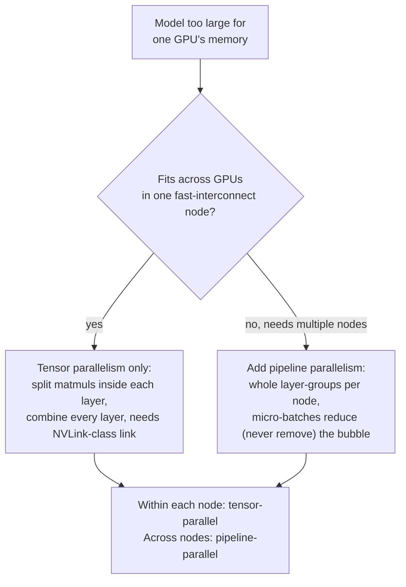

# Lesson 21. Tensor and Pipeline Parallelism

**Mission link:** Lesson 12 introduced `--tensor-parallel-size` as the flag that lets a model too large for one GPU run across several, and stopped there. This lesson opens up the mechanism inside that flag, **tensor parallelism**, introduces the other way to split a model across devices, **pipeline parallelism**, and gives a decision procedure for choosing between them, or combining both, instead of reaching for whichever one shows up first in a tutorial.
**Primary source:** [Paper: "Megatron-LM: Training Multi-Billion Parameter Language Models Using Model Parallelism", Shoeybi et al., 2019](https://arxiv.org/abs/1909.08053), [Paper: "GPipe: Efficient Training of Giant Neural Networks using Pipeline Parallelism", Huang et al., 2018](https://arxiv.org/abs/1811.06965)
**Prerequisites:** [Lesson 12](0012-vllm-tuning-knobs.md)

## Warm-up

1. ▢ What did lesson 12 say `--tensor-parallel-size` does, at the level it was taught?

Check

It splits a model's weights, and the compute over them, across multiple GPUs, so a model too large to fit on one GPU's memory can run across several, e.g. a 70B model's fp16 weights spread across two 80 GB GPUs with `--tensor-parallel-size 2`. Lesson 12 stopped there: no explanation of how a matrix multiply is actually divided, and no mention of any alternative way to split a model.

2. ▢ Why does combining tensor parallelism with quantization make sense, rather than treating them as competing options?

Check

Quantization shrinks how much memory the model needs in the first place; tensor parallelism spreads whatever memory footprint remains across more GPUs. They act on different axes of the same constraint (how much memory is needed vs. how much memory is available per device), so a model can be quantized and split at the same time.

## Know this

### Tensor parallelism actually splits the matrix multiplies inside a layer

Megatron-LM's contribution is an **intra-layer** model-parallel scheme: rather than putting whole layers on different GPUs, it splits the large matrix multiplications *inside* a single transformer layer's attention and MLP blocks across GPUs, and has each GPU compute its own slice of the result in parallel. A weight matrix is partitioned either by columns or by rows (the two partition styles are chosen together, per block, specifically so the output of one partition style feeds directly into the other without needing a synchronization step in between); after both GPUs finish their local slice of the computation, one communication step combines the partial results back into the same value every GPU would have gotten from an unsplit computation. The paper is explicit that this needs no new compiler or library, "the insertion of a few communication operations in native PyTorch" is enough, because the split only changes how the matrix multiply's work is divided, not what the layer computes.

### That combining step is a synchronization point on the critical path, every layer

The communication step that recombines each GPU's partial result isn't optional bookkeeping done once at start-up: it has to happen at specific points inside every transformer layer, every forward pass, before the next stage of computation can proceed, because each GPU only holds a slice of the true intermediate value until the results are combined. This is why tensor parallelism's communication cost scales with how many layers a model has and how many tokens are being processed, and why it needs a fast interconnect between the GPUs involved (like NVLink within one server) to avoid that per-layer synchronization becoming the bottleneck. It's also why tensor parallelism is normally kept to GPUs within a single node: stretching that same per-layer synchronization across a slower network link (between nodes) turns a fast local combine into a slow round trip repeated every layer.

### Pipeline parallelism splits the other way: whole layers, not inside them

**Pipeline parallelism** partitions a different axis of the same problem: instead of splitting what happens inside one layer, it partitions the model's *sequence of layers* into consecutive groups (GPipe's own framing: any network expressible as a sequence of layers can be split this way), and places each group on a different accelerator. Data flows through the devices in order, device 1's output becomes device 2's input, the same way the layers would run in order on a single device, except each group now lives on its own GPU. Unlike tensor parallelism, no single layer's computation is ever split, so there's no per-layer combine step; communication only happens at the boundary between one device's group of layers and the next.

### Naive pipelining idles most of the fleet; micro-batching is the fix

Splitting layers across devices this way has an obvious problem: while device 2 is working on the batch's data, device 1 sits idle waiting for device 2 (and later devices) to finish before the next batch can start, and the reverse happens on the way back during backpropagation. GPipe's fix is to split each batch into smaller **micro-batches** and pipe them through the device sequence one after another, so that by the time device 1 finishes micro-batch 1 and hands it to device 2, device 1 is already starting micro-batch 2 instead of waiting. This keeps more of the fleet busy at once, though it can never eliminate idle time entirely: there's still a startup delay before every device has work (filling the pipeline) and a drain delay at the end (emptying it), the **pipeline bubble**, which shrinks as more micro-batches flow through but never fully disappears.

### Choosing (or combining) them is a question about what's actually scarce

Tensor parallelism trades a fast, frequent, per-layer synchronization for the ability to split within a layer, which is why it wants a fast interconnect and is normally kept inside one node. Pipeline parallelism trades a pipeline bubble (some idle time, worse for small batches) for communication that only happens at group boundaries, which tolerates a slower link and is what lets a model span multiple nodes at all. A model that fits across the GPUs of a single fast-interconnect node needs only tensor parallelism; a model too large for that reaches for pipeline parallelism to span additional nodes, and production multi-node deployments commonly combine both: tensor-parallel within each node (fast link, per-layer splits), pipeline-parallel across nodes (slower link, whole-layer-group boundaries only). This is the same "what's actually the constraint" discipline lesson 12 already applied to its own tuning knobs, applied here to a choice between two axes of splitting a model rather than between two flags on one axis.

## Practice

1. ▢ A model's attention and MLP weight matrices are split across 4 GPUs using tensor parallelism. What has to happen after each GPU computes its local slice of a matrix multiply, before the next stage of the layer can proceed?

Hint

Each GPU only holds part of the true result until something happens.

Check

A communication step combines every GPU's partial result back into the single value the full, unsplit computation would have produced. This has to happen at specific points inside every layer, every forward pass, since the next stage of computation needs the combined value, not any one GPU's partial slice of it.

2. ▢ Why does tensor parallelism need a fast interconnect like NVLink, while pipeline parallelism can tolerate a slower link between nodes?

Check

Tensor parallelism's combine step happens every layer, every forward pass, so its communication is frequent and sits on the critical path; a slow link turns that into a repeated bottleneck. Pipeline parallelism only communicates at the boundary between one device's group of layers and the next, far less often, so it tolerates a slower link, which is exactly what lets it span multiple nodes.

3. ▢ A team pipelines a model's layers across 4 GPUs but sends the entire batch through as one single unit rather than splitting it into micro-batches. What happens to GPU 1 while GPU 4 is processing that batch?

Check

GPU 1 sits idle: it already finished its own group of layers for that batch and has nothing else to do until the whole batch finishes moving through the remaining GPUs and a new batch arrives. Splitting the batch into micro-batches is what lets GPU 1 start on the next micro-batch instead of idling.

4. ▢ Does splitting a batch into more micro-batches eliminate the pipeline bubble entirely, or only shrink it?

Check

Only shrink it. There's still a startup delay before every device in the pipeline has work to do, and a drain delay at the end after the last micro-batch has passed through, regardless of how many micro-batches the batch is split into; more micro-batches make that idle fraction smaller relative to total work, but never remove it.

5. ▢ A model fits comfortably across the 8 fast-interconnected GPUs of a single server. Which claim correctly describes the parallelism choice this calls for?

    - a) Pipeline parallelism only, since it's newer than tensor parallelism
    - b) Tensor parallelism alone is sufficient: the fast intra-node link tolerates its frequent per-layer combine step, and there's no second node for pipeline parallelism to span
    - c) Both are required whenever a model needs more than one GPU, with no case where only one applies
    - d) Neither applies; only quantization can address a model too large for one GPU

Check

**b)** That's the decision procedure this lesson establishes. (a) is false: recency isn't the criterion, interconnect speed and how many nodes are involved are. (c) is false: a single fast-interconnect node needs only tensor parallelism, pipeline parallelism earns its keep specifically when spanning multiple nodes. (d) is false: quantization shrinks the memory footprint but doesn't split compute across devices the way either parallelism scheme does, and lesson 12 already established they combine rather than substitute for each other.

## Real-world reps

- [ ] For a multi-GPU serving stack you have access to, check whether it exposes separate flags for tensor-parallel and pipeline-parallel degree (vLLM's `--tensor-parallel-size` and `--pipeline-parallel-size` are one example), and note which one is actually set and why.
- [ ] If you have access to a multi-node GPU cluster, check the interconnect between GPUs within one node versus between nodes (NVLink vs. Ethernet/InfiniBand bandwidth), and use this lesson's decision procedure to judge whether the deployment's tensor/pipeline split matches that hardware.
- [ ] Tomorrow: read the Megatron-LM paper's section describing exactly which two partition styles (column vs. row) it uses for the attention block's projections, and note why that specific pairing avoids an extra synchronization step between them.

## Going further

- [Paper: "Megatron-LM: Training Multi-Billion Parameter Language Models Using Model Parallelism", Shoeybi et al., 2019](https://arxiv.org/abs/1909.08053)
- [Paper: "GPipe: Efficient Training of Giant Neural Networks using Pipeline Parallelism", Huang et al., 2018](https://arxiv.org/abs/1811.06965)
- [Resources](../RESOURCES.md)

---

Not landing? Reread the primary source at the top, since this lesson compresses it and compression is where understanding leaks. Check the [glossary](../GLOSSARY.md) for any term that felt slippery.

If the lesson itself is unclear rather than the material, that is a defect: [open an issue](https://github.com/TokenCemetery/teach/issues).
