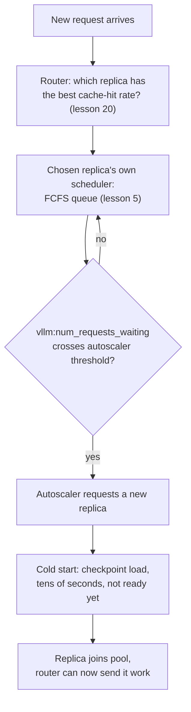

# Lesson 22. Fleet-Level Serving

**Mission link:** Lesson 5 taught how one server's scheduler picks the next waiting request out of its own queue. A fleet of many such servers adds three problems lesson 5 never had to solve: which server a request goes to at all (**routing**), when to add or remove servers (**autoscaling**), and what it costs to bring a new server online (a **cold start**, dominated by **model load time**). This lesson covers all three, and why they have to be reasoned about together, not separately.
**Primary source:** [Docs: "Autoscaling with KEDA" and "KV Cache Aware Routing", vLLM Production Stack](https://docs.vllm.ai/projects/production-stack), [Paper: "ServerlessLLM: Low-Latency Serverless Inference for Large Language Models", Fu et al., OSDI 2024](https://arxiv.org/abs/2401.14351)
**Prerequisites:** [Lesson 5](0005-request-scheduling.md), [Lesson 20](0020-prefix-caching.md)

## Warm-up

1. ▢ In lesson 5, what policy does a single server's scheduler use to decide which waiting request to admit next?

Check

First-come, first-served (FCFS): requests are admitted into a freed batch slot in arrival order.

2. ▢ What does prefix caching (lesson 20) let a request skip, and on which server does that only work?

Check

It lets a request skip recomputing the prefill for any prefix it shares with something already cached, but only on the specific server that already holds that cached prefix in its own KV cache; the caching lives per server, not fleet-wide.

## Know this

### A fleet inserts a decision before lesson 5's queue: which server at all

Lesson 5's FCFS scheduler only ever had to choose among requests already waiting for one server. A fleet of many servers adds an earlier decision: a **request router** has to pick which server a new request goes to in the first place, before that server's own scheduler ever sees it. Get this choice wrong and one server's queue balloons while another sits idle, no matter how well each server's own scheduler is written.

### Naive routing ignores exactly what lesson 20 already cached

The simple routing policies, round-robin or least-connections, treat every server as interchangeable and route purely on load. But lesson 20 established that a request sharing a prefix with something already cached only gets that speedup on the one server holding the cache; naive load-based routing can send a request to a different, less-loaded server that has to redo the entire prefill from scratch. The vLLM Production Stack's **KV-cache aware routing** fixes this by routing a request to whichever server already has the highest cache-hit rate for it, turning a load-balancing decision into a decision informed by prefix caching, not a separate concern from it.

### Autoscaling turns queue depth into a fleet-sizing decision

Once requests are routed well, a fleet still needs to grow or shrink with demand. The production stack's documented approach scales the number of server replicas off a live queueing metric, `vllm:num_requests_waiting`, exactly the same waiting-queue lesson 5 described, now read per server and fed to an autoscaler (KEDA) with a `minReplicaCount`, `maxReplicaCount`, and a `cooldownPeriod` so replicas aren't added and removed on every small fluctuation. Queueing, in other words, isn't a separate topic from autoscaling: the queue's depth is the signal that tells the fleet it's too small.

### A cold start means a newly added replica isn't actually ready

Adding a replica sounds like it should relieve a deep queue immediately, but ServerlessLLM's measurements show why it doesn't: loading an LLM's checkpoint onto a fresh server is dominated by moving a large checkpoint's weights into memory, a cost that "far exceeds the time required for generating a token during inference" (normally well under 100ms). The paper reports real serverless platforms seeing tens of seconds of latency bringing a large model online, and that over 40% of measured functions in a production trace show a cold-start rate above 25% within a short keep-alive window. A **cold start**, here, isn't about the request queue; it's the gap between "the autoscaler decided to add a replica" and "that replica can actually serve a request," and that gap is set by model load time, not by anything the scheduler or router controls.

### The three decisions have to be reasoned about as one pipeline, not separately

Routing decides which already-running replica serves a request now; autoscaling decides when the fleet's total capacity needs to change; cold-start latency decides how much lead time the autoscaler needs before a new replica is actually useful. Treating autoscaling in isolation, scaling out only once the queue is already deep, means the fleet is still cold-starting new replicas well after the traffic spike that triggered them has already passed, since ServerlessLLM's own numbers show that gap can be tens of seconds long. This is why ServerlessLLM's actual contribution is optimizing the load-time side directly (multi-tier checkpoint loading, keeping checkpoints near the GPU rather than a remote store), the same way this workspace has repeatedly found that the fix for a serving bottleneck lives in the part of the pipeline actually causing it, not in the part that's easiest to tune.

## Practice

1. ▢ A fleet uses plain round-robin routing. A request sharing a long, expensive-to-prefill prefix with a request just served on server A gets routed to idle server B instead. What does server B have to do that it wouldn't have had to if the request had gone to server A?

Hint

Think about what lesson 20's caching actually lives on.

Check

Server B has to prefill the shared prefix from scratch, since prefix caching's speedup only applies on the server that already holds the matching cached blocks; round-robin routing ignores this and can send a cache-friendly request to a server with no relevant cache at all.

2. ▢ Why does the vLLM Production Stack's autoscaling example trigger on `vllm:num_requests_waiting` rather than, say, GPU utilization alone?

Check

The waiting-queue depth is the direct signal that a server (or fleet) has more requests arriving than it can currently admit, which is exactly the condition an autoscaler needs to detect to justify adding capacity; GPU utilization can be high on a healthy, well-sized fleet too, so it doesn't distinguish "busy but keeping up" from "falling behind."

3. ▢ An autoscaler adds a new replica the instant the queue crosses its threshold. Does that replica start serving requests immediately?

Check

No. The replica still has to complete a cold start, loading the model's checkpoint into memory, which ServerlessLLM's measurements show can take tens of seconds for a large model, far longer than a single token's generation time. The replica isn't useful until that load finishes, regardless of how quickly the autoscaler reacted.

4. ▢ Why does ServerlessLLM describe cold-start latency as a separate problem from anything a request scheduler or router controls?

Check

A scheduler decides which waiting request to admit, and a router decides which running replica gets a request; neither has any effect on how long it takes to load a checkpoint onto a brand-new replica. That load time is a property of the checkpoint's size and the storage/network path it has to move across, which is exactly why ServerlessLLM's fix targets the loading path itself (multi-tier, near-GPU checkpoint storage) rather than the scheduler or router.

5. ▢ Which claim correctly describes how routing, autoscaling, and cold starts relate to each other in fleet-level serving?

    - a) They are three independent problems that can be tuned in isolation without affecting each other
    - b) Routing should ignore cache locality entirely, since autoscaling will always add enough capacity to compensate
    - c) Routing picks among already-running replicas using cache locality, autoscaling decides when the fleet's total capacity should change based on queue depth, and cold-start latency sets how much lead time autoscaling needs before a new replica is actually useful
    - d) Cold starts only matter for the very first replica a fleet ever launches

Check

**c)** That's the pipeline this lesson establishes. (a) is false: scaling out too late, without accounting for cold-start lead time, leaves a fleet still catching up after a traffic spike has passed. (b) is false: ignoring cache locality wastes exactly the prefix-caching benefit lesson 20 established, and no amount of autoscaling capacity fixes a cache miss that didn't need to happen. (d) is false: every new replica any autoscaler adds, at any point in a fleet's life, has to cold-start the same way.

## Real-world reps

- [ ] For a multi-replica serving stack you have access to, check whether requests are routed by plain load balancing or by something cache-aware, and whether that matches the workload's actual prefix-sharing pattern.
- [ ] Find the autoscaling trigger metric (if any) your stack scales on, and check whether it's a queue-depth signal like `vllm:num_requests_waiting` or something else like raw utilization.
- [ ] Tomorrow: time how long a fresh replica in your stack takes from "requested" to "serving its first request," and compare that cold-start time against your workload's typical traffic-spike duration.

## Going further

- [Docs: "Welcome to production-stack", vLLM Production Stack](https://docs.vllm.ai/projects/production-stack)
- [Docs: "KV Cache Aware Routing", vLLM Production Stack](https://docs.vllm.ai/projects/production-stack/en/latest/use_cases/kv-cache-aware-routing.html)
- [Docs: "Autoscaling with KEDA", vLLM Production Stack](https://docs.vllm.ai/projects/production-stack/en/latest/use_cases/autoscaling-keda.html)
- [Paper: "ServerlessLLM: Low-Latency Serverless Inference for Large Language Models", Fu et al., OSDI 2024](https://arxiv.org/abs/2401.14351)
- [Resources](../RESOURCES.md)

---

Not landing? Reread the primary source at the top, since this lesson compresses it and compression is where understanding leaks. Check the [glossary](../GLOSSARY.md) for any term that felt slippery.

If the lesson itself is unclear rather than the material, that is a defect: [open an issue](https://github.com/TokenCemetery/teach/issues).
