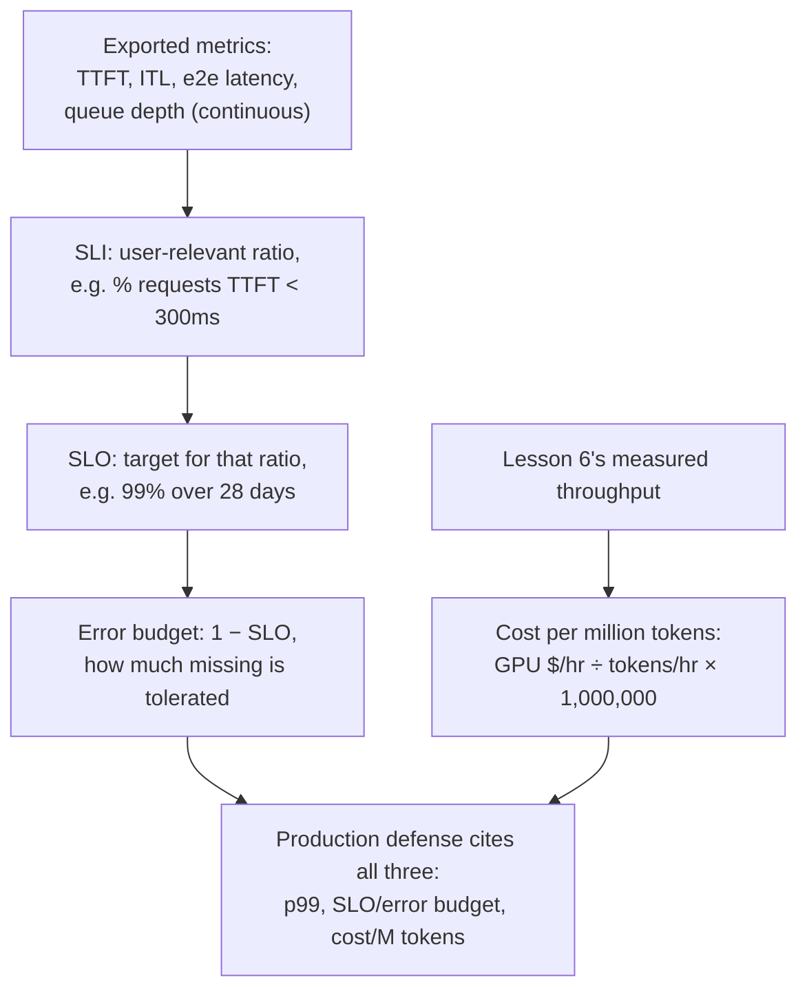

# Lesson 23. Production Observability and Cost

**Mission link:** Lesson 17 showed how to defend one measured p99 figure for one configuration, at one point in time. Running that configuration in production needs three more things lesson 17 never had to cover: metrics **exported continuously**, not measured once; a **service level objective (SLO)** and **error budget** that turn "good enough" into a stated target rather than a one-time benchmark result; and a **cost per million tokens** figure that has to be defended alongside p99, not instead of it.
**Primary source:** [Docs: "Metrics", vLLM Project](https://docs.vllm.ai/en/stable/design/metrics/), [Google SRE Workbook: "Implementing SLOs"](https://sre.google/workbook/implementing-slos/)
**Prerequisites:** [Lesson 16](0016-p99-latency-methodology.md), [Lesson 17](0017-defending-a-latency-budget-end-to-end.md)

## Warm-up

1. ▢ What three things did lesson 17 say a defended latency configuration has to cite?

Check

The measured p99 figures themselves, from a large enough and realistically shaped sample; the memory and batch-size reasoning behind the configuration; and the accuracy number measured for whatever quantization was applied.

2. ▢ Why does lesson 6 say throughput and per-token latency trade against each other via batch size?

Check

A larger batch keeps the GPU busier per step, raising the total tokens produced per second across all requests (throughput), but each individual request's step now shares GPU time with more neighbors, so its own per-token latency grows. Batch size is the shared knob that moves both numbers in opposite directions.

## Know this

### What actually gets exported, continuously, not measured once

Lesson 16's p99 was one number computed from one benchmark run. A production server instead exports metrics continuously so a regression shows up on its own, without anyone re-running a benchmark. vLLM's own metrics documentation lists exactly this set as Prometheus histograms: **time to first token (TTFT)**, **inter-token latency (ITL)**, **end-to-end request latency**, and separate **prefill time** and **decode time**. Each one maps directly onto a phase this workspace already taught: TTFT to prefill and the scheduler (lesson 5), ITL to decode's memory-bandwidth-bound cost (lessons 2 and 3), and the waiting-queue depth behind both to lesson 5's admission queue and lesson 22's autoscaling trigger. Exporting them is what turns lesson 17's one-time diagnostic walk into something that runs continuously, every request, without anyone watching.

### A raw metric isn't a target; an SLI, SLO, and error budget are

A histogram of TTFT values is a measurement, not a decision. The SRE framing turns it into one in three steps. A **service level indicator (SLI)** picks a specific, user-relevant ratio out of that raw data, for example the fraction of requests with TTFT under 300ms, framed from the user's perspective rather than the server's. A **service level objective (SLO)** states a target for that SLI, for example "99% of requests have TTFT under 300ms, measured over a rolling 28 days." An **error budget** is what's left over, 1 minus the SLO: at a 99% SLO, 1% of requests are allowed to miss without anything being considered broken. This is not a looser version of lesson 16's p99 measurement; it's what makes a p99 number actionable in production, a single measured figure with a stated tolerance for how often it's allowed to slip, instead of an assumption that it never will.

### The error budget is what decides when to act, not the raw latency number alone

Once an SLO and its error budget exist, they change what a missed measurement means. A single request with a slow TTFT is not, by itself, a problem: it's expected to happen up to the rate the error budget allows. What matters is whether the *rate* of misses is consuming the budget faster than the target window allows, the same distinction lesson 17's single-run diagnosis never had to make, since it only ever looked at one benchmark's outcome. A team burning its error budget quickly has a real, current problem worth lesson 17's full diagnostic walk; a team well within budget does not, even if an individual request's TTFT looked bad in isolation.

### Cost per million tokens turns lesson 6's throughput number into a dollar figure

Lesson 6 already produces the number this needs: measured throughput, tokens generated per second at whatever batch size a configuration settled on. **Cost per million tokens** divides a GPU's hourly rental cost by that throughput, converted to tokens per hour, and scaled to a million: `(GPU cost per hour / (throughput in tokens/sec × 3600)) × 1,000,000`. This is the same arithmetic discipline the "Transformer Inference Arithmetic" source already cited in this workspace applies to latency and memory: derive the number from measured throughput and known hardware cost, rather than quoting a vendor's advertised per-token price, which was measured on a different workload's batch size and won't transfer.

### A production defense cites all three, not p99 alone

Lesson 17's defended configuration cited a measured p99 and the reasoning behind it. A production defense adds the SLO (and its error budget) the exported metrics are held to, and the cost per million tokens the configuration's batch size and hardware choice produce. These aren't competing numbers to average together: a lower-latency configuration (smaller batch, more GPUs) usually costs more per million tokens, and a cheaper configuration usually has a wider SLO or a smaller error budget it can promise. Defending a production configuration means stating the p99, the SLO it's held to, and the cost that combination produces, and being explicit about which of the three was traded to get the others, exactly the same "what does this actually cost" discipline this workspace has applied to quantization, batching, and now the business side of the same trade-off.

## Practice

1. ▢ A server exports a TTFT histogram continuously to Prometheus. Why isn't that histogram, by itself, a service level objective?

Hint

Think about what's missing between a raw measurement and a stated target.

Check

The histogram is just measured data; it says nothing about what counts as acceptable. An SLO requires picking a user-relevant ratio out of that data (the SLI, e.g. the fraction of requests under some TTFT threshold) and stating a target for it (e.g. 99% over 28 days). Without that step, there's a measurement but no target to hold it to.

2. ▢ A service has a 99% SLO on TTFT under 300ms, measured over a rolling 28-day window. What is its error budget, and what does that number mean in practice?

Check

1% (1 minus the 99% SLO). In practice, up to 1% of requests in that 28-day window are allowed to have a TTFT of 300ms or more without the service being considered out of compliance with its own target; the budget is what's tracked to decide whether that tolerance is being consumed faster than the window allows.

3. ▢ One request in a well-within-budget service has a slow TTFT. Does that single slow request mean the service has a problem?

Check

Not by itself. An error budget exists precisely because some fraction of requests are expected to miss the target; what matters is the rate at which the budget is being consumed relative to the SLO's window, not whether any single request happened to miss. A service well within its budget has no current problem even if one request's TTFT looked bad in isolation.

4. ▢ A team measures a throughput of 2,000 tokens/sec at their chosen batch size, on a GPU renting for $2.00/hour. What is their cost per million tokens?

Check

`(2.00 / (2000 × 3600)) × 1,000,000 = (2.00 / 7,200,000) × 1,000,000 ≈ $0.278` per million tokens. The throughput figure is exactly lesson 6's measured number; the calculation just converts it into a dollar figure using the GPU's known hourly cost.

5. ▢ Which claim correctly describes what a production configuration's defense needs to cite, beyond lesson 17's single measured p99?

    - a) The p99 figure alone is sufficient; SLOs and cost are separate business concerns unrelated to serving
    - b) A production defense adds the SLO (and its error budget) the exported metrics are held to, and the cost per million tokens the configuration produces, since a lower-latency configuration usually costs more and a cheaper one usually accepts a wider budget
    - c) Cost per million tokens should always be minimized regardless of the resulting latency, since cost is the only number that matters in production
    - d) An error budget replaces the need to measure p99 at all

Check

**b)** That's the fuller defense this lesson requires, and the trade this lesson names explicitly between latency, SLO tolerance, and cost. (a) is false: p99 alone doesn't say what tolerance the metric is held to, or what the configuration producing it actually costs. (c) is false: minimizing cost alone ignores the latency SLO a workload actually needs. (d) is false: the error budget is derived from an SLO built on top of measured metrics like p99, not a replacement for measuring them.

## Real-world reps

- [ ] For a serving stack you have access to, check whether TTFT, ITL, and queue-depth metrics are actually exported (vLLM's `/metrics` endpoint, or an equivalent), and whether any SLO is defined against them.
- [ ] Compute your own cost-per-million-tokens figure for a workload you know, using its actual measured throughput and GPU rental cost, rather than a vendor's advertised per-token price.
- [ ] Tomorrow: pick a stated latency SLO for a workload you know (or write one), and work out what error budget it implies over a realistic time window (e.g., 28 days).

## Going further

- [Docs: "Metrics", vLLM Project](https://docs.vllm.ai/en/stable/design/metrics/)
- [Google SRE Workbook: "Implementing SLOs"](https://sre.google/workbook/implementing-slos/)
- [Article: "Transformer Inference Arithmetic", Kipply](https://kipp.ly/transformer-inference-arithmetic/)
- [Resources](../RESOURCES.md)

---

Not landing? Reread the primary source at the top, since this lesson compresses it and compression is where understanding leaks. Check the [glossary](../GLOSSARY.md) for any term that felt slippery.

If the lesson itself is unclear rather than the material, that is a defect: [open an issue](https://github.com/TokenCemetery/teach/issues).
