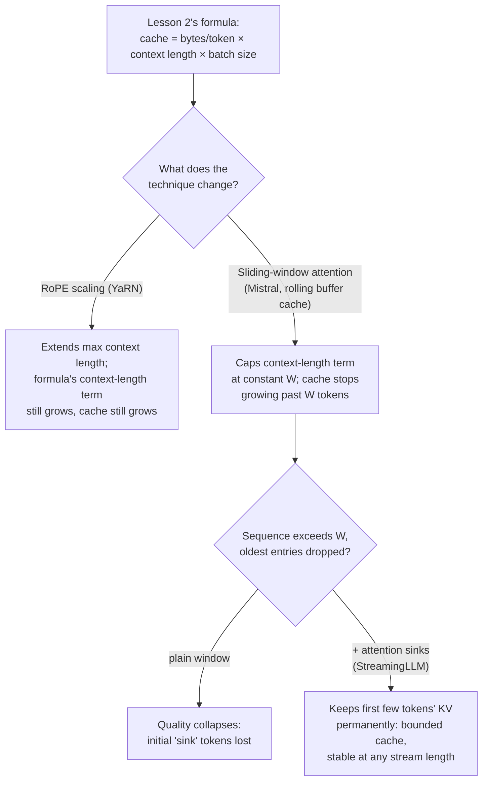

# Lesson 24. Long Context at Serve Time

**Mission link:** Lesson 2 gave the formula a capacity budget actually runs on: `total cache bytes = bytes per token × context length × batch size`, memory growing linearly with context length. Three serving-time techniques touch that formula in different ways: **RoPE scaling** extends how long a context a model can handle at all, without changing the formula's growth at all; **sliding-window attention** changes the formula itself, capping context length to a constant; and **attention sinks** fix the one failure mode a plain sliding window has, so that cap actually holds up at any stream length.
**Primary source:** [Paper: "YaRN: Efficient Context Window Extension of Large Language Models", Peng et al., ICLR 2024](https://arxiv.org/abs/2309.00071), [Paper: "Mistral 7B", Jiang et al., 2023](https://arxiv.org/abs/2310.06825), [Paper: "Efficient Streaming Language Models with Attention Sinks", Xiao et al., ICLR 2024](https://arxiv.org/abs/2309.17453)
**Prerequisites:** [Lesson 2](0002-capacity-and-batch-size.md), [Lesson 3](0003-growth-prefill-decode-precision.md)

## Warm-up

1. ▢ Write lesson 2's total cache footprint formula from memory.

Check

`total cache bytes = bytes per token × context length × batch size`.

2. ▢ Why does a longer context length always mean a larger KV cache, holding batch size and model fixed?

Check

Every additional token needs its own key and value vectors stored at every layer; the cache's size is exactly the per-token cost multiplied by however many tokens' worth of cache are being held, so more tokens means proportionally more cache, with nothing in the mechanism that lets it grow any slower than linearly.

## Know this

### RoPE scaling extends length without touching the cache formula at all

Rotary position embeddings (RoPE) encode a token's position so attention can tell how far apart two tokens are; the problem is that a model trained at one context length doesn't generalize its positional encoding past that length. **RoPE scaling** (YaRN's approach: rather than scaling every RoPE dimension by the same factor, it scales high-frequency dimensions less and low-frequency dimensions more, a targeted method the paper calls "NTK-by-parts") lets a model handle sequences longer than it was trained on, at a fraction of the fine-tuning cost of earlier methods. But RoPE scaling is purely about *positional encoding*; it changes nothing about how many keys and values get stored per token or how many tokens are in the sequence. A longer context handled via RoPE scaling still costs lesson 2's formula in full: `bytes per token × (now-longer) context length × batch size`. RoPE scaling buys length; it does not buy memory.

### Sliding-window attention caps context length to a constant instead

Mistral 7B's **sliding-window attention (SWA)** takes the opposite approach: instead of letting every token attend to the entire sequence so far, each token attends to at most `W` previous tokens (Mistral's example: `W = 4096`). Paired with SWA is a **rolling buffer cache**: since no token ever needs more than `W` prior positions' keys and values, the cache only ever needs to hold `W` tokens' worth, overwriting the oldest entries as new tokens arrive, regardless of how long the overall sequence grows. This changes lesson 2's formula directly: `context length` in the cache-footprint calculation is no longer the sequence's actual length, it's capped at the constant `W`, so the cache stops growing once a sequence passes `W` tokens, no matter how much longer it gets after that.

### The theoretical span through stacked layers is real, but the cache stays capped

A single layer only lets a token see `W` tokens back, but stacked layers extend this: a hidden state at layer `k` indirectly draws on information up to `W × k` tokens back, since layer `k`'s window itself attended to representations already shaped by layer `k-1`'s own window. Mistral's own figure, `W = 4096` over 32 layers, gives a theoretical span of roughly 131K tokens. This is real, but it's an indirect, diffused kind of access, not the same as directly attending to a token 131K positions back the way full attention would; follow-up evaluations found retrieval accuracy for information outside the literal `W`-token window degrades in practice, which is why this theoretical span is a ceiling on what's reachable at all, not a guarantee that everything within it is reachable well. The cache-memory win (a fixed-size rolling buffer, capped regardless of sequence length) is the part this lesson cares about; it holds regardless of how well distant information is actually retrieved.

### Attention sinks fix window attention's actual failure mode

A plain sliding window, on its own, doesn't just lose distant information gracefully, it breaks: StreamingLLM's paper shows that once a sequence passes the window size and old entries get dropped, quality collapses, not degrades. The cause they identify is that the very first few tokens in a sequence absorb disproportionately large attention scores, regardless of their actual semantic content, a phenomenon they name the **attention sink**. Dropping those initial tokens' cache entries, which a plain sliding window eventually does once the sequence runs long enough, removes something the model's attention mechanism structurally depends on, not just some old context. **StreamingLLM** keeps a small, fixed number of initial tokens' KV entries permanently in the cache, alongside the usual sliding window of recent tokens, and this alone recovers most of full attention's performance. The cache stays small and bounded (a handful of sink tokens plus the sliding window, not the whole history), but now it actually works at any stream length, reported stable out to millions of tokens, instead of collapsing once the window fills.

### Picking the right one depends on which problem is actually being solved

RoPE scaling answers "this model needs to handle prompts longer than it was trained on," and pays for that length with cache memory that still grows exactly as lesson 2's formula predicts; it's the right tool when occasional long prompts are the issue and the memory budget already accounts for them. Sliding-window attention plus attention sinks answers a different question, "this workload is an effectively unbounded stream, and the cache has to stay a fixed size no matter how long it runs," at the cost of most tokens no longer having direct access to the entire history. A deployment serving occasional long documents needs the first; a deployment serving an open-ended chat session that could run for millions of tokens needs the second, and conflating the two means either paying for cache growth a fixed-window design was supposed to avoid, or losing direct access to context a RoPE-scaled model was supposed to keep.

## Practice

1. ▢ A model is fine-tuned with YaRN's RoPE scaling to handle a 32K-token context, up from its original 4K. For a batch of sequences now using the full 32K context, how does the KV cache footprint compare to what lesson 2's formula would have predicted at 4K?

Hint

Ask what RoPE scaling actually changes about the cache.

Check

The cache footprint grows by the same 8x that lesson 2's formula predicts for an 8x longer context (32K vs 4K), since RoPE scaling only changes positional encoding, not how many tokens' keys and values get stored. It extends how long a context the model can use at all; it does nothing to reduce what that context costs in cache memory.

2. ▢ A server uses Mistral-style sliding-window attention with `W = 4096` and a rolling buffer cache. A request's sequence grows to 50,000 tokens. What is the cache's size at that point, compared to a server without SWA processing the same sequence?

Check

The SWA server's cache stays capped at `W = 4096` tokens' worth, regardless of the sequence's actual 50,000-token length, since the rolling buffer only ever holds the most recent `W` tokens' keys and values. A server without SWA would have a cache sized for the full 50,000 tokens, over 12 times larger.

3. ▢ Why does a plain sliding window (no attention sinks) suffer a quality collapse rather than a graceful degradation once a sequence exceeds the window size?

Check

The first few tokens in a sequence absorb disproportionately large attention scores regardless of their content, the "attention sink" phenomenon. Once the sequence exceeds the window and those initial tokens' cache entries get dropped, the model loses something its attention mechanism structurally relies on, not just some old, low-value context, which is why the effect is a collapse rather than a smooth loss of distant information.

4. ▢ What does StreamingLLM add on top of a plain sliding window, and what does it buy back?

Check

It keeps a small, fixed number of initial tokens' KV entries permanently cached, alongside the usual sliding window of recent tokens. This recovers most of full attention's quality and lets the model handle effectively unbounded streams (reported stable to millions of tokens) without the collapse a plain sliding window suffers, while keeping the cache small and bounded, just the sink tokens plus the window, not the whole history.

5. ▢ Which claim correctly distinguishes what RoPE scaling and sliding-window-plus-attention-sinks each do to lesson 2's cache-footprint formula?

    - a) Both reduce the cache footprint for a given context length
    - b) RoPE scaling extends the usable context length while leaving the formula's linear growth in context length unchanged; sliding-window attention (with attention sinks fixing its failure mode) caps the context-length term at a constant, bounding the cache regardless of stream length
    - c) Sliding-window attention extends how long a context a model can handle, the same role RoPE scaling plays
    - d) Attention sinks eliminate the need for a KV cache entirely

Check

**b)** That's the precise distinction this lesson draws. (a) is false: RoPE scaling doesn't reduce anything about the cache, it extends context length and the cache grows accordingly. (c) is false: RoPE scaling extends maximum usable length; sliding-window attention instead caps the cache regardless of length, a different lever entirely. (d) is false: attention sinks keep a small cache (sink tokens plus the sliding window), they don't remove the cache.

## Real-world reps

- [ ] For a model you plan to serve, check whether it was trained with a RoPE-scaling method (YaRN, NTK-aware, or linear position interpolation) and what maximum context length that scaling targets versus its original trained length.
- [ ] For a long-running or streaming workload you have in mind, work out whether lesson 2's linear cache growth (a RoPE-scaled model) or a capped, sliding-window-plus-sink cache actually matches what the workload needs.
- [ ] Tomorrow: read the StreamingLLM paper's section on adding a dedicated attention-sink token during pre-training, and note what it changes compared to relying on whichever early token happens to become a sink naturally.

## Going further

- [Paper: "YaRN: Efficient Context Window Extension of Large Language Models", Peng et al., ICLR 2024](https://arxiv.org/abs/2309.00071)
- [Paper: "Mistral 7B", Jiang et al., 2023](https://arxiv.org/abs/2310.06825)
- [Paper: "Efficient Streaming Language Models with Attention Sinks", Xiao et al., ICLR 2024](https://arxiv.org/abs/2309.17453)
- [Resources](../RESOURCES.md)

---

Not landing? Reread the primary source at the top, since this lesson compresses it and compression is where understanding leaks. Check the [glossary](../GLOSSARY.md) for any term that felt slippery.

If the lesson itself is unclear rather than the material, that is a defect: [open an issue](https://github.com/TokenCemetery/teach/issues).
