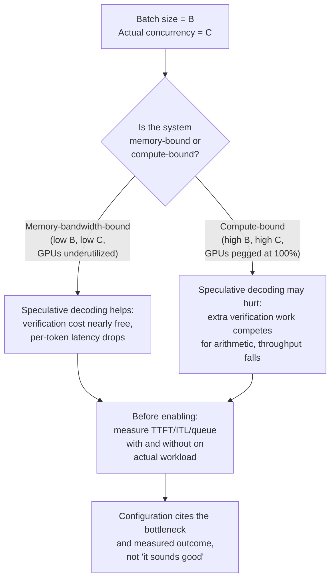

# Lesson 25. Reviewing a Serving Configuration

**Mission link:** The mission ends here: *"defend the latency and throughput numbers it produces."* That defense is not a solo exercise. You will need to review someone else's configuration, trace each choice back to the workload it claims to serve, and spot the mismatch before it reaches production.
**Primary source:** [Docs: "Speculative Decoding", vLLM Project](https://docs.vllm.ai/en/latest/features/speculative_decoding.html)
**Prerequisites:** [Lesson 2](0002-capacity-and-batch-size.md), [Lesson 6](0006-throughput-latency-tradeoff.md), [Lesson 12](0012-vllm-tuning-knobs.md), [Lesson 18](0018-speculative-decoding.md), [Lesson 22](0022-fleet-level-serving.md), [Lesson 23](0023-production-observability-and-cost.md)

## Warm-up

1. ▢ Lesson 2 named the formula that governs a serving configuration's memory footprint. What causes the cache to grow, and what does batching do to that cost?

Check

`total cache bytes = bytes per token × context length × batch size`. The cache grows linearly with context length and batch size; a larger batch means more concurrent sequences, each holding its own KV cache.

2. ▢ Lesson 6 said throughput and per-token latency trade against each other via batch size. What actually governs which direction the trade moves?

Check

Batch size. A larger batch amortizes the prefill cost across more requests (raising throughput) but forces each individual request to wait longer for its tokens since they share GPU time with more neighbors (raising latency). Which of the two numbers matters more depends on the workload's stated SLO.

3. ▢ Lesson 18 said speculative decoding verifies several tokens in one forward pass, roughly the cost of generating one token normally, because decoding is memory-bandwidth-bound. Does that mechanism change when your batch size gets very large?

Check

The mechanism itself (bandwidth-bound verification cost) does not change. But the system's regime does: a very large batch can make the system compute-bound overall, where the verification work speculative decoding adds actually competes for GPU arithmetic instead of running nearly free. The per-token cost is the same; what changes is whether that cost is negligible or material at your system's scale.

## Know this

### The review checklist: does each knob match the stated workload?

When you review a serving configuration, walk through this list. For each one, ask: is this choice actually justified by the workload's stated bottleneck, or was it cargo-culted from a different workload's defaults?

**1. Is the batching configuration matched to the workload's concurrency and SLO?**

Lesson 6 teaches that batch size trades throughput against per-token latency. A configuration that states "batch size = 128, SLO = 300ms p99 TTFT" needs to show that batch size 128 actually delivers 300ms under the stated concurrency. If the workload is 10 concurrent users, a batch of 128 means padding with 118 empty requests or wasting GPU time on an artificially large batch. If the workload is 1000 concurrent users and batch 128 means only 12% utilization, the configuration is leaving throughput on the table. The knob must be chosen with measurements on the actual workload, not guessed.

**2. Is the quantization scheme actually earning its keep for this workload's latency target?**

Lesson 9 teaches the trade: lower bit-width quantization saves memory and speeds up decode (bandwidth-bound), but loses accuracy and may speed up prefill differently depending on the implementation. Before adopting int4 quantization because another team did, measure your own task's accuracy loss at your own batch size. Some workloads are insensitive to the loss; some are not. A configuration that says "int4 quantization" without citing its measured accuracy impact on *this* task has not actually justified that choice.

**3. Does the parallelism strategy actually address a real bottleneck?**

Lesson 21 teaches tensor parallelism and pipeline parallelism as two different ways to split a model across GPUs. A configuration that uses 8-way tensor parallelism on a 4-GPU node is nonsensical: you have already split across all the GPUs you have, and the high communication cost (NVLink or network) is being paid for nothing. The choice should trace back to a measurement: "the model is too large to fit on any single GPU's memory, so we need parallelism; at 4 GPUs tensor parallelism bottlenecks on communication, so we added pipeline parallelism for the remaining stages." Without that story, the configuration has knobs turned but not choices made.

**4. Is speculative decoding actually turned on for the right reason, for this workload's batch size?**

Lesson 18 says speculative decoding is a latency lever: it reduces per-token latency by verifying multiple tokens per expensive forward pass. Lesson 23 established that in production, you cite an SLO. The vLLM docs are explicit: speculative decoding reduces inter-token latency "under medium-to-low QPS (queries per second), memory-bound workloads." The detail is load-bearing. When batch size is small (low QPS), the system is memory-bandwidth-bound and speculative decoding's extra verification cost is nearly free (lesson 18's mechanism holds). When batch size is very large (high QPS, compute-bound), the extra verification compute competes for GPU arithmetic and can actually lower throughput-the latency of one individual request may improve, but the fleet's overall throughput may not. A configuration that says "speculative decoding enabled" because "it sounds good" has not actually measured whether the workload is bandwidth-bound or compute-bound at the chosen batch size. Name it: "Speculative decoding enabled for low-QPS workloads with batch size ≤ 32, where memory bandwidth is the bottleneck. Disabled for batch size > 64 where compute becomes the bottleneck and the extra verification cost would lower fleet throughput."

### Carrying a change through what others depend on

A serving fleet has live callers mid-request when you deploy a new configuration, model version, or quantization scheme. A config change that silently alters output distribution, such as switching quantization or enabling speculative decoding, can break a downstream consumer (an eval gate, a caller with hardcoded expectations about latency distribution, a system expecting exact output matching) without the serving team knowing why.

**Safe rollout strategy:**

1. **Canary a new configuration on a small slice of traffic** before a full cutover. Not to test whether the server stays up, but to measure how the change affects output distribution and latency distribution, and whether a downstream consumer notices.
2. **Stage the change the same way you stage a model version**: a canary, monitoring for regressions that a downstream consumer might detect before you do, then a rolling rollout if the canary is clean.
3. **Communicate the change to callers before rolling it out at scale.** A configuration change is not a pure implementation detail; it can shift a latency distribution or output slightly (quantization, speculative decoding's rare verification failures), and downstream systems built on tight assumptions might break.

This is not paranoia. A real example: switching from float16 to int8 quantization can shift the output distribution enough that an eval gate tuned for float16 outputs starts rejecting valid answers; the serving fleet looks fine (same request throughput, same p99) but the downstream eval pipeline silently starts failing. A staged rollout catches this because someone watching the eval gate's acceptance rate during the canary phase sees it drop and asks why before rolling out at scale.

### Saying when the usual answer is wrong, and settling a disputed claim from the primary source

Speculative decoding is the case study here, because the answer genuinely depends on your workload's current bottleneck.

Lesson 18 presents speculative decoding as a latency win: verify multiple tokens cheaply in one forward pass instead of generating them one at a time. That is exactly right for the conditions the paper describes and the conditions that vLLM documents: **when the system is memory-bandwidth-bound** (small batch, low QPS). In that regime, the extra verification work does cost nearly nothing and the latency per token drops measurably.

But **at high batch size and high QPS, when the system becomes compute-bound**, the extra verification tokens the draft model proposes add compute work that now genuinely competes with other requests for GPU arithmetic. The cost is no longer negligible: the target model's forward pass is doing more work (verifying multiple tokens), and that extra work displaces time that could have been spent generating tokens for other requests in the batch. Per-request latency may still improve (your own request's tokens arrive slightly faster), but fleet throughput-the total tokens generated per second across all requests-may fall, and throughput is what lesson 6's batch-size trade governs and lesson 23's cost-per-million-tokens depends on.

The vLLM documentation states this directly: "Speculative Decoding... to reduce inter-token latency under medium-to-low QPS (queries per second), memory-bound workloads." That phrasing is not accidental. Under high QPS, a compute-bound system, speculative decoding can hurt overall throughput even as it improves individual request latency. The right answer is not "turn on speculative decoding" or "turn it off always"; the right answer is **"measure your workload's bottleneck first."**

To settle which is true for your configuration:

1. **Measure your system's current bottleneck** at your actual batch size and QPS: Is memory bandwidth or arithmetic the limiting factor? Lesson 23's metrics (TTFT, ITL, queue depth) tell you. If the system is CPU-limited (high queue depth, low memory utilization, all GPUs pegged at 100% utilization), compute is the bottleneck and speculative decoding is likely to hurt. If the system is memory-limited (high memory utilization, GPUs underutilized), memory bandwidth is the bottleneck and speculative decoding is likely to help.
2. **Compare two measurements:** measure end-to-end throughput (total tokens/sec across all requests) and per-request latency with speculative decoding on and off, at your actual batch size and concurrency.
3. **Cite what you measured.** A configuration should say: "Speculative decoding is disabled because this workload runs at 256-request batch size and QPS is 80 requests/sec, which is high-concurrency and compute-bound. We measured throughput at 3,200 tokens/sec with spec decode on and 3,400 tokens/sec with it off. Per-request latency is slightly higher with spec decode off (258ms vs 245ms) but fleet throughput is the bottleneck for this SLO, not per-request latency."

## Practice

1. ▢ A configuration proposes batch size 256 for a workload that stated SLO is "p99 TTFT under 500ms at 20 concurrent users." You measure TTFT at batch 256 and find p99 is 1200ms. What is the configuration's actual error?

Hint

Does batch 256 match the stated concurrency of 20 users?

Check

Batch size 256 is absurdly large for 20 concurrent users. At 20 users, the system will be idle waiting for requests to fill the batch, wasting GPU time. The measured TTFT proves it: batch size is a knob that trades throughput against latency, and this configuration has traded latency in the wrong direction. The fix is not "tune TTFT" but "use batch size 16-32 matched to actual concurrency, not fantasy concurrency."

2. ▢ You are reviewing a configuration that enables speculative decoding, and the justification is "speculative decoding reduces latency, and latency is important." Is this justification sufficient?

Check

No. Speculative decoding *can* reduce latency, but only when the system is memory-bandwidth-bound. At high concurrency and large batch size, where compute is the bottleneck, it can actually reduce fleet throughput while improving per-request latency. The configuration needs to measure the actual workload's bottleneck and cite the outcome: "Measured at B=X, C=Y: throughput with spec-decode on is Z1, off is Z2; we chose based on which maximizes the metric that matters for this SLO."

3. ▢ A team wants to switch their serving quantization from float16 to int8 and roll it out all at once to the entire fleet. What is the problem with this plan?

Check

Quantization changes output distribution. A downstream consumer (an eval gate, a monitoring system, a caller with tight output expectations) might break silently. The right approach: canary the change on a small slice of traffic first, monitor downstream consumers (eval gates, latency distributions, caller success rates) for regressions, and roll out gradually. A pure implementation detail this is not.

4. ▢ A configuration states "tensor parallelism: 8-way, on 4 GPUs." What is wrong with this?

Hint

How many GPUs are available, and how many ways is the model being split?

Check

Nonsensical: you cannot split a model 8 ways on 4 GPUs. Either the configuration meant to split it 4 ways (tensor parallelism fully utilizing the available hardware), or it needs more GPUs. A parallelism strategy must be matched to the hardware available, or it has not actually justified that choice. Check whether the team measured that this particular parallelism scheme (tensor vs. pipeline) is better than alternatives for this model and this hardware.

5. ▢ Which statement correctly describes when speculative decoding helps versus when it can hurt overall fleet throughput?

    - a) Speculative decoding always reduces latency and always improves throughput, so it should be enabled on all deployments
    - b) Speculative decoding reduces inter-token latency on memory-bandwidth-bound systems (low concurrency), but at high concurrency where compute is the bottleneck, the extra verification work can reduce fleet throughput even as per-request latency improves
    - c) Speculative decoding is only useful for very large batch sizes and should not be enabled for small batches
    - d) Speculative decoding reduces throughput and should only be enabled if latency is more important than throughput

Check

**b)** This is the genuine trade-off this lesson teaches. (a) is false: speculative decoding helps under specific bottleneck conditions, not universally. (c) is backwards: it helps most at small batches where the system is memory-bound. (d) is false: at the right batch size, it improves both latency and throughput; the issue is only at the wrong batch size where it trades throughput for latency.

## Real-world reps

- [ ] Take a serving configuration from your own work (or a public config, such as vLLM's example deployments). For each knob (batch size, quantization, parallelism, speculative decoding, prefix caching), check whether the configuration cites the workload it was tuned for and the measurement that justified that choice. Write down which knobs are justified and which are just defaults.
- [ ] Pick one config knob from the above and compare two different settings on the same workload, measuring throughput and latency with each. Record which metric matters more for your SLO and whether the configured choice is the right one.
- [ ] Tomorrow: design a safe rollout plan for a configuration change you are planning (e.g., switching quantization, enabling a feature, changing batch size). Include who needs to be notified, what metrics you will monitor in the canary, and what would trigger a rollback.

## Going further

- [Docs: "Speculative Decoding", vLLM Project](https://docs.vllm.ai/en/latest/features/speculative_decoding.html)
- [Paper: "Fast Inference from Transformers via Speculative Decoding", Leviathan et al., 2022](https://arxiv.org/abs/2211.17192)
- [Resources](../RESOURCES.md)

---

Not landing? Reread the primary source at the top, since this lesson compresses it and compression is where understanding leaks. Check the [glossary](../GLOSSARY.md) for any term that felt slippery.

If the lesson itself is unclear rather than the material, that is a defect: [open an issue](https://github.com/TokenCemetery/teach/issues).
