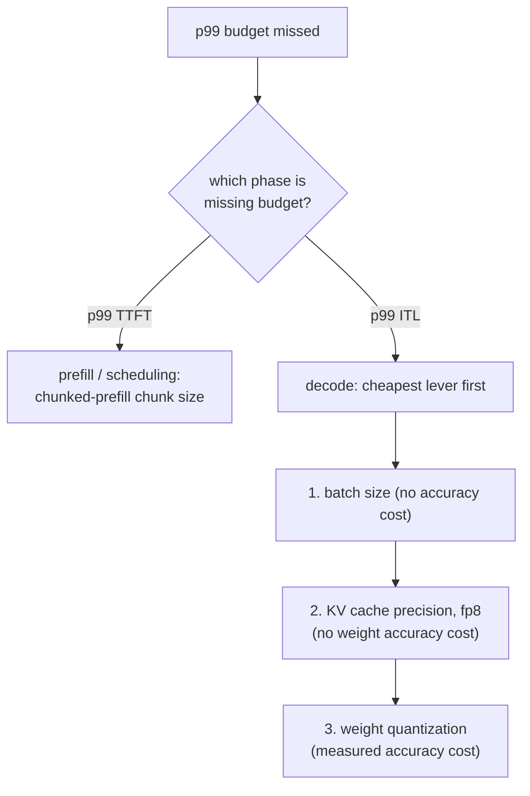

# Latency Budget

Measuring and defending a p99 latency budget. Built for lookup when diagnosing a miss.

## p99, not the average

The **p99** is the value below which 99% of measured requests fall; only the worst 1% are slower. An average can look fine while hiding a real problem: [head-of-line blocking](batching.md#admission-order-and-head-of-line-blocking) only strikes the small fraction of requests unlucky enough to share a step with a large prefill, so it barely moves an average across thousands of otherwise-fast requests while making that unlucky 1% dramatically slower.

## Two figures, not one

"Request latency" splits into at least two numbers, each dominated by a different phase and shaped by different levers:

| Figure | Dominated by | Shaped by |
|---|---|---|
| Time to first token (TTFT) | Prefill | Scheduling, chunked-prefill chunk size |
| Inter-token latency (ITL) | Decode | Batch size, cache precision, weight quantization |

Folding them into one blended number obscures which lever a bad result actually points at.

## What makes a p99 measurement trustworthy

- **Enough samples.** A p99 from 20 requests is really reporting on the single slowest one, not a stable tail estimate; a trustworthy figure typically needs samples in the hundreds to thousands.
- **Realistic load.** Realistic concurrency (so batching and scheduling behavior actually gets stressed) and a realistic mix of prompt/output lengths: [static-batching waste](batching.md#static-batching-wastes-capacity-on-uneven-finish-times) and head-of-line blocking both depend on request-length variance a uniform-length benchmark never surfaces.

## Diagnostic order: phase first, then cheapest lever



Checking the wrong phase's levers wastes effort: tuning the chunk size does nothing for a decode-bound ITL problem, and shrinking the batch does nothing for a TTFT problem caused by a large prefill stalling the queue. Within the decode branch, order follows cost: batch size first (free), then cache precision (no weight-accuracy cost), then weight quantization (costs measured accuracy, so reach for it only once the cheaper levers are exhausted or insufficient).

## Worked chain

A 13B model on one 80 GB GPU, measured from a realistic 2,000-request benchmark: p99 TTFT comfortably under budget, p99 ITL 80 ms against a 50 ms budget.

```text
TTFT fine -> rules out scheduling; this is a decode-phase, ITL problem
1. batch size already at the lesson-6-defended figure -> shrinking further costs needed throughput, skip
2. quantize weights to int8 -> ITL drops to 65 ms, accuracy delta measured against the unquantized model
   still over budget; two options remain:
   a. shrink batch size further (free, if it still meets required concurrency)
   b. quantize to int4 with AWQ (frees more time, further measured accuracy cost)
-> pick whichever closes the gap without paying for more than the budget needs
```

## What the final defense must cite

1. **The measured p99 figures** themselves, from a sample large and realistic enough to trust.
2. **The memory and batch-size reasoning** behind the [capacity ceiling](kv-cache.md#capacity-budget) and [defended batch size](batching.md#the-throughputlatency-trade-off) the configuration settled on.
3. **The accuracy number** measured for whatever [quantization](quantization-at-serve-time.md#defending-the-choice-means-citing-three-numbers), if any, was applied to get there.

A configuration that hits its latency target by luck, with none of these three written down, is exactly as undefended as one that misses it.

## Related

- [Lesson 16](../lessons/0016-p99-latency-methodology.md), [Lesson 17](../lessons/0017-defending-a-latency-budget-end-to-end.md)
- [KV cache](kv-cache.md), [Batching](batching.md), [Quantization at Serve Time](quantization-at-serve-time.md): the levers this sheet's diagnostic order walks through
