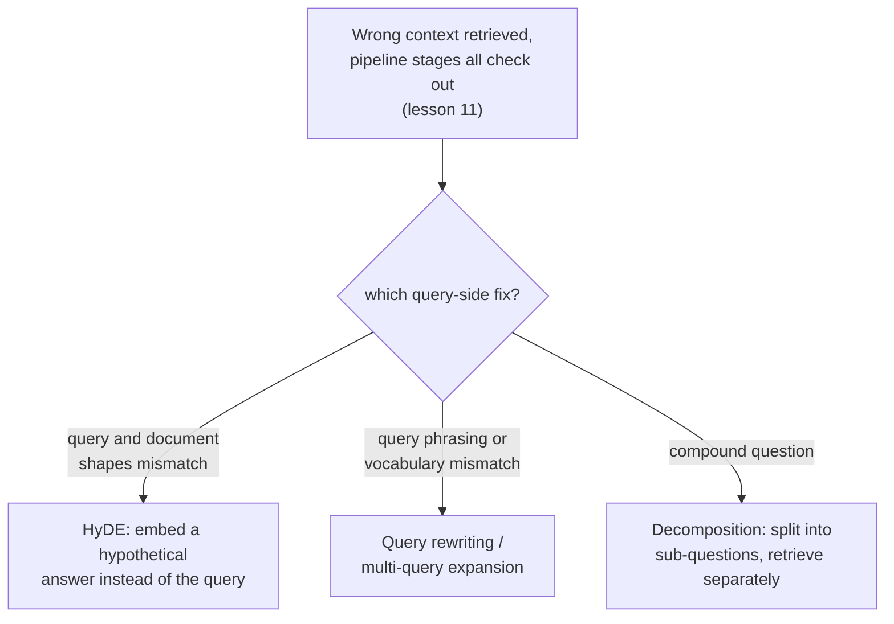

# Lesson 14. Query-Side Transformation

**Mission link:** Lesson 11 gave a stage-by-stage procedure for finding which part of a retrieval pipeline is at fault when the wrong context comes back, chunking, embedding, the index, hybrid weighting, reranking. It never asked whether the query itself was the problem. This lesson is what to do once every one of those stages checks out clean and the query is still the thing standing between a user's actual need and the corpus's actual content.
**Primary source:** [Paper: "Precise Zero-Shot Dense Retrieval without Relevance Labels" (HyDE), Gao et al., 2022](https://arxiv.org/abs/2212.10496)
**Prerequisites:** [Lesson 11](0011-diagnosing-the-pipeline.md), [Lesson 7](0007-reciprocal-rank-fusion.md)

## Warm-up

1. ▢ Why is diagnosing across a small set of known-failing queries more reliable than debugging a single anecdotal failure?

Check

A single failing query might fail for an unusual, one-off reason that doesn't reflect a systemic pipeline problem. Measuring retrieval quality across a representative set of known failures at each stage reveals where the aggregate biggest drop-off happens, rather than reacting to whichever single failure someone happened to notice.

2. ▢ Why does reciprocal rank fusion combine two rankings by their rank position rather than by their raw scores?

Check

A lexical method's raw scores and a vector method's raw scores are computed on different, incomparable scales; combining them directly would let whichever method happens to produce larger numbers dominate for reasons that have nothing to do with actual relevance. Rank position is comparable across both methods regardless of how each one's underlying scores are scaled.

## Know this

### A query and a document are structurally different kinds of text

A user's query is typically short, informal, and phrased as a question or a few keywords; the documents in a corpus are typically long, formal, and phrased as statements or explanations. Embedding both with the same model and comparing them by similarity assumes this asymmetry doesn't matter, but a short question and a long passage that answers it can genuinely sit far apart in embedding space even when the passage is exactly what the question needed, simply because they're such differently-shaped pieces of text. **Query-side transformation** is the general fix: change what actually gets embedded and searched, rather than touching any of lesson 11's pipeline stages.

### HyDE: embed a hypothetical answer instead of the question

**HyDE (Hypothetical Document Embeddings)** addresses the query-document asymmetry directly: given a query, an instruction-following language model is asked, zero-shot, to generate a **hypothetical document**, an imagined passage that would answer the query, and that hypothetical document is what actually gets embedded and searched against the corpus, not the original query. The paper's own framing is specific about why this works even though the hypothetical document is invented and may contain **factually wrong details**: the encoder's job is to capture relevance patterns, and its dense embedding step acts as a bottleneck that filters out the invented details while preserving the genuine topical and stylistic similarity to real, relevant documents. The hypothetical document doesn't have to be true; it only has to be shaped like the kind of passage that would actually answer the question.

### Query rewriting and multi-query expansion: change or multiply the question, not the answer

**Query rewriting** is more direct: an LLM reformulates the user's raw query into a clearer, more explicit search query before it's embedded, resolving ambiguity, expanding an abbreviation, or restating an informal question in language closer to how the corpus itself is likely phrased. **Multi-query expansion** goes further by generating several different reformulations of the same underlying question, retrieving separately for each one, and merging the results, often with the same reciprocal rank fusion lesson 7 already covered for combining rankings across retrieval methods, since here the multiple rankings come from multiple query phrasings instead of multiple methods. Where HyDE bridges the query-document asymmetry, rewriting and multi-query expansion hedge against any single phrasing of the query missing the corpus's own vocabulary or framing.

### Decomposition: a compound question is really several questions in a trenchcoat

A **compound question** asks about more than one thing at once ("what's the refund policy, and does it differ for annual subscriptions?"), and a single embedding of the whole question sits, at best, somewhere in between the corpus regions that would actually answer each part, close to neither. **Query decomposition** breaks a compound question into its separate sub-questions, retrieves for each sub-question independently, and combines the results, so each part of the original question gets its own chance to land close to the specific passage that actually answers it, rather than all parts competing to be represented by one averaged embedding that serves none of them well.

### Diagnosing the query itself, not just the pipeline

Lesson 11's procedure asks, in order, whether chunking, the embedding, the index, the hybrid blend, and reranking are each doing their job. A query-side failure looks identical from the outside (wrong context retrieved) but survives every one of those checks: the correct chunk exists, is embedded reasonably, is indexed correctly, and would rank well hybrid and reranked, yet the query itself, as actually embedded, still doesn't land near it. Recognizing this as a distinct, sixth possibility, rather than re-tuning an already-correct pipeline stage, is what query-side transformation exists to fix.

## Practice

1. ▢ A team confirms, using lesson 11's procedure, that the correct chunk exists, is embedded well, is indexed correctly, and would rank highly under hybrid search and reranking. The system still returns the wrong context for a specific query. What does this rule in as the likely cause?

Hint

Consider what's left to check once every pipeline stage lesson 11 covers has been confirmed clean.

Check

The query itself, as actually embedded and searched, doesn't land near the correct chunk, a query-side failure rather than a pipeline-stage failure. This is exactly the sixth possibility lesson 11's stage-by-stage procedure doesn't check, since every stage it does check can genuinely be correct while the query's own embedding still misses.

2. ▢ HyDE embeds a hypothetical document that may contain factually incorrect details. Why doesn't this incorrectness undermine its retrieval quality?

Check

The encoder's dense embedding step acts as a bottleneck that filters out the invented, incorrect details while preserving the genuine topical and stylistic similarity to real relevant documents; HyDE only needs the hypothetical document to be shaped like a real answer, not to be factually correct itself.

3. ▢ A user asks a compound question covering two unrelated topics in one sentence. Why does embedding the whole question as one vector serve neither topic well?

Check

A single embedding of a compound question sits somewhere between the corpus regions that would answer each part separately, close to neither; decomposing the question into its separate sub-questions and retrieving for each independently gives each part its own chance to land near the specific passage that actually answers it.

4. ▢ How does multi-query expansion reuse a mechanism this workspace already covered for a different purpose?

Check

It commonly merges the separate retrieval results from each query reformulation using reciprocal rank fusion (lesson 7), the same rank-based combination technique originally used to combine a lexical ranking and a vector ranking, applied here instead to combine rankings produced by multiple phrasings of the same question.

5. ▢ Which claim correctly distinguishes HyDE from query rewriting and multi-query expansion?

    - a) All three techniques modify a pipeline stage lesson 11 already covers, such as the embedding model or the index
    - b) HyDE embeds a generated hypothetical answer instead of the query, bridging the query-document shape asymmetry; query rewriting and multi-query expansion instead reformulate (or multiply reformulations of) the query itself before embedding it
    - c) HyDE requires the hypothetical document it generates to be factually correct for retrieval to work
    - d) Query decomposition is another name for multi-query expansion, with no meaningful difference

Check

**b)** That's the precise distinction this lesson draws between the techniques. (a) is false: all of these are query-side changes, not modifications to chunking, embedding models, indexing, or reranking. (c) is false: HyDE's own framing explicitly tolerates factually wrong details in the hypothetical document, relying on the encoder to filter them out. (d) is false: decomposition splits one compound question into separate sub-questions retrieved independently, while multi-query expansion generates several full reformulations of one question.

## Real-world reps

- [ ] For a RAG system you have access to, pick a query that returns poor results, and check (using lesson 11's procedure) whether every pipeline stage actually checks out before concluding the query itself is at fault.
- [ ] Try rewriting that same query more explicitly, or generating a HyDE-style hypothetical answer for it by hand, and see whether either version retrieves noticeably better context.
- [ ] Tomorrow: read the HyDE paper's results section in full, and note which task categories (web search, QA, fact verification) it found the technique helped most and least.

## Going further

- [Paper: "Precise Zero-Shot Dense Retrieval without Relevance Labels" (HyDE), Gao et al., 2022](https://arxiv.org/abs/2212.10496)
- [Resources](../RESOURCES.md)

---

Not landing? Reread the primary source at the top, since this lesson compresses it and compression is where understanding leaks. Check the [glossary](../GLOSSARY.md) for any term that felt slippery.

If the lesson itself is unclear rather than the material, that is a defect: [open an issue](https://github.com/TokenCemetery/teach/issues).
