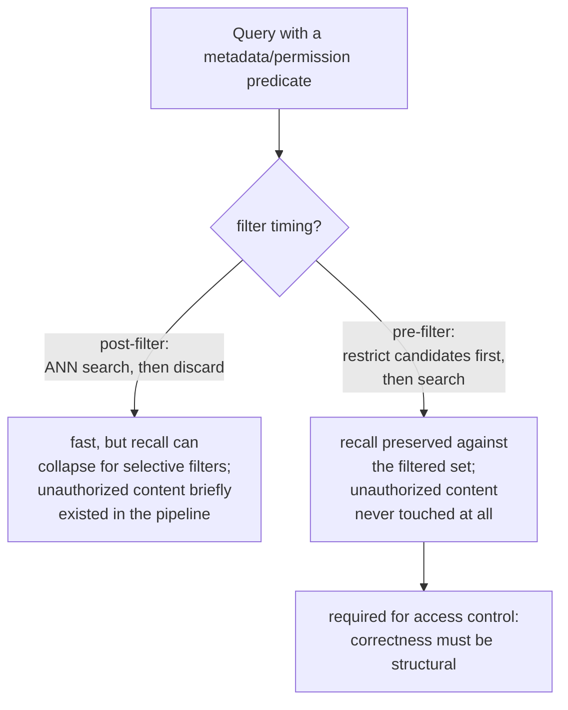

# Lesson 15. Metadata Filtering and Permission-Aware Retrieval

**Mission link:** Lesson 11's diagnosis procedure treats "wrong context retrieved" as a relevance problem: chunking, embedding, the index, hybrid weighting, or reranking got something wrong. A permission failure produces the identical symptom, a chunk that shouldn't have been in the answer, for a completely different reason: the chunk was perfectly relevant, correctly retrieved, and the user was simply never allowed to see it. This lesson covers the mechanism that has to prevent that before lesson 11's procedure would ever even get a chance to run.
**Primary source:** [Paper: "Policy-aware Vector Search: A Vision for Fine Grained Access Control in Vector Databases", Yalamarthi and Pappachan, 2026](https://arxiv.org/abs/2606.19803)
**Prerequisites:** [Lesson 5](0005-pgvector-specifics.md), [Lesson 11](0011-diagnosing-the-pipeline.md)

## Warm-up

1. ▢ What does pgvector let you combine that a pure vector-search operation alone can't?

Check

Ordinary SQL predicates and Postgres's own relational features (transactions, row-level security, joins) alongside vector similarity search, in the same query, rather than needing a separate system for anything that isn't pure nearest-neighbor search.

2. ▢ A single failing query might fail for a one-off reason that doesn't reflect a systemic pipeline problem. Why does diagnosing across a small set of known-failing queries avoid this trap?

Check

Measuring retrieval quality across a representative set of known failures reveals where the aggregate biggest drop-off happens, pointing at a stage that's systematically losing information rather than reacting to whichever single failure someone happened to notice.

## Know this

### Metadata filtering restricts the candidate set to more than just "nearest"

Real chunks carry structured attributes beyond their text: a document type, a department, a date, an owner, a sensitivity tag. **Metadata filtering** lets a query restrict retrieval to chunks matching a predicate on these attributes ("only Q3 reports," "only documents this user's team owns") in addition to nearest-neighbor similarity, rather than searching the whole corpus by similarity alone and hoping the right subset happens to rank highly.

### Where the filter runs relative to the ANN search changes both recall and correctness

A metadata filter can run in either of two places relative to the vector search. **Post-filtering** runs the ANN search first, over the whole index, and discards results that fail the predicate afterward; this is fast, but an approximate index only scans a bounded candidate budget assuming most of what it finds will survive, so a selective predicate can discard most of what came back, leaving far fewer than the requested number of results and quietly wrecking recall. **Pre-filtering** restricts the candidate set to only the chunks satisfying the predicate *before* the ANN search runs at all, preserving recall against that filtered set regardless of how selective the predicate is, at the cost of not fully exploiting an index built to search the whole vector space efficiently.

### Access control is the one filter where getting the order wrong is a security incident, not a quality one

An ordinary metadata filter (date range, document type) failing badly just means worse relevance, an inconvenience. A **permission filter**, restricting results to what the requesting user is actually authorized to see, is different in kind: with post-filtering, the disallowed chunk was still retrieved and existed in the pipeline before being discarded, meaning it was already touched, and any bug in that discard step is a straightforward disclosure of content the user should never have received at all. This is exactly why access control specifically needs **pre-filtering** (or an enforcement strategy that behaves equivalently): the correctness of *never surfacing* unauthorized content has to be structural, not a cleanup step applied after the fact to results that already included it.

### A permission failure is silent in a way lesson 11's other failures aren't

Every failure mode lesson 11 diagnoses (a badly chunked passage, a mismatched embedding, an under-tuned index) produces a visibly wrong or missing answer, something a user or a reviewer can notice and trace back to a stage. A permission failure produces a perfectly fluent, plausible, well-formed answer, built from content the user was never authorized to see, and nothing about the output looks broken. Nobody notices until someone happens to recognize content they shouldn't have had access to, which is precisely why this class of bug has to be prevented structurally, by construction, rather than caught later by noticing a symptom the way lesson 11's diagnosis procedure catches a relevance failure.

## Practice

1. ▢ A team applies a metadata filter for "documents from this quarter" using post-filtering, and notices fewer results than expected on a narrow date range. What's the likely cause?

Hint

Consider what the ANN index's candidate budget assumed about how many results would survive the filter.

Check

The ANN index scanned its usual bounded candidate budget assuming most results would survive the filter, but a narrow, selective date range discarded most of them after the fact, leaving far fewer results than requested; this is post-filtering's recall problem showing up exactly as predicted for a selective predicate.

2. ▢ Why is post-filtering specifically unacceptable for a permission filter, even though it might be an acceptable trade-off for an ordinary metadata filter like document type?

Check

With post-filtering, a chunk the user isn't authorized to see was still retrieved and existed in the pipeline before being discarded; any bug in that discard step directly discloses unauthorized content. An ordinary metadata filter failing badly only costs relevance quality, not a security guarantee, so the same trade-off that's merely inconvenient for one is a genuine incident for the other.

3. ▢ Why can't lesson 11's diagnosis procedure be relied on to catch a permission failure the way it catches a chunking or embedding failure?

Check

Lesson 11's failures all produce a visibly wrong or missing answer that a reviewer can notice and trace to a stage. A permission failure produces a fluent, well-formed answer built from unauthorized content, with nothing about the output looking broken; nobody notices until someone happens to recognize content they shouldn't have had access to, so it has to be prevented structurally rather than caught by symptom.

4. ▢ Why is pgvector, as this workspace's standardized vector store, particularly well suited to enforcing access control correctly?

Check

Because it lets vector similarity search be combined directly with ordinary SQL predicates and Postgres's own relational features like row-level security in one system, rather than treating filtering and access control as a separate, bolted-on concern the way some purpose-built vector databases do.

5. ▢ Which claim correctly describes the relationship between pre-filtering, post-filtering, and access control specifically?

    - a) Pre-filtering and post-filtering produce identical recall and security guarantees, differing only in implementation convenience
    - b) Post-filtering risks recall collapse under a selective predicate and, for permission filters specifically, exposes unauthorized content to the pipeline before discarding it; pre-filtering preserves recall against the filtered set and never lets unauthorized content enter the pipeline at all, which is why access control specifically requires it
    - c) An ordinary metadata filter (like document type) and a permission filter carry the same consequences if either fails
    - d) Lesson 11's diagnosis procedure already covers permission failures, since they produce the same "wrong context" symptom

Check

**b)** That's the precise distinction this lesson establishes. (a) is false: post-filtering can severely hurt recall for selective predicates, and specifically for access control, briefly retrieves content it shouldn't. (c) is false: a permission filter's failure is a security incident, not merely a quality regression, unlike most ordinary metadata filters. (d) is false: lesson 11's procedure was built for visibly wrong relevance failures, not a silently well-formed answer built from unauthorized content.

## Real-world reps

- [ ] For a RAG system you have access to, check whether it applies any metadata filters, and if so, whether they run before or after the vector search.
- [ ] If the system has any access-control or permission requirement, check specifically whether unauthorized content could ever be retrieved (even temporarily, before being discarded) under its current implementation.
- [ ] Tomorrow: read the primary source's comparison of enforcement strategies in full, and note what its preliminary findings say about the latency cost of guaranteeing correct enforcement compared to an unfiltered baseline.

## Going further

- [Paper: "Policy-aware Vector Search: A Vision for Fine Grained Access Control in Vector Databases", Yalamarthi and Pappachan, 2026](https://arxiv.org/abs/2606.19803)
- [Repo: pgvector, pgvector](https://github.com/pgvector/pgvector)
- [Resources](../RESOURCES.md)

---

Not landing? Reread the primary source at the top, since this lesson compresses it and compression is where understanding leaks. Check the [glossary](../GLOSSARY.md) for any term that felt slippery.

If the lesson itself is unclear rather than the material, that is a defect: [open an issue](https://github.com/TokenCemetery/teach/issues).
