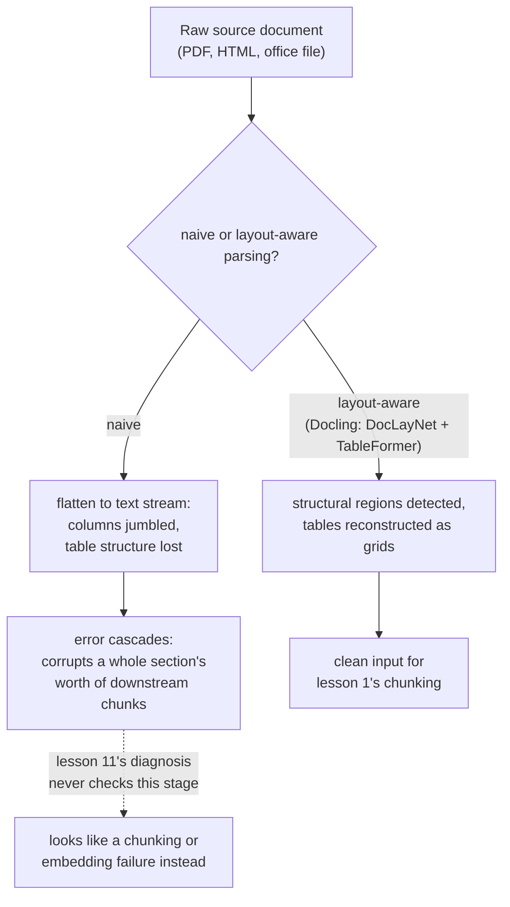

# Lesson 16. The Ingestion Pipeline

**Mission link:** Lesson 1 called chunking "the first pipeline choice, and the one every later stage inherits." That was true only once a document already exists as clean, structured text. Real corpora arrive as PDFs, HTML, and office documents, and turning those into text chunking can actually work with is a real stage this workspace never named, one whose mistakes corrupt everything downstream in a way lesson 11's diagnosis procedure was never built to catch.
**Primary source:** [Paper: "Docling Technical Report", Auer et al., 2024](https://arxiv.org/abs/2408.09869)
**Prerequisites:** [Lesson 1](0001-chunking.md), [Lesson 11](0011-diagnosing-the-pipeline.md)

## Warm-up

1. ▢ Why does a symptom like "wrong context retrieved" need a stage-by-stage diagnosis rather than being fixed by guessing at one likely cause?

Check

The fault could sit in any of several stages (chunking, embedding, indexing, hybrid weighting, reranking), and changing several at once wastes effort without revealing which one was actually broken; checking each stage in an order that isolates the fault is what actually finds the cause.

2. ▢ Why does a chunk that's too large, mixing multiple topics, dilute its own embedding?

Check

An embedding model produces one vector for a chunk's entire content; a chunk spanning several unrelated topics gets an embedding that's an average of all of them, not a precise representation of any single one, making it harder for a query about just one of those topics to match it well.

## Know this

### Ingestion is the stage before the first stage

**Ingestion** is turning a real source document, a PDF, an HTML page, a Word or PowerPoint file, into the clean, structured text that chunking (lesson 1) actually operates on. Lesson 1 treated chunking as the pipeline's starting point because it assumed that clean text already existed; ingestion is where it actually comes from, and it's a genuine pipeline stage with its own way of going wrong, not a preprocessing detail beneath the pipeline's notice.

### Naive extraction flattens exactly the structure that gives a document its meaning

The simplest way to get text out of a PDF just pulls every character out in whatever order the file's internal representation happens to store them, discarding layout, column structure, and the distinction between a heading, a body paragraph, and a table cell. This works acceptably for a simple, single-column document, but a multi-column layout can interleave two unrelated columns' text into one jumbled, incoherent stream, and a table's rows and columns, flattened into linear text, lose the row-to-column relationships that gave each cell's number its actual meaning in the first place.

### Layout-aware parsing treats structure as something to detect, not discard

Docling's own approach is to run dedicated models for exactly the structure naive extraction throws away: a layout-analysis model (DocLayNet) identifies a page's structural regions (headings, paragraphs, tables, figures) before any text is extracted from them, and a table-structure-recognition model (TableFormer) specifically reconstructs a table's actual row-and-column grid rather than reading it as an undifferentiated stream of words. The point isn't that this is strictly necessary for every document; a clean, single-column text file needs none of it. It's that a real corpus's harder documents, dense multi-column layouts, financial tables with merged cells, need this structural detection to produce text that still means what the original document meant.

### An ingestion error cascades, corrupting a whole section rather than one sentence

A mistake at the layout-detection stage doesn't stay contained to whatever it directly touches: if a heading is misidentified as body text, or two columns get merged in the wrong order, every downstream step, extracting the actual text, recognizing a table's structure, everything chunking will later split, inherits that mistake. A single early error can corrupt a whole section's worth of eventual chunks, not just the one element the layout model got wrong, because every later step operates on the already-corrupted structure it was handed rather than the original document.

### This is exactly the failure lesson 11's diagnosis procedure was never built to see

Lesson 11 starts its diagnosis at chunking, checking whether the correct information exists coherently inside one chunk. A bad parse means the answer to that first check is already "no," but for a reason lesson 11 has no branch for: not a bad chunking *strategy*, but bad chunking *input*, text that was already jumbled or structurally scrambled before chunking ever ran. Every later stage lesson 11 checks, the embedding, the index, hybrid weighting, reranking, can be working exactly as designed and still surface wrong context, because they're all faithfully processing content that was broken before any of them ever touched it.

## Practice

1. ▢ A two-column PDF page is parsed with a naive text extractor, and the resulting text interleaves sentences from both columns into one incoherent stream. What's actually gone wrong, and at which stage?

Hint

Consider what information naive extraction discards about where text sits on the page.

Check

The ingestion stage, not chunking, is at fault: naive extraction discarded the page's column layout, reading text in whatever raw order the file stored it rather than respecting the visual reading order a human would follow. No chunking strategy can recover coherent text from an input that was already jumbled before chunking ran.

2. ▢ Why does Docling use a dedicated table-structure model (TableFormer) rather than treating a table as ordinary flowing text?

Check

A table's meaning depends on which row and column each value belongs to; flattening it into linear text the way ordinary paragraphs are read loses those relationships, turning a structured grid of numbers into an undifferentiated stream that no longer conveys what each value actually referred to.

3. ▢ A layout model misidentifies a document's section heading as ordinary body text. Why does this one mistake potentially corrupt far more than just that heading?

Check

Every downstream step, text extraction, chunking, works on the structure the layout stage handed it; if that structure is already wrong, later steps faithfully process the mistake rather than correcting it, so one misidentified heading can misalign or corrupt an entire section's worth of eventual chunks, not just the heading itself.

4. ▢ A team runs lesson 11's diagnosis procedure on a wrong-retrieval symptom, confirms chunking, embedding, indexing, hybrid weighting, and reranking are all behaving correctly, and still can't explain the bad result. What has lesson 11's procedure not checked?

Check

The ingestion stage: whether the text chunking actually received was a clean, structurally faithful representation of the source document at all. Every stage lesson 11 checks can be working exactly as designed while still processing already-corrupted input from a bad parse further upstream.

5. ▢ Which claim correctly describes the relationship between ingestion and the pipeline stages this workspace already covered?

    - a) Ingestion is a preprocessing detail with no real failure mode of its own, since chunking is the true first stage
    - b) Ingestion turns a raw source document into the structured text chunking depends on, and a mistake there (like discarding column layout or table structure) cascades downstream in a way lesson 11's diagnosis procedure, which starts at chunking, was never built to check
    - c) A naive text extractor and a layout-aware parser like Docling produce equivalent results for any document, regardless of its layout complexity
    - d) An ingestion error only ever affects the single element (a heading, a table) where the mistake occurred

Check

**b)** That's the precise relationship this lesson establishes. (a) is false: ingestion is a genuine stage with its own distinct failure modes, upstream of everything lesson 1 through 11 already cover. (c) is false: naive extraction and layout-aware parsing diverge sharply on multi-column or table-heavy documents specifically. (d) is false: an ingestion error cascades, corrupting a whole section's worth of downstream content, not just the directly mis-identified element.

## Real-world reps

- [ ] For a document in your own corpus (or one you have access to) with a multi-column layout or a dense table, extract its text with a naive extractor and compare the result against what a layout-aware tool (like Docling) produces for the same document.
- [ ] Pick one ingested document and trace one table through the pipeline: does its row/column structure survive into the chunk that eventually gets embedded, or has it been flattened into unstructured text?
- [ ] Tomorrow: read the Docling paper's description of its layout-analysis and table-structure models in full, and note what kind of training data (DocLayNet, PubTables-1M-style datasets) each was built on.

## Going further

- [Paper: "Docling Technical Report", Auer et al., 2024](https://arxiv.org/abs/2408.09869)
- [Resources](../RESOURCES.md)

---

Not landing? Reread the primary source at the top, since this lesson compresses it and compression is where understanding leaks. Check the [glossary](../GLOSSARY.md) for any term that felt slippery.

If the lesson itself is unclear rather than the material, that is a defect: [open an issue](https://github.com/TokenCemetery/teach/issues).
