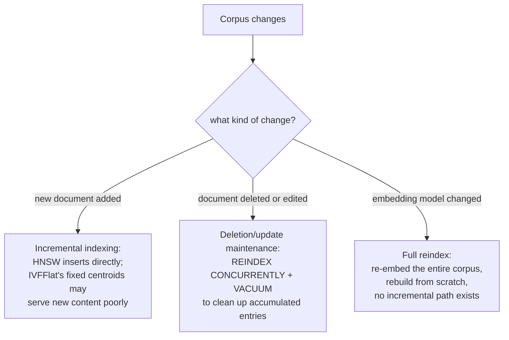

# Lesson 17. Freshness

**Mission link:** Lesson 4 compared HNSW and IVFFlat as two ways to trade exactness for speed, as if an index were built once and queried forever after. A real corpus keeps changing: documents get added, edited, and removed, and eventually someone decides to swap the embedding model itself. Each of these breaks a different assumption the index was built under, and each needs a genuinely different fix.
**Primary source:** [Repo: pgvector, pgvector](https://github.com/pgvector/pgvector)
**Prerequisites:** [Lesson 4](0004-ann-indexes.md), [Lesson 2](0002-embedding-models-and-similarity.md)

## Warm-up

1. ▢ What's the key structural difference between how HNSW and IVFFlat are built, according to lesson 4?

Check

IVFFlat has a training step: it divides vectors into lists using cluster centroids computed from the data present when the index is built. HNSW has no training step at all; it builds a multilayer graph directly, which can even be created before any data exists in the table.

2. ▢ Why does a bi-encoder's similarity metric have to match how the model was actually trained?

Check

The model was optimized to place semantically similar items close together under one specific distance function; using a different metric at query time compares distances the model was never trained to make meaningful, so similarity scores stop reflecting genuine semantic closeness.

## Know this

### Adding new documents doesn't affect every index type the same way

**Incremental indexing** is adding new vectors to an already-built index without rebuilding it from scratch. HNSW handles this natively: since it has no training step, a new vector is simply inserted into the graph directly, and pgvector's own documentation notes an HNSW index can even be created before any data exists at all. IVFFlat is structurally different: its cluster centroids (the "lists" a vector search narrows down to) are computed once, from whatever data existed when the index was built, and a new vector added afterward is assigned to the nearest existing centroid without those centroids ever being recomputed. If the corpus's content shifts meaningfully after the index was built, newly added vectors can end up poorly clustered, since the centroids were never trained on anything resembling them, degrading recall specifically for the newest content rather than the corpus as a whole.

### Deletes and updates leave a graph-based index in a state that needs cleanup

Removing or changing a chunk (a source document was edited or retracted) isn't free even for an index built to support incremental insertion. pgvector's own operational guidance names this directly: vacuuming an HNSW index after deletes or updates can take a while, and reindexing first speeds it up, `REINDEX INDEX CONCURRENTLY` followed by `VACUUM`. This reflects a real structural cost: a graph-based index doesn't cleanly excise a node without risking the graph's navigability, so deleted or stale entries tend to accumulate until a maintenance pass cleans them up, rather than vanishing the instant a row is deleted. A production system has to plan for this maintenance cadence, not assume deletes are instantaneous and free.

### Swapping the embedding model isn't a freshness update at all, it's a full rebuild

Everything above assumes the embedding model stays the same while the corpus's *content* changes. Swapping the embedding model itself is a different problem entirely: every vector already in the index was produced by the old model, placed in that model's own specific vector space, and a query embedded with a new model has no meaningful relationship to distances in the old model's space at all (the same reason lesson 2 requires a similarity metric to match how a model was actually trained, extended to say two different models don't share a comparable space in the first place). There's no incremental fix for this; every vector in the corpus has to be re-embedded with the new model and the index rebuilt from scratch, since a mix of old- and new-model vectors in one index would be comparing distances that were never trained to mean anything relative to each other.

### Three different problems, three different operational plans

Incremental indexing (new documents), deletion and update maintenance (removed or edited documents), and a full model-driven reindex (a changed embedding model) aren't three names for the same freshness concern; they're genuinely different operations with different costs, different frequencies, and different index-type sensitivities. Planning only for the cheapest of the three (routine incremental additions) while treating a full reindex as an afterthought is exactly how a model upgrade turns into an unplanned, expensive, corpus-wide rebuild instead of a scheduled one.

## Practice

1. ▢ A corpus's content shifts meaningfully in topic over time (a growing product line, say), and new documents are added to an IVFFlat index built on the original, narrower corpus. Why might retrieval quality for the newest documents specifically suffer?

Hint

Consider what IVFFlat's cluster centroids were actually computed from, and whether they get updated as new data arrives.

Check

IVFFlat's centroids were computed once, from the data present at build time, and never recomputed as new vectors are added; if the new documents' content differs meaningfully from what the centroids were trained on, those new vectors get assigned to clusters that don't actually represent them well, degrading recall specifically for the newest content.

2. ▢ Why does pgvector's own documentation recommend `REINDEX INDEX CONCURRENTLY` before `VACUUM` for an HNSW index that's had many deletes?

Check

Deleted or stale entries in a graph-based index accumulate rather than being cleanly removed the instant a row is deleted, since removing a node without care risks the graph's navigability; reindexing first rebuilds the graph cleanly, which speeds up the vacuum pass that follows compared to vacuuming the original, entry-accumulated structure directly.

3. ▢ A team swaps their retrieval pipeline's embedding model and tries to incrementally add only the newly changed documents' new-model embeddings into the existing index, leaving old-model embeddings in place for everything else. What's wrong with this plan?

Check

Old-model and new-model embeddings don't share a comparable vector space at all; a query embedded with the new model has no meaningful distance relationship to old-model vectors sitting in the same index. The entire corpus has to be re-embedded with the new model and the index rebuilt from scratch; there's no incremental or partial path that mixes the two models' vectors correctly.

4. ▢ Why does this lesson insist incremental indexing, deletion/update maintenance, and a model-driven reindex are three genuinely different problems rather than three degrees of the same "freshness" concern?

Check

Each breaks a different assumption the index relies on: incremental indexing assumes the index structure can absorb new vectors (true for HNSW, complicated for IVFFlat's fixed centroids); deletion/update maintenance assumes stale entries can be cleaned up periodically without breaking the graph; a model change assumes the entire index shares one comparable vector space, which no longer holds at all once the model changes, requiring a full rebuild rather than any incremental operation.

5. ▢ Which claim correctly describes how these three kinds of corpus change affect a vector index?

    - a) All three can be handled the same way: incrementally update the affected vectors and move on
    - b) Incremental indexing is well-supported by HNSW but can degrade for IVFFlat's fixed centroids; deletes and updates require periodic reindex/vacuum maintenance rather than being instantaneous; a changed embedding model requires a full corpus re-embed and rebuild, since old and new model vectors share no comparable space
    - c) IVFFlat handles newly added, out-of-distribution content better than HNSW does, since it recomputes centroids automatically
    - d) Swapping the embedding model can be handled incrementally by re-embedding only the documents added since the last model change

Check

**b)** That's the precise, three-way distinction this lesson establishes. (a) is false: a model change specifically cannot be handled incrementally at all. (c) is false: IVFFlat's centroids are fixed at build time and are not recomputed as new data arrives; this is exactly its weakness relative to HNSW here. (d) is false: every vector already in the index, not just newly added ones, was produced by the old model and is incompatible with the new model's space.

## Real-world reps

- [ ] For a vector index you maintain (or one you have access to), check whether it uses HNSW or IVFFlat, and whether it has any scheduled reindex or vacuum maintenance in place for handling deletes and updates.
- [ ] If the corpus behind that index has grown or shifted in topic since the index was first built, check whether recall for the newest content seems worse than for the original corpus, especially if the index is IVFFlat.
- [ ] Tomorrow: read pgvector's own documentation on index maintenance in full, and note what it recommends for how often to run `REINDEX` versus relying on autovacuum alone.

## Going further

- [Repo: pgvector, pgvector](https://github.com/pgvector/pgvector)
- [Resources](../RESOURCES.md)

---

Not landing? Reread the primary source at the top, since this lesson compresses it and compression is where understanding leaks. Check the [glossary](../GLOSSARY.md) for any term that felt slippery.

If the lesson itself is unclear rather than the material, that is a defect: [open an issue](https://github.com/TokenCemetery/teach/issues).
