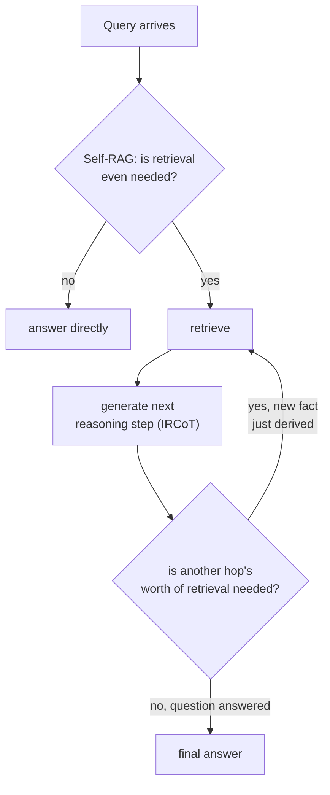

# Lesson 18. Multi-Hop and Agentic Retrieval

**Mission link:** Lesson 14 fixed a compound question by splitting it into sub-questions and retrieving for each, all at once, before generation ever starts. That only works when every sub-question is already visible in the original text. Some questions have a second sub-question that doesn't exist yet, in any form, until the first one's answer comes back. This lesson covers retrieval as a loop the system runs, rather than a single pass it takes once.
**Primary source:** [Paper: "Interleaving Retrieval with Chain-of-Thought Reasoning for Knowledge-Intensive Multi-Step Questions" (IRCoT), Trivedi et al., 2022](https://arxiv.org/abs/2212.10509)
**Prerequisites:** [Lesson 14](0014-query-side-transformation.md), [Lesson 11](0011-diagnosing-the-pipeline.md)

## Warm-up

1. ▢ Why does embedding a whole compound question as one vector serve neither of its two parts well?

Check

A single embedding of a compound question sits somewhere between the corpus regions that would answer each part separately, close to neither; decomposing the question into its separate sub-questions and retrieving for each independently gives each part its own chance to land near the specific passage that actually answers it.

2. ▢ What's the key structural difference between how HNSW and IVFFlat handle a vector added after the index is built?

Check

HNSW has no training step, so a new vector inserts directly into the graph. IVFFlat's cluster centroids are fixed at build time and never recomputed, so a newly added vector is assigned to the nearest existing centroid without that centroid ever adapting to represent it.

## Know this

### Some sub-questions don't exist until the first one is answered

Lesson 14's decomposition assumes every sub-question is already visible in the compound question's own text: "what's the refund policy, and does it differ for annual subscriptions" contains both parts up front. A genuinely **multi-hop** question doesn't: "who directed the film that won Best Picture the year the reigning monarch was born" can't be split into its two sub-questions in advance, because the second sub-question (which film won Best Picture in year X) can't even be phrased until the first one (what year was the monarch born) has actually been answered. The paper's own framing states this precisely: **what to retrieve depends on what has already been derived, which in turn may depend on what was previously retrieved**, a genuine dependency chain, not a split that could have been done upfront with a cleverer prompt.

### IRCoT: alternate a reasoning step and a retrieval step

**IRCoT (Interleaving Retrieval with Chain-of-Thought)** addresses this by alternating two actions instead of running retrieval once: generate the next reasoning step (a sentence of chain-of-thought) using whatever's been retrieved so far, then use that new reasoning step itself as the basis for another retrieval, and repeat. Each retrieval is informed by the reasoning derived from the previous retrieval, which is exactly what a single, even a decomposed, upfront retrieval pass can't do: the query for hop two didn't exist until hop one's answer produced it.

### Self-RAG: deciding whether to retrieve at all, not just how many times

A different, complementary question is whether retrieval should happen at all, and whether what came back was actually good enough to use. Ordinary RAG retrieves a fixed number of passages every single time, whether or not retrieval was actually necessary for that particular query, and whether or not the retrieved passages were genuinely relevant, which the **Self-RAG** paper's own framing identifies as a real cost: indiscriminate retrieval can diminish a model's versatility or produce an unhelpful response when the retrieved passages don't actually help. Self-RAG instead trains a model to decide, per query, whether retrieval is needed, and to critique the retrieved passages and its own draft output for relevance and support, rather than treating retrieval as an unconditional, always-on step applied identically to every query regardless of whether it was ever needed.

### Agentic retrieval: the system, not a fixed pipeline shape, decides what happens next

Put together, these are what turns retrieval from a pipeline (fixed stages, run once, in order) into something closer to an agent's decision at each step: does this query need retrieval at all, is what came back sufficient to answer, or does answering the question require deriving an intermediate fact and searching again based on it. This is a structurally different shape from every earlier lesson in this workspace, which assumed one retrieval pass (possibly against several sub-queries, per lesson 14) followed by one generation step; multi-hop and agentic retrieval instead loop between retrieving and reasoning an unbounded, query-dependent number of times.

## Practice

1. ▢ A question requires knowing fact A before the query for fact B can even be phrased. Why can't lesson 14's decomposition technique handle this the same way it handles an explicit compound question?

Hint

Consider what decomposition needs to already have, in the original question's text, before it can split anything.

Check

Decomposition splits sub-questions that are already visible in the original compound question's text; here, the second sub-question doesn't exist in any phraseable form until fact A's answer comes back, so there's nothing for an upfront split to extract from the original question at all.

2. ▢ What does IRCoT alternate between, and why does each retrieval step depend on the previous one rather than all being decided at the start?

Check

It alternates generating a chain-of-thought reasoning step (using whatever's been retrieved so far) and retrieving again based on that new reasoning step. Each retrieval depends on the previous one because the reasoning that determines what to search for next is itself produced from the prior retrieval, not knowable in advance.

3. ▢ Why does Self-RAG's own framing describe indiscriminate, fixed-count retrieval as a real cost, not just an occasional inefficiency?

Check

Retrieving a fixed number of passages regardless of whether retrieval was even necessary, or whether the passages are relevant, can diminish the model's versatility or lead to an unhelpful response when the retrieved content doesn't actually help; the paper treats this as a genuine quality cost, not a rare edge case.

4. ▢ How does "agentic retrieval" differ structurally from every earlier retrieval design in this workspace?

Check

Every earlier design assumed one retrieval pass (against one query, or several sub-queries decided upfront) followed by one generation step. Agentic retrieval instead loops: the system decides, per step, whether retrieval is needed at all, evaluates whether what came back is sufficient, and can retrieve again based on something just derived, an unbounded, query-dependent number of times rather than a fixed pipeline shape.

5. ▢ Which claim correctly distinguishes IRCoT and Self-RAG?

    - a) Both address the exact same problem: deciding whether to retrieve at all before answering
    - b) IRCoT interleaves reasoning steps with retrieval so each hop's query can depend on what was just derived; Self-RAG instead decides whether retrieval is needed at all and critiques what comes back, a complementary but distinct question from how many hops are needed
    - c) IRCoT and lesson 14's decomposition solve the identical problem, just with different terminology
    - d) Self-RAG always retrieves the same fixed number of passages, just chosen more carefully

Check

**b)** That's the precise, complementary distinction this lesson draws. (a) is false: IRCoT addresses multi-hop dependency between retrieval steps, not whether to retrieve at all. (c) is false: decomposition splits sub-questions already visible in the original text; IRCoT handles sub-questions that don't exist until a prior hop's answer produces them. (d) is false: Self-RAG's whole point is deciding whether retrieval happens at all, and how much of it to trust, not fixing the count more precisely.

## Real-world reps

- [ ] Write one genuinely multi-hop question for a domain you know (where the second fact needed can't be identified until the first fact is resolved), and manually trace what retrieval, reasoning, retrieval, reasoning sequence would actually answer it.
- [ ] For a RAG system you have access to, check whether it always retrieves the same fixed number of passages regardless of the query, or whether it has any mechanism for deciding retrieval isn't needed or wasn't sufficient.
- [ ] Tomorrow: read the IRCoT paper's results section in full, and note how much multi-hop QA accuracy improved over a single-pass retrieve-and-read baseline on the datasets it tested.

## Going further

- [Paper: "Interleaving Retrieval with Chain-of-Thought Reasoning for Knowledge-Intensive Multi-Step Questions" (IRCoT), Trivedi et al., 2022](https://arxiv.org/abs/2212.10509)
- [Paper: "Self-RAG: Learning to Retrieve, Generate, and Critique through Self-Reflection", Asai et al., 2023](https://arxiv.org/abs/2310.11511)
- [Resources](../RESOURCES.md)

---

Not landing? Reread the primary source at the top, since this lesson compresses it and compression is where understanding leaks. Check the [glossary](../GLOSSARY.md) for any term that felt slippery.

If the lesson itself is unclear rather than the material, that is a defect: [open an issue](https://github.com/TokenCemetery/teach/issues).
