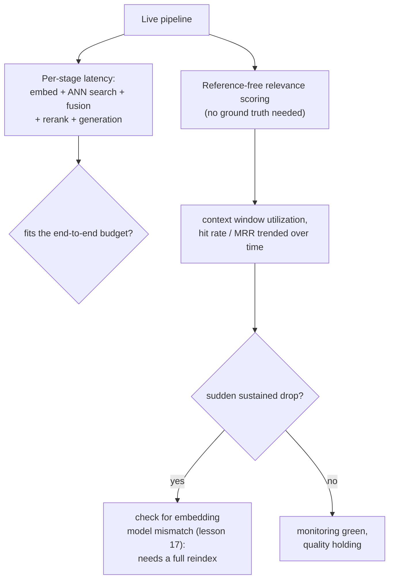

# Lesson 19. Cost, Latency, and Production Monitoring

**Mission link:** Lesson 9 measured whether one stage, reranking, earns its added latency for a given workload. This lesson extends that same discipline to the whole pipeline's cumulative cost and latency, and then covers the part lesson 9's offline measurement can't: once the pipeline is live, ordinary infrastructure monitoring can stay green while retrieval quality silently degrades underneath it.
**Primary source:** [Guide: "RAG Observability: How Coralogix Helps You Trace Retrieval-to-Generation Quality", Coralogix, 2026](https://coralogix.com/guides/rag-observability/)
**Prerequisites:** [Lesson 9](0009-when-reranking-earns-its-cost.md), [Lesson 17](0017-freshness.md)

## Warm-up

1. ▢ How should a team decide whether reranking earns its cost for their specific workload?

Check

Measure retrieval quality both without and with reranking on the same representative query set, separately measure the actual added latency at the candidate-set size in use, and compare both against the workload's actual latency budget and quality bar, rather than assuming reranking always or never helps.

2. ▢ Why does swapping the embedding model require a full reindex rather than an incremental update?

Check

Every vector already in the index was produced by the old model's own vector space, and a query embedded with a new model has no meaningful distance relationship to those old vectors; the entire corpus has to be re-embedded and the index rebuilt from scratch, since there's no way to mix the two models' vectors correctly.

## Know this

### The whole pipeline's budget is more than any one stage's cost

Lesson 9 measured reranking's added latency in isolation. A real request pays the cost of every stage in sequence: ingestion happened earlier and off the critical path, but query embedding, the ANN search, hybrid fusion, reranking (if used), and generation all add their own latency to one live request, and the pipeline's actual budget is whatever's left after every one of those stages has taken its share. A reranking stage that easily fits a 5-second budget in isolation can still blow that budget if the stages before it, or the generation step after it, already consumed most of it; the budget question always has to be asked about the whole chain, not stage by stage in isolation.

### Ordinary infrastructure monitoring can stay green while the answer is already wrong

The primary source's own framing is direct about the gap: a RAG pipeline can return a fast, confident answer while quietly missing the document that should have anchored it, and traditional application monitoring, latency, throughput, error rates, has nothing to say about this, since nothing in the request actually threw an error. A concrete case makes this precise: **hard truncation** can drop a correctly-retrieved chunk once the assembled prompt exceeds the model's context window (lesson 12's own budget concern), silently, with no exception raised anywhere; the retriever did its job, the chunk just never reached the model. Ordinary infrastructure monitoring reports this request as a complete success.

### Context window utilization: a metric for whether retrieved tokens actually earned their place

**Context window utilization**, the ratio of chunks actually cited in the generated answer to chunks that were retrieved and placed in the prompt, gives a concrete signal ordinary latency and error-rate metrics can't. Low utilization means tokens (and the money spent retrieving and processing them) are being spent on context the model never used; but the source's own point cuts the other way too: consistently *high* utilization is itself a warning sign, since it can indicate that critical material is getting truncated out before it ever has a chance to be cited at all.

### Reference-free scoring is what production monitoring uses instead of ground truth

Lesson 10's recall@k and MRR need a labeled or synthetic query set to compute at all. Live production traffic has no such labels for most queries, so production monitoring instead relies on **reference-free scoring**, an LLM-judged relevance score computed per retrieved chunk without needing a known correct answer, aggregated across a time window as a hit rate or average relevance. A sustained drop in this aggregate is exactly the kind of signal that would never show up in an infrastructure dashboard, since nothing about the request pipeline itself failed.

### A sudden drop in a retrieval metric is how you'd actually notice lesson 17's model-change problem happening

Lesson 17 established that swapping the embedding model requires a full reindex, not an incremental fix. This lesson closes the loop on how a team would actually notice, in production, that this has happened, or that a partial reindex left old and new vectors mixed: a sudden, sustained drop in MRR or hit rate, tracked over time, is the concrete production signal that specifically points at an embedding-model mismatch rather than an ordinary quality fluctuation, and it means the fix is lesson 17's full reindex, not another round of tuning.

## Practice

1. ▢ A reranking stage measured in isolation costs 150 ms, well inside a 5-second budget. Why might it still be worth checking the full pipeline's cumulative latency before deciding it's affordable?

Hint

Consider what else happens in the same request besides the reranking step itself.

Check

The budget question is about the whole chain, not one stage in isolation: query embedding, ANN search, hybrid fusion, and generation all add their own latency to the same request, and if those stages already consume most of the budget, an individually-affordable reranking cost can still push the total over the limit.

2. ▢ A chunk is correctly retrieved and ranked highly, but the assembled prompt exceeds the model's context window and the chunk gets truncated before generation. Does this show up as an error in ordinary infrastructure monitoring?

Check

No. Hard truncation drops the chunk silently, with no exception raised anywhere; the request completes successfully from an infrastructure standpoint, even though the model never actually saw the chunk it needed. This is exactly the kind of failure ordinary latency/error-rate monitoring has nothing to say about.

3. ▢ Why is consistently *high* context window utilization treated as a warning sign, rather than simply a good thing?

Check

Very high utilization can indicate that critical material is being truncated out before generation, since a heavily-utilized context window is closer to its limit; a metric meant to catch wasted tokens can, at the opposite extreme, also be an early signal of the truncation problem itself.

4. ▢ Production traffic has no ground-truth labels for most queries. What does reference-free scoring let a team measure anyway, and why can't lesson 10's recall@k and MRR be computed the same way in production?

Check

Reference-free scoring uses an LLM judge to score each retrieved chunk's relevance without needing a known correct answer, aggregated as a hit rate or average relevance over time. Lesson 10's recall@k and MRR both require knowing which result actually was correct for a given query, which a labeled or synthetic query set provides offline but live production traffic mostly doesn't.

5. ▢ Which claim correctly describes how this lesson's monitoring approach relates to lesson 17's freshness problem?

    - a) Monitoring and reindexing address unrelated concerns with no practical connection
    - b) A sudden, sustained drop in a trended metric like MRR or hit rate is the production signal that points specifically at an embedding-model mismatch, telling a team lesson 17's full reindex is needed rather than another round of tuning
    - c) Reference-free scoring makes reindexing unnecessary, since it can correct for a stale index automatically
    - d) Context window utilization and embedding-model mismatch are the same underlying problem measured two different ways

Check

**b)** That's the precise link this lesson draws between monitoring and lesson 17's earlier material. (a) is false: monitoring is specifically what lets a team notice, in production, that lesson 17's reindex scenario has actually occurred. (c) is false: reference-free scoring only measures relevance, it doesn't fix an incompatible vector space; a genuine model mismatch still needs lesson 17's full reindex. (d) is false: context window utilization is about truncation and token spend, a separate concern from an embedding-model mismatch showing up as a retrieval-metric drop.

## Real-world reps

- [ ] For a RAG pipeline you have access to, add up each stage's typical latency (ingestion aside, since it's off the critical path) and check whether the total fits your actual end-to-end budget, not just any one stage measured alone.
- [ ] Check whether your own pipeline logs anything like context window utilization, or whether you'd currently have no way of noticing a chunk got silently truncated.
- [ ] Tomorrow: read the primary source's section on vector database health monitoring in full, and note what specific metrics it recommends trending to catch an embedding-model mismatch before users notice degraded answers.

## Going further

- [Guide: "RAG Observability: How Coralogix Helps You Trace Retrieval-to-Generation Quality", Coralogix, 2026](https://coralogix.com/guides/rag-observability/)
- [Paper: "RAGAS: Automated Evaluation of Retrieval Augmented Generation", Es et al., 2023](https://arxiv.org/abs/2309.15217)
- [Resources](../RESOURCES.md)

---

Not landing? Reread the primary source at the top, since this lesson compresses it and compression is where understanding leaks. Check the [glossary](../GLOSSARY.md) for any term that felt slippery.

If the lesson itself is unclear rather than the material, that is a defect: [open an issue](https://github.com/TokenCemetery/teach/issues).
