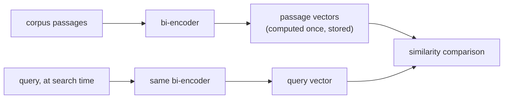

# Chunking and Embeddings

The first two pipeline decisions, and what each actually costs. Built for lookup when designing a retrieval pipeline.

## Why chunk at all

A long, topically mixed passage embeds as one blurred vector, an average of everything it touches, which retrieves poorly for a query about any one specific thing inside it (and may not even fit the embedding model's context window). Chunk size trades two failure modes:

| Chunks too large | Chunks too small |
|---|---|
| Blurs multiple topics into one averaged vector; retrieval returns irrelevant surrounding text | Loses surrounding context that makes a chunk interpretable; a multi-piece answer may not be answerable from any single chunk |

There is no universal right size: it depends on the corpus and the query pattern.

## Chunking strategies

| Strategy | How | Trade-off |
|---|---|---|
| Fixed-size | Split every N tokens/characters, usually with overlap | Simple and predictable, but blind to structure: can split a sentence or table in half |
| Recursive / structure-aware | Split on natural boundaries (sections, then paragraphs, then sentences), falling back to fixed-size only when a piece is still too large | Respects the document's own organization |
| Semantic | Embed consecutive sentences, split where neighbor similarity drops sharply | Targets the actual failure mode (mixed topics) directly; more expensive to compute |
| Document-structure-aware | Treat structural units (a heading's section, a table, a code block) as atomic | Never destroys a structural unit's meaning by splitting it |

**Overlap** between consecutive chunks trades some redundant storage and embedding computation against not fragmenting a fact or sentence that straddles a chunk boundary.

## Bi-encoders: embed once, compare cheaply

A **bi-encoder** maps text to a fixed-size vector independently of any other text; a query and a passage are embedded separately, not jointly. Every corpus chunk is embedded once, ahead of time, and stored; at search time only the query needs embedding, compared cheaply against the precomputed vectors. A **cross-encoder** (running the model jointly over every query-passage pair) doesn't scale to searching a large corpus at query time.



## Similarity metrics must match training

| Metric | What it measures | Note |
|---|---|---|
| Cosine similarity | Angle between vectors, ignoring magnitude | |
| Dot product | Cosine similarity without normalizing by magnitude | Rewards larger-magnitude vectors when unnormalized; identical ranking to cosine only when both vectors are unit-length |
| Euclidean distance | Straight-line distance | |

The metric is not a free choice: an embedding model is trained with a specific similarity function in its loss (Sentence-BERT-style models are typically trained so cosine similarity, or a normalized dot product, reflects semantic closeness). Using a different metric than the one trained for can rank in ways the model was never tuned to produce, not just "slightly worse".

## Choosing a model: match training objective to task

Retrieval is usually **asymmetric search** (a short query against long passages), a different training setup than **symmetric search** (comparing two similar-length, similar-kind texts). A model topping a general benchmark (e.g. MTEB) can still underperform a domain- or task-matched model on a specialized corpus (legal, medical) a general web-trained model saw little of. The question is not "which model scores highest overall" but "which model was trained on something close to this corpus and this query shape."

## Dimensionality is a cost, not a free quality knob

Storage, index memory, and per-candidate distance computation all scale linearly with dimension:

```text
bytes per vector = dimensions × 4   (float32)
```

| Dimensions | Bytes/vector | 1M chunks |
|---|---|---|
| 256 | 1,024 (~1 KB) | ~1 GB |
| 1536 | 6,144 (~6 KB) | ~6 GB |

## Matryoshka Representation Learning (MRL): truncation as a designed feature

Ordinarily, truncating a standard embedding vector is unsafe: nothing orders its dimensions by importance, so cutting it discards information unpredictably. **MRL** trains a model so that prefixes of the full vector (e.g. the first 256 dimensions of a 1536-dimension embedding) are themselves usable, meaningful embeddings, nested like a matryoshka doll. This lets an MRL-trained model be truncated after the fact with a bounded, predictable quality cost, no retraining or re-embedding needed. This only holds for models actually trained this way.

## Deciding dimensionality: measure, don't guess

The right dimensionality is the smallest one that still clears the quality bar the workload needs, measured (most directly via recall@k) at each candidate dimensionality on the actual corpus and query pattern, not assumed from the largest available size.

## Related

- [Lesson 1](../lessons/0001-chunking.md), [Lesson 2](../lessons/0002-embedding-models-and-similarity.md), [Lesson 3](../lessons/0003-embedding-dimensionality.md)
