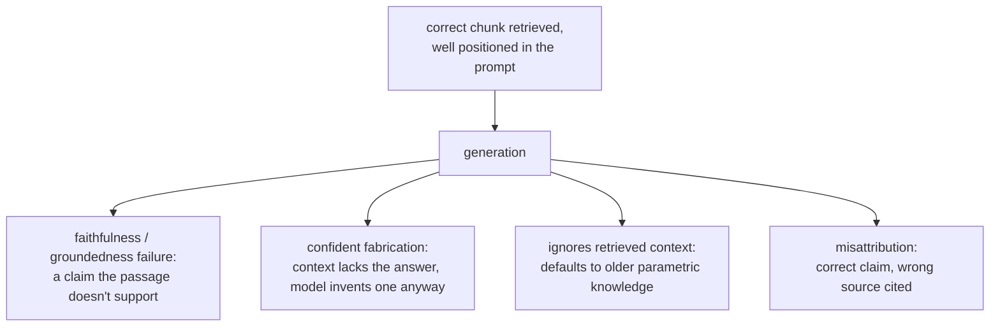

# Generation from Retrieval

What happens after the right chunks are retrieved. Built for lookup when assembling a prompt or diagnosing a wrong final answer that isn't a retrieval failure.

## Context-window budget is shared

Retrieved chunks are one line item in a finite context window shared with the system prompt, conversation history, and the user's question. Retrieving more chunks (a larger k) isn't free even when every one is genuinely relevant: each one consumes budget something else could use.

## Lost in the middle

Being technically present in the context window doesn't guarantee a model uses it. Models use information near the very beginning or end of a long context far more reliably than information buried in the middle, even fully within the stated context limit.

| Consequence | Why |
|---|---|
| Stuffing many marginal chunks "to be safe" has a cost beyond token budget | It can bury a genuinely good chunk in the middle, making the answer worse |
| Chunk placement is a deliberate choice | The most relevant chunk should sit near the beginning or end of the assembled context, not wherever concatenation order put it |

A highly relevant chunk buried in the middle produces a wrong or incomplete answer that looks like a retrieval failure but isn't: the chunk was retrieved correctly; it wasn't positioned somewhere the model reliably reads from. This is a distinct failure point from [everything stage 6 diagnoses](retrieval-evaluation.md), which only checks whether the correct chunk was retrieved and ranked highly enough to reach the prompt at all.

## Generation-stage failures that survive correct retrieval

Even with the exact right passage retrieved and well positioned, generation itself introduces failure modes none of the earlier stages can fix or detect:

| Failure | What happens |
|---|---|
| Faithfulness / groundedness | The model generates a claim the retrieved passage doesn't actually support, or contradicts it outright |
| Confident fabrication | The context genuinely lacks the answer; the model produces a plausible-sounding one anyway. The most costly failure, since fluency gives no visible signal it isn't grounded |
| Ignoring retrieved context | The model defaults to its own parametric knowledge instead of retrieved, more current information (e.g. answering an old policy figure despite a retrieved document stating the new one) |
| Misattribution | The right information is used, but cited to the wrong retrieved passage among several provided |

## Checking faithfulness is a separate question from retrieval evaluation

Stage 6's diagnostic procedure checks whether retrieval found and ranked the right chunk; none of that machinery checks whether the generated answer stayed faithful to what was retrieved. That is checked by comparing each claim in the generated answer against the retrieved context it rests on, commonly with an LLM-as-judge prompt built for that comparison, the design and calibration discipline `llm/evals` covers, applied here to a different question than whether retrieval succeeded.

## Related

- [Lesson 12](../lessons/0012-prompt-construction-and-context-budget.md), [Lesson 13](../lessons/0013-what-generation-still-gets-wrong.md)
- [Retrieval Evaluation](retrieval-evaluation.md): the separate diagnostic procedure for whether the right chunk was retrieved at all
