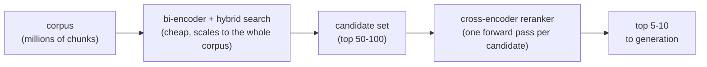
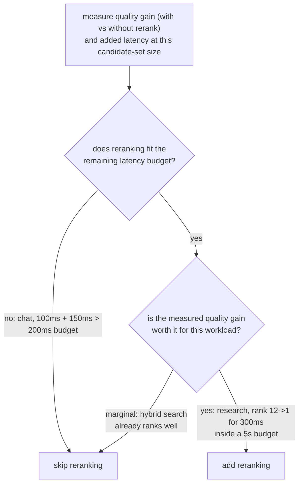

# Reranking

The second-pass, higher-accuracy stage over an already-narrowed candidate set. Built for lookup when adding or evaluating a reranking stage.

## Cross-encoders see the query and passage together

| | Bi-encoder (retrieval) | Cross-encoder (reranking) |
|---|---|---|
| Input | Query and passage embedded independently | Query and one candidate passage, jointly, as one input |
| What it captures | Overall semantic similarity | Fine-grained query-passage interaction (this word matching this clause) |
| Precomputable | Yes: passage vectors computed once, stored | No: one full forward pass per query-candidate pair, every query |
| Scales to a full corpus | Yes (embedding index) | No: a million chunks would need a million forward passes per query |

## Retrieve cheap, rerank precisely



Bi-encoder retrieval (plus [hybrid search](hybrid-search.md)) cheaply narrows the corpus to a modest candidate set; a cross-encoder then reranks only that smaller set, applying the expensive step only where the corpus has already been narrowed enough for it to be affordable.

## What reranking costs

```text
added latency ≈ candidates reranked × per-candidate forward-pass cost
```

Reranking 100 candidates costs roughly 100x one forward pass, additive on top of whatever the initial retrieval stage already took. Nothing about reranking is free just because it improves accuracy.

## Deciding whether it earns its cost

The question is not "does reranking improve quality in general" (it usually does) but "does it improve quality enough, for this corpus and query pattern, to justify what it costs here." Measure retrieval quality (recall@k, MRR) both without and with reranking, on the same query set, and measure the actual added latency at the candidate-set size in use.



**Worked examples:**

| Workload | Retrieval | Rerank cost | Budget | Quality gain | Verdict |
|---|---|---|---|---|---|
| Real-time chat | 100 ms | +150 ms | 200 ms | n/a | Skip: 250 ms already exceeds the budget |
| Offline research assistant | n/a | +300 ms | 5 s | Rank 12 -> 1 | Add: cheap relative to the budget, large gain |

Neither "always rerank" nor "never rerank" is the right default: the decision is measuring the actual quality gain and the actual added latency, and checking both against the specific workload's budget and quality bar.

## Related

- [Lesson 8](../lessons/0008-cross-encoder-rerankers.md), [Lesson 9](../lessons/0009-when-reranking-earns-its-cost.md)
- [Hybrid Search](hybrid-search.md): what produces the candidate set reranking operates on
