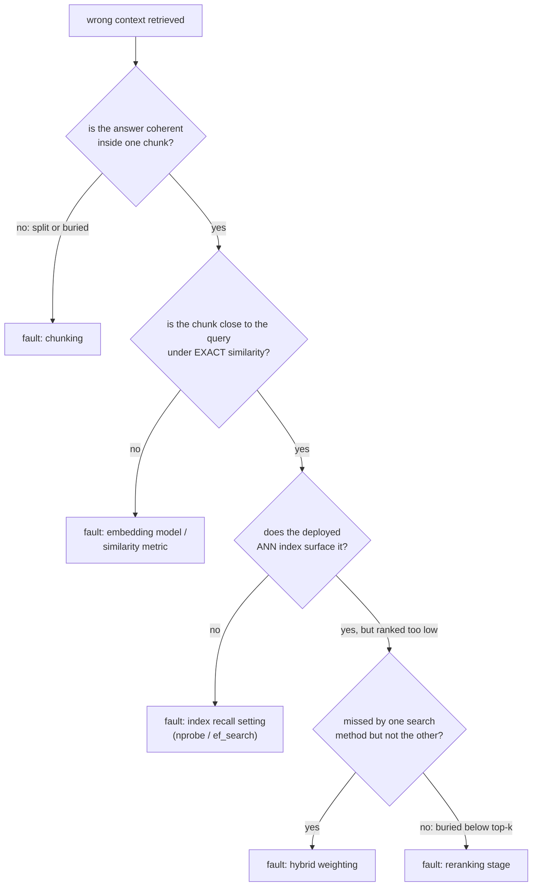

# Retrieval Evaluation

Measuring retrieval quality and diagnosing a failure. Built for lookup when evaluating or debugging a pipeline.

## Recall@k and MRR

| Metric | Asks | Sensitive to exact rank? |
|---|---|---|
| Recall@k | Across test queries, what fraction had a relevant document somewhere in the top k | No: rank 1 and rank k both count as a hit |
| MRR (mean reciprocal rank) | Average of `1/rank` of the first relevant result, across queries | Yes: rank 1 contributes 1.0, rank 10 contributes 0.1 |

Recall@k grows as k grows; it is a budget question (if downstream only looks at the top k, recall@k says how often it got the chance to find the answer). MRR rewards ranking the right answer as high as possible, the information recall@k throws away.

**Worked example**, four queries, first-relevant-result ranks 1, 3, 1, 8:

```text
recall@1: ranks <= 1 are queries 1 and 3 -> 2/4 = 0.50
recall@5: ranks <= 5 are queries 1, 2, 3 (ranks 1, 3, 1); query 4 (rank 8) misses -> 3/4 = 0.75
MRR: (1/1 + 1/3 + 1/1 + 1/8) / 4 = (1.000 + 0.333 + 1.000 + 0.125) / 4 ~= 0.615
```

recall@5 says three of four queries would find their answer within the top 5. MRR's 0.615 reflects that most hits landed at rank 1, with one weaker hit and one miss pulling the average down.

## Choosing k, and choosing between the metrics

The right k for recall@k is whatever the downstream system actually uses: if only the top 5 chunks reach generation, recall@100 measures something the pipeline never exploits. MRR is most informative when only the very top result matters a great deal; recall@k is more informative when several results within a budget are all usable. Reporting both, at the k the pipeline actually uses, gives a fuller picture than either alone.

## Diagnosing the pipeline: isolate before tuning

"Wrong context retrieved" is a symptom, not a diagnosis. Check stages in order, so an earlier stage's fault doesn't waste effort tuning a later one:



| Check | What it isolates |
|---|---|
| Pull up the chunk that should answer a known failing query | Whether [chunking](chunking-and-embeddings.md) gave the answer a coherent representation at all; no later stage can fix a split or buried answer |
| Exact similarity (bypassing the ANN index) | Whether the embedding model or similarity metric places the correct chunk near the query, independent of index tuning |
| Deployed ANN index, once the embedding is confirmed close | Whether [the index's recall setting](vector-search-and-indexing.md) (`nprobe` / `ef_search`) is tuned too aggressively toward speed |
| Compare vector-only vs BM25-only vs hybrid | Whether [the hybrid blend](hybrid-search.md) is under-weighting the method that would have surfaced it |
| Check the final top-k after fusion | If retrieved but ranked too low, whether [reranking](reranking.md) is missing or under-tuned |

## Diagnose across a query set, not one anecdote

A single failing query can fail for a one-off reason (unusual phrasing) rather than a systemic problem. Measuring recall@k and MRR at each stage (initial retrieval, after hybrid fusion, after reranking) across a small set of known, representative failures reveals where the aggregate biggest drop happens.

## Related

- [Lesson 10](../lessons/0010-recall-at-k-and-mrr.md), [Lesson 11](../lessons/0011-diagnosing-the-pipeline.md)
- [Chunking and Embeddings](chunking-and-embeddings.md), [Vector Search and Indexing](vector-search-and-indexing.md), [Hybrid Search](hybrid-search.md), [Reranking](reranking.md): the stages this sheet's diagnostic procedure isolates between
