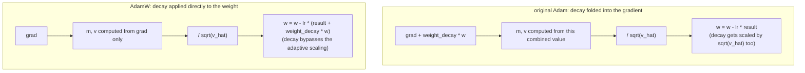

# Lesson 11. The AdamW Optimizer Step

**Mission link:** This is stage 4's capstone: lesson 10's backward pass produces a gradient for every weight, and the optimizer is what actually turns those gradients into updated weights, closing the loop that lets the model train from scratch.
**Primary source:** [Paper: "Decoupled Weight Decay Regularization", Loshchilov and Hutter, 2019](https://arxiv.org/abs/1711.05101)
**Prerequisites:** [Lesson 10](0010-backward-pass-and-autograd.md), [Scaled dot-product attention](../GLOSSARY.md)

## Warm-up

1. ▢ What does calling `loss.backward()` populate, and why must gradients typically be zeroed before the next call?

<details markdown="1"><summary>Check</summary>

It populates every trainable parameter's `.grad` attribute with the gradient of the loss with respect to that parameter. Gradients accumulate by default rather than overwrite, so without zeroing first, a new backward pass's gradient would be contaminated by the previous step's leftover values.

</details>

2. ▢ Why does a residual connection guarantee some gradient reaches an earlier layer regardless of how small the sublayer's own local derivative is?

<details markdown="1"><summary>Check</summary>

The identity path's local derivative is exactly 1, so its contribution to the gradient, `d(loss)/d(y) × 1`, doesn't depend on the sublayer's derivative at all; that direct term passes through unscaled no matter what the sublayer contributes.

</details>

## Know this

### The simplest update: plain gradient descent

The most basic optimizer moves each weight a small step opposite its gradient: `w = w - lr × grad`, where `lr` is the **learning rate**. Since the gradient points in the direction of steepest increase in the loss, subtracting a scaled version of it moves the weight toward lower loss. Too large a learning rate overshoots and can diverge; too small makes training crawl. Plain gradient descent applies this identical rule to every parameter, with no memory of past updates and no distinction between parameters that need large or small steps.

### Momentum: smoothing noisy per-batch gradients

**Adam** improves on this in two ways. First, it tracks a **first moment**, `m`, an exponentially decaying running average of past gradients: `m = beta1 × m + (1 - beta1) × grad`. Rather than reacting to each batch's gradient in isolation, which is noisy since different batches produce somewhat different gradients, the update follows this smoothed running average, letting the optimizer build consistent "velocity" in a direction the gradient has repeatedly pointed toward, rather than jittering with every batch's individual noise.

### Adaptive scaling: a per-parameter step size

Second, Adam tracks a **second moment**, `v`, an exponentially decaying running average of the squared gradient: `v = beta2 × v + (1 - beta2) × grad^2`. This estimates each parameter's typical gradient magnitude. Dividing the update by `sqrt(v)` gives a parameter whose gradients are usually small a relatively larger effective step, and a parameter whose gradients are usually large a relatively smaller one, adapting the step size per parameter rather than using one fixed learning rate for every weight in the model. The full update, with bias correction (`m_hat`, `v_hat`, correcting for `m` and `v` both starting at zero and being biased toward zero early in training) and a small constant `eps` to avoid dividing by zero, is:

```text
w = w - lr × m_hat / (sqrt(v_hat) + eps)
```

### AdamW's fix: decouple weight decay from the adaptive update

**Weight decay** is a regularization technique that shrinks every weight slightly toward zero each step, discouraging overly large weights and generally helping generalization. The original way to add it to Adam folded it directly into the gradient before computing `m` and `v`: effectively adding `weight_decay × w` to `grad`. That interacts badly with Adam's adaptive scaling: the decay term itself then gets divided by `sqrt(v_hat)` along with the rest of the gradient, so a parameter with large typical gradients gets its decay shrunk, and one with small typical gradients gets its decay amplified, neither of which is the fixed, uniform shrinkage weight decay is supposed to apply. **AdamW** fixes this by applying weight decay directly to the weights, separately from the gradient-based Adam update:

```text
w = w - lr × (m_hat / (sqrt(v_hat) + eps) + weight_decay × w)
```

The decay term is added to the update directly, never passed through `m`, `v`, or the adaptive denominator, which is exactly why AdamW ("W" for weight decay) rather than plain Adam is the standard optimizer for training transformers.



## Practice

1. ▢ Using plain gradient descent, a weight is `w = 5.0`, its gradient is `2.0`, and the learning rate is `0.1`. Compute the updated weight.

<details markdown="1"><summary>Hint</summary>

`w = w - lr × grad`.

</details>

<details markdown="1"><summary>Check</summary>

`w = 5.0 - 0.1 × 2.0 = 5.0 - 0.2 = 4.8`.

</details>

2. ▢ Why does tracking a running average of past gradients (Adam's first moment, `m`) help compared to using each batch's raw gradient directly?

<details markdown="1"><summary>Check</summary>

Individual batches produce noisy gradients that vary somewhat from batch to batch. A running average smooths that noise out, letting the update follow the direction the gradient has consistently pointed toward across recent steps, rather than reacting to each batch's individual fluctuation.

</details>

3. ▢ Why does dividing the update by `sqrt(v)`, Adam's second moment, help parameters that have different typical gradient magnitudes?

<details markdown="1"><summary>Check</summary>

`v` estimates each parameter's typical squared gradient magnitude. Dividing by its square root scales the update inversely to that magnitude, giving a parameter with usually small gradients a relatively larger effective step and a parameter with usually large gradients a relatively smaller one, rather than forcing every parameter to use the same fixed step size regardless of how large its gradients typically are.

</details>

4. ▢ What goes wrong with folding weight decay directly into the gradient in original Adam, and what does AdamW do differently?

<details markdown="1"><summary>Check</summary>

Folding weight decay into the gradient means it gets divided by `sqrt(v_hat)` along with the rest of the update, so a parameter's decay ends up shrunk or amplified depending on its typical gradient magnitude, rather than applying the same fixed fractional shrinkage weight decay is meant to provide. AdamW applies weight decay directly to the weights, added to the update separately from the gradient-based term, so it never passes through the adaptive scaling at all.

</details>

5. ▢ Which claim is true of AdamW compared to plain gradient descent and original Adam?

    - a) AdamW uses the same fixed step size for every parameter, the same as plain gradient descent
    - b) AdamW adds momentum and per-parameter adaptive scaling like Adam, but applies weight decay directly to the weights rather than folding it into the gradient
    - c) AdamW removes adaptive per-parameter scaling entirely, relying only on momentum
    - d) Weight decay in AdamW is scaled by the same adaptive denominator as the gradient-based update

<details markdown="1"><summary>Check</summary>

**b)** That decoupling is exactly what distinguishes AdamW from original Adam, while keeping Adam's momentum and adaptive scaling. (a) is false: adaptive per-parameter scaling is precisely what plain gradient descent lacks and Adam/AdamW add. (c) is false: AdamW keeps both momentum and adaptive scaling. (d) is false: that's the original Adam problem AdamW specifically fixes by decoupling.

</details>

## Real-world reps

- [ ] Implement plain gradient descent, then Adam, then AdamW from raw operations for a small set of parameters, and confirm each successive version changes the update in the way this lesson describes.
- [ ] Run a few training steps with weight decay folded into the gradient (original Adam style) versus applied directly (AdamW style) on the same small model, and compare how the weights' magnitudes evolve.
- [ ] Tomorrow: check what optimizer and hyperparameters (learning rate, weight decay, beta1, beta2) a real training script you have access to (such as nanoGPT's) actually uses.

## Going further

- [Paper: "Decoupled Weight Decay Regularization", Loshchilov and Hutter, 2019](https://arxiv.org/abs/1711.05101)
- [Paper: "Adam: A Method for Stochastic Optimization", Kingma and Ba, 2015](https://arxiv.org/abs/1412.6980)
- [Resources](../RESOURCES.md)

---

Not landing? Reread the primary source at the top, since this lesson compresses it and compression is where understanding leaks. Check the [glossary](../GLOSSARY.md) for any term that felt slippery.

If the lesson itself is unclear rather than the material, that is a defect: [open an issue](https://github.com/TokenCemetery/teach/issues).
