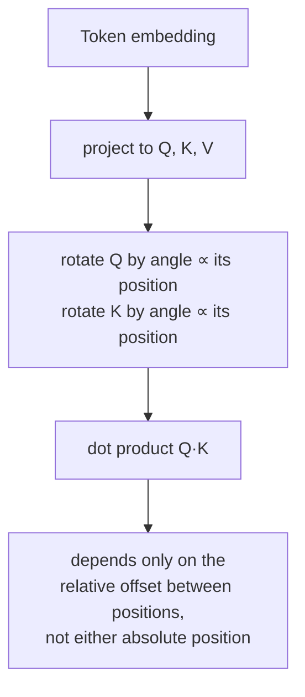

# Lesson 14. Rotary Position Embeddings

**Mission link:** Lesson 4 established that position has to enter through the vectors that produce `Q`, `K`, and `V`, since attention's equation has no other channel for it, and it taught the one way the original paper does this: adding a fixed sinusoidal vector to the token embedding before attention runs at all. **Rotary position embeddings (RoPE)** are the mechanism nearly every current open model actually uses instead, and they inject position through the same channel lesson 4 identified, but by a genuinely different operation: rotating `Q` and `K` themselves, inside the attention computation, rather than adding anything to the embedding beforehand.
**Primary source:** [Paper: "RoFormer: Enhanced Transformer with Rotary Position Embedding", Su et al., 2021](https://arxiv.org/abs/2104.09864)
**Prerequisites:** [Lesson 4](0004-positional-encoding.md), [Positional encoding](../GLOSSARY.md)

## Warm-up

1. ▢ Why must position be encoded into the vectors that produce `Q`, `K`, and `V`, rather than passed to attention as some separate signal?

Check

Attention's equation only ever operates on `Q`, `K`, and `V`; there's no additional input for position to enter through. The only way the computation becomes sensitive to position is if position is already baked into the vectors that produce them.

2. ▢ Why can sinusoidal positional encoding be evaluated at a sequence length longer than anything seen during training, where a learned position embedding table cannot?

Check

Sinusoidal encoding is a formula, evaluable at any position value at all. A learned embedding table only has rows for the positions it was sized and trained for, with nothing to look up beyond that range.

## Know this

### RoPE rotates Q and K instead of adding anything to the embedding

Where sinusoidal encoding adds a fixed vector to a token's embedding once, before it's ever projected into `Q`, `K`, or `V`, **RoPE** instead takes the already-projected query and key vectors for a token at position `pos` and applies a **rotation** to them, by an angle proportional to `pos`. Splitting a vector into 2-dimensional pairs (the same pairing sinusoidal encoding used for its sine/cosine frequencies), each pair is rotated by an angle that scales with position and with that pair's own frequency, lower-index pairs rotating slowly across positions, higher-index pairs rotating fast, mirroring the frequency structure lesson 4 already introduced.

### A rotated dot product depends only on relative position, not on either absolute position

This is RoPE's actual payoff, and it's a property of rotation itself: rotating a query vector by an angle proportional to position `m` and a key vector by an angle proportional to position `n`, then taking their dot product, produces a value that depends only on `m − n`, the relative offset between them, not on `m` or `n` individually. Two rotations compose by adding their angles, so comparing a vector rotated by `m`'s angle against one rotated by `n`'s angle is mathematically equivalent to comparing the original, unrotated vectors after rotating by the *difference* `m − n` alone. The paper's own framing captures exactly this: RoPE encodes *absolute* position (each vector is rotated according to its own position) but the effect on attention is an *explicit relative* position dependency, since only the offset between positions survives into the attention score.

### This is a different mechanism from lesson 4's, not a patch on top of it

Sinusoidal encoding is additive and happens once, before attention, permanently mixed into the embedding from that point on. RoPE is multiplicative (a rotation) and happens inside the attention computation itself, applied fresh to `Q` and `K` at every layer that computes attention, rather than baked into the embedding a single time at the input. Both satisfy lesson 4's requirement that position enter through the vectors attention actually operates on, but they are two structurally different ways of doing it, and RoPE's relative-position property is not something sinusoidal encoding's additive scheme produces on its own.

### Why this specific property matters for real models

A model whose attention score depends on relative offset rather than absolute position handles a practical case sinusoidal encoding's own paper only argued for informally: the relationship between a token and one 5 positions before it looks the same whether that pair sits at the start of a short sequence or in the middle of a very long one. This relative-position property, derived directly from how rotation composes, is a major reason RoPE displaced sinusoidal encoding in practice, alongside the flexibility to handle sequence lengths not fixed at training time the same way lesson 4's formula-based (rather than table-based) approach could.

## Practice

1. ▢ RoPE rotates a query vector according to its absolute position and a key vector according to its own absolute position. Why does the paper still describe the resulting effect on attention as a *relative* position dependency?

Hint

Consider what happens to two rotation angles when you compare the vectors they were each applied to.

Check

Because two rotations compose by adding their angles, comparing a vector rotated by position `m`'s angle against one rotated by position `n`'s angle is equivalent to comparing the unrotated vectors after a single rotation by the difference `m − n`. Even though each vector was rotated according to its own absolute position, only the relative offset between the two positions survives into the resulting dot product.

2. ▢ How does RoPE's mechanism for injecting position differ structurally from sinusoidal encoding's, even though both satisfy lesson 4's requirement that position enter through Q, K, and V?

Check

Sinusoidal encoding adds a fixed vector to the token embedding once, before attention or any projection happens, permanently mixed into the representation from that point forward. RoPE instead rotates the already-projected `Q` and `K` vectors, applied fresh inside the attention computation at every layer, a multiplicative operation rather than an additive one performed upfront.

3. ▢ Two tokens are 5 positions apart near the start of a sequence, and two other tokens are also 5 positions apart much later in a long sequence. Under RoPE, how do their attention scores relate to each other, all else being equal?

Check

They depend on the same relative offset (5 positions), so RoPE's rotation-composition property makes the resulting attention score treat both pairs consistently based on that shared offset, rather than being sensitive to where in the sequence each pair happens to sit.

4. ▢ Does RoPE contradict lesson 4's claim that position must be encoded into the vectors producing Q, K, and V, since RoPE operates on Q and K directly rather than the embedding?

Check

No. RoPE rotates the query and key vectors that attention's equation actually uses, which are still the vectors lesson 4 said position has to enter through; RoPE is a different mechanism for injecting position into those same vectors (multiplicative rotation, applied after projection) rather than an exception to the requirement itself.

5. ▢ Which claim correctly distinguishes RoPE from sinusoidal positional encoding?

    - a) RoPE adds a fixed vector to the token embedding, exactly like sinusoidal encoding, just computed with a different formula
    - b) RoPE rotates the projected Q and K vectors by an angle proportional to position, which makes a resulting dot product depend only on relative position, a property sinusoidal encoding's additive scheme doesn't produce
    - c) RoPE and sinusoidal encoding both operate on the token embedding before any projection into Q, K, or V
    - d) RoPE requires position to be passed to attention as a signal separate from Q and K

Check

**b)** That's the precise mechanism and payoff this lesson establishes. (a) is false: RoPE is a rotation applied to the already-projected Q and K, not an additive vector on the embedding. (c) is false: sinusoidal encoding operates on the embedding before projection; RoPE operates on Q and K after projection. (d) is false: RoPE still respects lesson 4's requirement, injecting position into Q and K themselves, the same channel attention's equation actually uses.

## Real-world reps

- [ ] Implement RoPE's rotation for a small vector dimension and a few integer positions, and confirm numerically that the dot product between a rotated query at position `m` and a rotated key at position `n` depends only on `m - n`, not on `m` or `n` individually.
- [ ] Compare your lesson 4 sinusoidal implementation and this lesson's RoPE implementation side by side: which vectors does each one modify, and at what point in the forward pass does each one run?
- [ ] Tomorrow: read the primary source's section on how RoPE's relative-position property affects attention's behavior as distance grows, and note what it claims about scores decaying with distance.

## Going further

- [Paper: "RoFormer: Enhanced Transformer with Rotary Position Embedding", Su et al., 2021](https://arxiv.org/abs/2104.09864)
- [Paper: "Attention Is All You Need", Vaswani et al., 2017](https://arxiv.org/abs/1706.03762)
- [Resources](../RESOURCES.md)

---

Not landing? Reread the primary source at the top, since this lesson compresses it and compression is where understanding leaks. Check the [glossary](../GLOSSARY.md) for any term that felt slippery.

If the lesson itself is unclear rather than the material, that is a defect: [open an issue](https://github.com/TokenCemetery/teach/issues).
