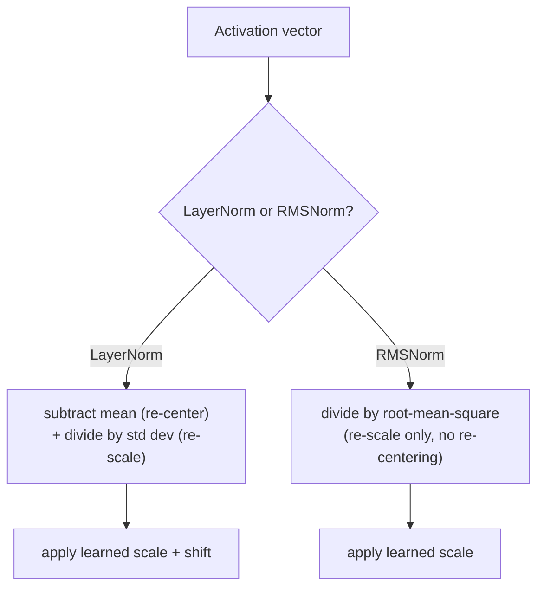

# Lesson 15. RMSNorm

**Mission link:** Lesson 5 derived why a deep stack needs layer normalization at all, and why pre-norm placement (norm inside the residual branch) trains more stably than the original paper's post-norm. That lesson used ordinary layer norm to make the point. **RMSNorm** is what current models actually place inside that same pre-norm branch instead, and it exists because one of layer norm's two operations turns out not to be doing much work.
**Primary source:** [Paper: "Root Mean Square Layer Normalization", Zhang and Sennrich, 2019](https://arxiv.org/abs/1910.07467)
**Prerequisites:** [Lesson 5](0005-layer-norm-and-residuals.md), [Lesson 14](0014-rotary-position-embeddings.md)

## Warm-up

1. ▢ Why does layer norm's per-example computation (rather than across the batch, like batch norm) matter specifically for a sequence model doing autoregressive generation?

Check

Autoregressive generation commonly runs with a small batch, often batch size 1, where batch normalization's across-batch statistics would be meaningless or unstable. Layer norm computes its statistics from a single example's own features, so it works identically regardless of batch size.

2. ▢ Contrast post-norm and pre-norm placement, and explain why pre-norm is generally preferred for very deep models.

Check

Post-norm applies layer norm after adding the residual, `LayerNorm(x + Sublayer(x))`; pre-norm applies it before the sublayer, inside the residual branch, `x + Sublayer(LayerNorm(x))`. Pre-norm leaves the residual path itself completely clean and unnormalized end to end, while post-norm normalizes the residual sum at every layer, disrupting that clean gradient path, which is why pre-norm trains more stably as depth increases.

## Know this

### Layer norm actually does two separate things

Lesson 5's layer norm computes a mean and a standard deviation across a single example's own features, then uses both: subtracting the mean **re-centers** the activations to zero, and dividing by the standard deviation **re-scales** them to a consistent range. These are two distinct operations bundled into one computation, and nothing about lesson 5's derivation asked whether both are actually necessary for what layer norm is doing for training stability.

### RMSNorm's premise: re-centering is dispensable, re-scaling isn't

RMSNorm's own paper states its hypothesis plainly: the re-centering invariance layer norm provides is dispensable, and re-scaling alone is what's actually doing the useful work. **RMSNorm** keeps only the re-scaling operation, dividing an activation vector by its **root mean square** (the square root of the mean of its squared values) instead of by the standard deviation of its mean-subtracted values, then applying the same kind of learned scale layer norm uses. The mean is never computed or subtracted at all; RMSNorm never re-centers.

### Dropping one operation is exactly what makes it cheaper

Because RMSNorm skips the mean computation and subtraction step entirely, it has less arithmetic to do per normalization than layer norm does, and the paper's own framing is direct about why this matters: layer norm's computational overhead had been making its stabilizing benefit an expensive one to buy, slowing down the very networks it was meant to help train. RMSNorm's own experiments found it achieves comparable performance to layer norm across a range of tasks and architectures, which is the empirical support for the paper's hypothesis that re-centering wasn't earning its computational cost in the first place.

### RMSNorm replaces layer norm inside the same pre-norm branch lesson 5 already derived

Nothing about switching from layer norm to RMSNorm changes lesson 5's residual or pre-norm-versus-post-norm argument at all: a modern block still wraps its sublayer in a residual connection, and still places its normalization inside that residual branch for the same clean-gradient-path reason lesson 5 gave. What changes is only which normalization computation sits in that slot, `x + Sublayer(RMSNorm(x))` instead of `x + Sublayer(LayerNorm(x))`, a cheaper operation dropped into a placement decision this workspace already made.

## Practice

1. ▢ A team implements a normalization layer that only divides an activation vector by its root mean square, without ever computing or subtracting a mean. Which of layer norm's two operations does this keep, and which does it drop?

Hint

Consider which operation re-centers activations to zero and which one re-scales them.

Check

It keeps re-scaling (dividing by a measure of the vector's magnitude) and drops re-centering entirely (never subtracting the mean). This is exactly RMSNorm's design: only re-scaling, none of layer norm's mean-subtraction step.

2. ▢ Why does RMSNorm's own paper argue it should be computationally cheaper than layer norm, specifically?

Check

Because it skips computing and subtracting the mean entirely, RMSNorm has less arithmetic to perform per normalization than layer norm does; the paper frames layer norm's overhead as making its benefit expensive to buy, and RMSNorm removes one of the two operations contributing to that cost.

3. ▢ A model swaps layer norm for RMSNorm inside its pre-norm residual branch. Does this change whether the block uses pre-norm or post-norm placement?

Check

No. The placement decision (norm inside the residual branch, keeping the residual path itself clean) is unchanged; only the normalization computation occupying that slot changes, from layer norm's mean-and-variance-based normalization to RMSNorm's root-mean-square-only version.

4. ▢ RMSNorm achieves comparable task performance to layer norm in the paper's own experiments, despite dropping re-centering. What does this suggest about re-centering's actual contribution to layer norm's stabilizing effect?

Check

It suggests re-centering wasn't contributing much of layer norm's actual benefit, supporting the paper's hypothesis that re-scaling alone accounts for most of what made layer norm effective, and that the mean-subtraction step could be dropped without a meaningful performance cost.

5. ▢ Which claim correctly describes the relationship between layer norm, RMSNorm, and pre-norm placement?

    - a) RMSNorm replaces pre-norm placement with a new placement rule entirely
    - b) RMSNorm keeps layer norm's re-scaling operation but drops its re-centering (mean-subtraction) operation, making it cheaper while fitting into the same pre-norm branch lesson 5 already derived
    - c) Layer norm and RMSNorm both compute and subtract a mean before dividing by a measure of scale
    - d) Dropping re-centering was found to substantially hurt task performance compared to full layer norm

Check

**b)** That's the precise relationship this lesson establishes. (a) is false: pre-norm versus post-norm is a placement decision lesson 5 already settled; RMSNorm only changes which normalization computation occupies that slot. (c) is false: RMSNorm specifically never computes or subtracts a mean. (d) is false: the paper's own experiments found comparable performance despite dropping re-centering.

## Real-world reps

- [ ] Implement RMSNorm from raw tensor operations (root mean square, divide, learned scale) for a small activation vector, and compare its output against a full layer norm computation on the same vector.
- [ ] Time (even roughly) a layer norm computation against an RMSNorm computation on a reasonably large tensor, and check whether the difference matches what dropping the mean-subtraction step would predict.
- [ ] Tomorrow: read the primary source's experiments section and note which tasks and architectures it tested RMSNorm against, and whether any showed a larger gap from layer norm than others.

## Going further

- [Paper: "Root Mean Square Layer Normalization", Zhang and Sennrich, 2019](https://arxiv.org/abs/1910.07467)
- [Paper: "Layer Normalization", Ba, Kiros, and Hinton, 2016](https://arxiv.org/abs/1607.06450)
- [Resources](../RESOURCES.md)

---

Not landing? Reread the primary source at the top, since this lesson compresses it and compression is where understanding leaks. Check the [glossary](../GLOSSARY.md) for any term that felt slippery.

If the lesson itself is unclear rather than the material, that is a defect: [open an issue](https://github.com/TokenCemetery/teach/issues).
