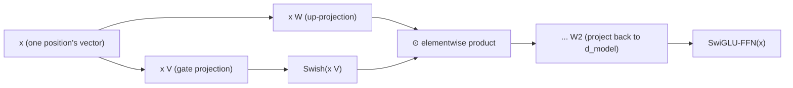

# Lesson 16. SwiGLU and the Gated Feed-Forward Block

**Mission link:** Lesson 6 named the shape every feed-forward block shares, expand, apply a nonlinearity, project back down, and mentioned in passing that later architectures swap in variants like SwiGLU without changing that shape. This lesson derives what actually changes: not the shape, but how many projections the block computes and how they combine before the second projection sends the result back down.
**Primary source:** [Paper: "GLU Variants Improve Transformer", Shazeer, 2020](https://arxiv.org/abs/2002.05202)
**Prerequisites:** [Lesson 6](0006-feed-forward-block.md), [Lesson 15](0015-rmsnorm.md)

## Warm-up

1. ▢ Why is attention's value-mixing step considered linear, and why does that make the feed-forward block necessary?

Check

Once softmax has produced the weights, the output is a weighted sum (a linear combination) of the value vectors; the nonlinearity lives entirely in how the weights were computed, not in how they're applied. Attention alone never gives the network a genuinely nonlinear way to reshape a single position's own representation, which is exactly what the feed-forward block's nonlinearity provides instead.

2. ▢ What does RMSNorm keep from layer norm, and what does it drop?

Check

It keeps re-scaling (dividing by a measure of the vector's magnitude, here the root mean square) and drops re-centering entirely, never computing or subtracting a mean.

## Know this

### A gated linear unit computes two projections and multiplies them together

A **gated linear unit (GLU)** is the elementwise product of two separate linear projections of the same input, with a nonlinearity applied to only one of them before the multiplication: `GLU(x) = (x W) ⊙ σ(x V)`, where `⊙` is elementwise multiplication and `σ` was originally a sigmoid. The projection passed through the nonlinearity acts as a **gate**: its output, squashed toward 0 or 1 by the sigmoid, scales the other projection's output element by element, letting the network learn how much of each feature to let through rather than committing to a single, fixed nonlinear transformation of one projection alone.

### Lesson 6's feed-forward block used one projection and a fixed nonlinearity; a gated version uses two

Lesson 6's `FFN(x) = max(0, x W1 + b1) W2 + b2` computes one projection up to `d_ff`, applies ReLU, then projects back down. A gated feed-forward block instead computes two separate projections up to (typically a somewhat smaller) hidden dimension, combines them with a GLU-style elementwise product, and only then applies the second, down-projecting matrix. The paper's own framing is a direct generalization: **GLU variants** swap out the sigmoid gate for other functions, and testing several of these variants in exactly the transformer's feed-forward sublayer is the paper's actual experiment, finding some outperform the plain ReLU or GELU nonlinearity lesson 6 described.

### SwiGLU: the Swish-gated variant current models actually use

**SwiGLU** is the GLU variant that gates with the **Swish** (also called SiLU) activation in place of a plain sigmoid, and it's the specific variant that ended up displacing ReLU in the feed-forward block of most current open models, the same way RoPE (lesson 14) displaced sinusoidal encoding and RMSNorm (lesson 15) displaced layer norm. A SwiGLU feed-forward block computes `SwiGLU(x) = (x W) ⊙ Swish(x V)`, then projects the result back down to `d_model` with a third weight matrix, three weight matrices in total where lesson 6's plain version used two.

### Three matrices instead of two changes the parameter and compute budget, not the block's role in the architecture

Adding a second up-projection is a real cost: a SwiGLU feed-forward block has three weight matrices doing the work two did before, which is why implementations commonly shrink the hidden dimension somewhat to keep the total parameter count comparable to a plain feed-forward block at the same `d_model`. None of this changes what the feed-forward block is *for*: it's still lesson 6's position-wise sublayer, still applied identically and independently to every position's own vector, still the network's only source of genuinely nonlinear per-position computation. What changed is purely the internal computation that block performs, exactly the kind of "small, common deviation" lesson 12 names without deriving.

## Practice

1. ▢ What does the sigmoid (or Swish) branch of a gated linear unit actually do to the other projection's output?

Hint

Consider what an elementwise product with a squashed-toward-0-or-1 signal accomplishes.

Check

It acts as a gate, scaling the other projection's output element by element; the network learns how much of each feature in that projection to let through, rather than applying one fixed nonlinearity to a single projection uniformly.

2. ▢ How many weight matrices does a SwiGLU feed-forward block use, compared to lesson 6's plain feed-forward block, and why does this commonly lead to a smaller hidden dimension in practice?

Check

Three, versus lesson 6's two (one up-projection, one down-projection): SwiGLU adds a second up-projection for the gate. Since three matrices at the same hidden dimension would cost more parameters than two, implementations commonly shrink the hidden dimension to keep the total parameter count comparable to a plain feed-forward block at the same `d_model`.

3. ▢ Does swapping a plain feed-forward block for a SwiGLU one change the feed-forward sublayer's role within a transformer block?

Check

No. It's still applied identically and independently to each position's own vector, with no cross-position mixing, and it's still the block's only source of genuinely nonlinear per-position computation. Only the internal computation inside that sublayer changed, not what the sublayer is for.

4. ▢ What specifically did the GLU Variants paper test, and what did it find?

Check

It tested several GLU variants (different gating nonlinearities in place of sigmoid) inside the feed-forward sublayer of the transformer sequence-to-sequence model, finding that some of these variants yield quality improvements over the typically-used ReLU or GELU activations.

5. ▢ Which claim correctly describes a gated feed-forward block like SwiGLU?

    - a) It replaces the feed-forward block with a second attention mechanism
    - b) It computes two linear projections of the input, applies a nonlinearity (like Swish) to one, multiplies them elementwise as a gate, then projects the result back down, using three weight matrices instead of lesson 6's two
    - c) It mixes information across positions, unlike lesson 6's feed-forward block
    - d) It requires removing RMSNorm or any other normalization from the block

Check

**b)** That's the precise mechanism and its cost this lesson establishes. (a) is false: it's still the position-wise feed-forward sublayer, unrelated to attention's mixing role. (c) is false: it remains strictly position-wise, exactly like lesson 6's version. (d) is false: the gated feed-forward block and normalization (RMSNorm or otherwise) are independent design choices that coexist in the same block.

## Real-world reps

- [ ] Implement a SwiGLU feed-forward block from raw tensor operations (two up-projections, a Swish gate, elementwise product, one down-projection), and confirm its output shape matches lesson 6's plain version at the same `d_model`.
- [ ] Compare the parameter count of your SwiGLU implementation against lesson 6's plain feed-forward block at the same `d_ff`, then adjust `d_ff` down and recheck until the counts are roughly comparable.
- [ ] Tomorrow: read the primary source's results table in full, and note which GLU variant it found performed best, and by how much, over the plain ReLU baseline.

## Going further

- [Paper: "GLU Variants Improve Transformer", Shazeer, 2020](https://arxiv.org/abs/2002.05202)
- [Paper: "Attention Is All You Need", Vaswani et al., 2017](https://arxiv.org/abs/1706.03762)
- [Resources](../RESOURCES.md)

---

Not landing? Reread the primary source at the top, since this lesson compresses it and compression is where understanding leaks. Check the [glossary](../GLOSSARY.md) for any term that felt slippery.

If the lesson itself is unclear rather than the material, that is a defect: [open an issue](https://github.com/TokenCemetery/teach/issues).
