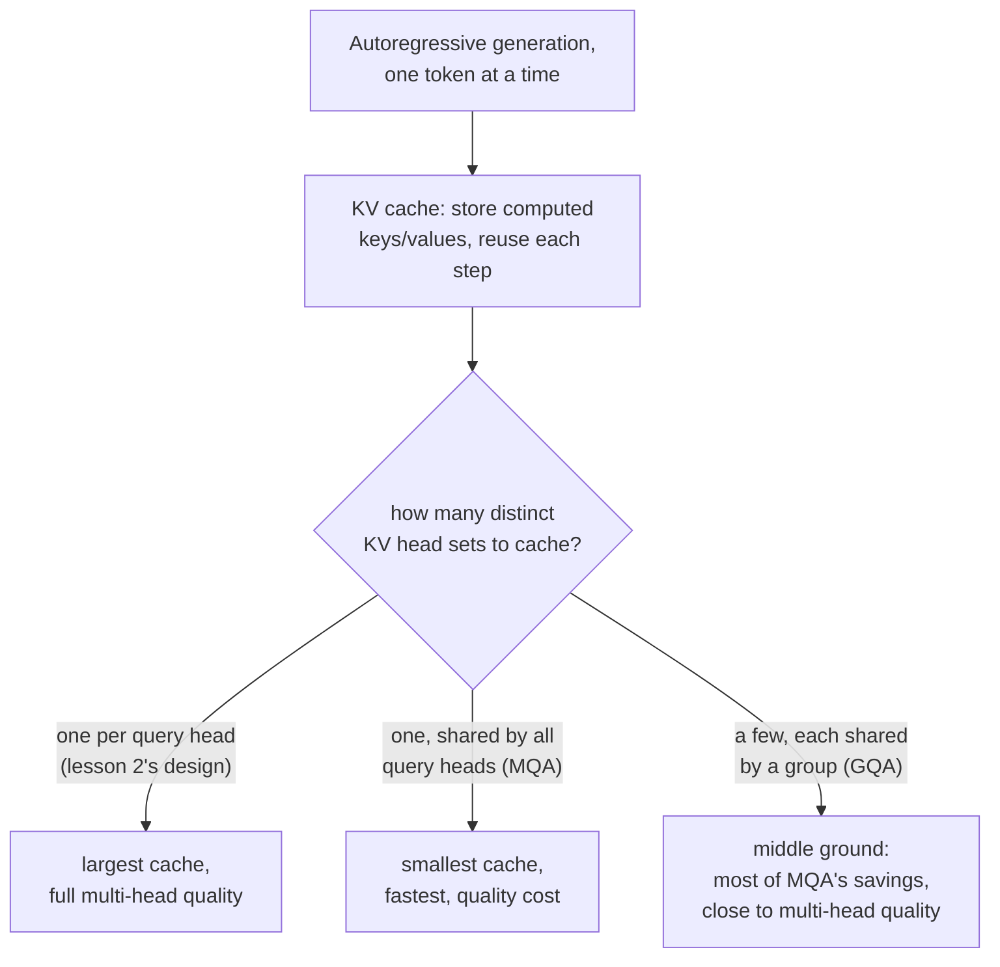

# Lesson 17. Grouped-Query Attention and KV Caching

**Mission link:** Lesson 2 gave every head its own query, key, and value projections, with no reason yet to treat them differently. That reason shows up the moment the model starts generating text one token at a time: recomputing every previous token's key and value at every single generation step is wasted work, and once caching them becomes the obvious fix, the cache's own size is what makes **grouped-query** and **multi-query attention** worth deriving as their own architectural change, not just a curiosity.
**Primary source:** [Paper: "GQA: Training Generalized Multi-Query Transformer Models from Multi-Head Checkpoints", Ainslie et al., 2023](https://arxiv.org/abs/2305.13245)
**Prerequisites:** [Lesson 2](0002-multi-head-attention.md), [Lesson 16](0016-swiglu-and-the-gated-feed-forward.md)

## Warm-up

1. ▢ Why can different attention heads end up specializing in different kinds of relationships between positions, when all of them apply the exact same attention equation?

Check

Each head has its own, independently learned projection matrices; applying the identical equation to differently projected versions of the same input lets different heads attend to entirely different aspects of the input.

2. ▢ Why is a final linear projection (`W_O`) applied after concatenating multi-head attention's heads, rather than using the concatenated vector directly?

Check

Concatenation alone places each head's output side by side with no interaction between them; `W_O` lets the model learn how to combine information across the separate heads into one unified representation.

## Know this

### Generating one token at a time recomputes work that never changed

A model producing text autoregressively generates one token, appends it to the sequence, and generates the next, repeating until done. At each new step, computing attention for the newest token needs that token's query compared against every previous token's key and value, exactly the same keys and values that were already computed at every earlier step. Recomputing them from scratch at every single generation step, when the tokens producing them haven't changed, is pure waste.

### The KV cache: store what won't change, compute only what's new

A **KV cache** stores every previous position's key and value vectors once they're computed, so each new generation step only has to compute the key and value for the newest token and append them to the cache, rather than recomputing the whole sequence's keys and values from scratch. This turns the per-step cost of attention during generation from growing with the whole sequence length's worth of key/value computation into growing with just one new token's worth, at the cost of the cache itself taking up memory that grows with sequence length.

### Multi-query and grouped-query attention shrink exactly what the cache has to hold

The KV cache's size scales with how many distinct sets of key and value vectors it has to store, which is determined by how many separate key/value projections the model has, one per attention head in lesson 2's design. **Multi-query attention (MQA)** reduces this to a single, shared key/value head used by every query head, drastically shrinking the cache (and the memory bandwidth needed to read it back at every step), at a cost the paper's own framing states plainly: MQA can lead to quality degradation compared to giving every head its own keys and values. **Grouped-query attention (GQA)** is the paper's proposed middle ground: an intermediate number of key/value heads, more than one, fewer than the number of query heads, with groups of query heads sharing one key/value head each. This keeps most of MQA's cache-size and bandwidth savings while giving the model more distinct key/value representations to work with than a single shared head would allow.

### Uptraining turns an existing multi-head model into a GQA one cheaply

Rather than training a GQA (or MQA) model from scratch, the paper's own contribution is a recipe for converting an already-trained, ordinary multi-head checkpoint into one using grouped or multi-query attention, using a small fraction, about 5 percent, of the compute the original pretraining run took. The paper reports that an uptrained GQA model reaches quality close to the original multi-head model while approaching MQA's inference speed, which is exactly the practical reason GQA displaced training a separate, from-scratch multi-query model: the quality cost of going all the way to one shared key/value head can be avoided without discarding an existing multi-head model's training investment.

## Practice

1. ▢ A model generates text one token at a time. Why is recomputing every previous token's key and value vectors at each new generation step wasteful?

Hint

Consider whether anything about a previous, already-generated token's key and value actually changes at a later step.

Check

A previous token's key and value vectors don't change once computed; recomputing them at every later step repeats work whose answer is already known, which is exactly what a KV cache exists to avoid by storing them once and reusing them.

2. ▢ What determines how large a KV cache needs to be, and why does multi-query attention reduce it so much compared to lesson 2's ordinary multi-head design?

Check

The cache's size scales with how many distinct key/value head sets have to be stored. Lesson 2's design gives every attention head its own key/value projections, so the cache has to hold one set per head; MQA shrinks this to a single shared key/value head used by every query head, drastically reducing what has to be cached and read back at each step.

3. ▢ Why does the GQA paper describe grouped-query attention as a middle ground, rather than simply recommending multi-query attention outright?

Check

Multi-query attention's single shared key/value head can lead to quality degradation; grouped-query attention uses an intermediate number of key/value heads (more than one, fewer than the number of query heads), keeping most of MQA's cache-size and speed benefits while giving the model more distinct key/value representations, closer to multi-head attention's quality.

4. ▢ Why does the paper propose "uptraining" an existing multi-head checkpoint into a GQA model, rather than always training a GQA model from scratch?

Check

Uptraining converts an already-trained multi-head model using only a small fraction (about 5 percent) of the original pretraining compute, reaching quality close to the original while approaching MQA's speed. This avoids discarding an existing model's training investment just to gain grouped or multi-query attention's inference benefits.

5. ▢ Which claim correctly describes the relationship between KV caching, MQA, and GQA?

    - a) A KV cache exists to store query vectors, not key and value vectors
    - b) A KV cache avoids recomputing unchanged keys and values at each generation step; its size scales with the number of distinct key/value head sets, which is exactly what MQA (one shared head) and GQA (a few shared heads) reduce, trading some quality for cache size and speed
    - c) Grouped-query attention always matches multi-head attention's quality exactly, with no trade-off at all
    - d) Uptraining requires training a new model from scratch at full pretraining cost

Check

**b)** That's the precise chain of reasoning this lesson establishes, from the cache's purpose to why fewer key/value heads shrink it. (a) is false: a KV cache stores key and value vectors, not queries, since queries are only needed for the current step. (c) is false: GQA is explicitly a trade-off, closer to multi-head quality than MQA but not identical to it. (d) is false: uptraining's whole point is converting an existing checkpoint using a small fraction of original pretraining compute.

## Real-world reps

- [ ] For a model you have access to (or its published architecture details), check whether it uses ordinary multi-head attention, MQA, or GQA, and if GQA, how many key/value heads it uses relative to its query heads.
- [ ] Estimate the KV cache size difference between a hypothetical 32-query-head multi-head model and the same model using GQA with 8 key/value heads, in terms of how many distinct head sets each has to store.
- [ ] Tomorrow: read the primary source's results section in full, and note how close uptrained GQA's quality came to the original multi-head checkpoint's, and at what fraction of MQA's speed.

## Going further

- [Paper: "GQA: Training Generalized Multi-Query Transformer Models from Multi-Head Checkpoints", Ainslie et al., 2023](https://arxiv.org/abs/2305.13245)
- [Paper: "Attention Is All You Need", Vaswani et al., 2017](https://arxiv.org/abs/1706.03762)
- [Resources](../RESOURCES.md)

---

Not landing? Reread the primary source at the top, since this lesson compresses it and compression is where understanding leaks. Check the [glossary](../GLOSSARY.md) for any term that felt slippery.

If the lesson itself is unclear rather than the material, that is a defect: [open an issue](https://github.com/TokenCemetery/teach/issues).
