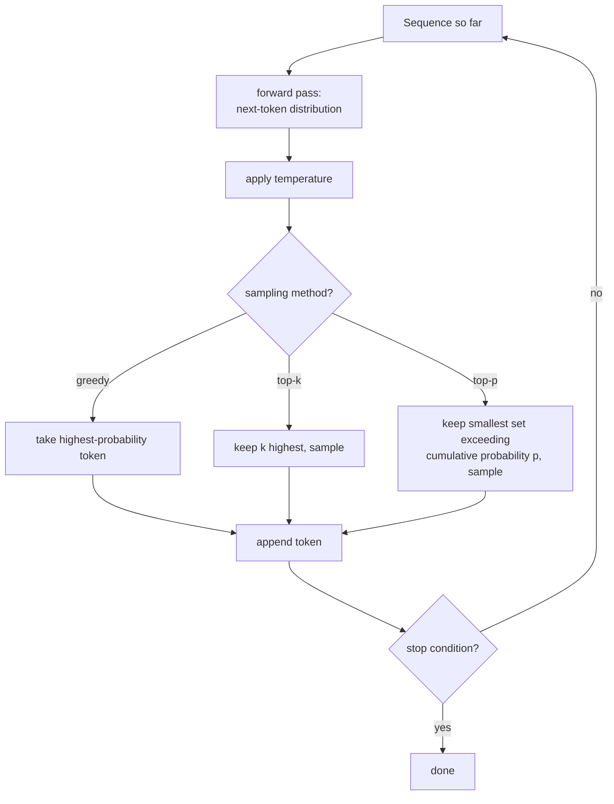

# Lesson 18. Generation and Sampling

**Mission link:** Every lesson through stage 4 built and trained a model that predicts a probability distribution over the next token. None of them asked what to actually do with that distribution to produce text. This lesson closes that gap: running the hand-built forward pass repeatedly, and choosing, at each step, which token from the predicted distribution actually gets appended to the sequence.
**Primary source:** [Paper: "The Curious Case of Neural Text Degeneration", Holtzman et al., 2019](https://arxiv.org/abs/1904.09751)
**Prerequisites:** [Lesson 9](0009-cross-entropy-loss.md), [Lesson 17](0017-grouped-query-attention-and-kv-caching.md)

## Warm-up

1. ▢ What determines how large a KV cache needs to be, and why does multi-query attention reduce it so much?

Check

The cache's size scales with how many distinct key/value head sets have to be stored; multi-query attention shrinks this to a single shared key/value head used by every query head, drastically reducing what has to be cached and read back at each step.

2. ▢ What is cross-entropy loss the negative log probability of, during training?

Check

The actual next token in the training data, given everything before it; minimizing this loss is what pushes the model to assign higher probability to the token that actually came next.

## Know this

### Training asks "how likely was the right answer"; generation asks "what token comes next"

Training's loss function scores the model by how much probability it assigned to the token that was *actually there* in the data. Generation is a completely different task: there is no "actually there" token yet, only the model's predicted distribution over every possible next token, and something has to turn that distribution into one concrete choice before the sequence can be extended and fed back through the model for the next step.

### Greedy decoding: always take the most likely token

**Greedy decoding** is the simplest possible choice: at every step, pick whichever token the model's distribution assigns the highest probability, append it, and repeat. It's deterministic, always producing the same output for the same input, and it sounds like the obviously correct choice, since the model itself says that token is the most likely one. The paper's own framing states the counter-intuitive result plainly: even though likelihood is a good *training* objective, using likelihood as the *decoding* objective (always taking the most likely token) leads to text that is bland and strangely repetitive, not the high-quality output the training objective's success would suggest.

### Temperature reshapes the distribution before anything else happens

**Temperature** rescales the logits before the final softmax that produces the next-token distribution, dividing every logit by a temperature value `T` before applying softmax. A temperature below 1 sharpens the distribution, making the already-likely tokens even more dominant and pushing generation closer to greedy's behavior; a temperature above 1 flattens it, spreading probability more evenly across more tokens and making unlikely choices more likely to be picked. Temperature doesn't decide *which* tokens are eligible to be chosen, only how sharply peaked or flat their relative probabilities are before whatever sampling method runs next.

### Top-k and top-p both truncate the distribution, but by different rules

**Top-k sampling** keeps only the `k` highest-probability tokens, discards everything else, renormalizes the remaining probabilities, and samples from that fixed-size set. **Top-p (nucleus) sampling** instead keeps the smallest set of highest-probability tokens whose cumulative probability exceeds a threshold `p`, however many tokens that happens to take, and samples from that set. The paper's own description of nucleus sampling captures exactly why the size varies: sampling from this "dynamic nucleus" allows for diversity while effectively truncating the unreliable tail of the distribution, and the resulting text was found to better match human text's quality, enhanced diversity without sacrificing fluency and coherence, compared to always taking the single most likely token.

### A fixed k is the wrong size for a distribution that isn't always the same shape

Top-k's fixed count is exactly what top-p was built to fix: at a step where the model is genuinely confident (only two or three tokens are remotely plausible), a fixed `k` of 40 forces sampling to include dozens of implausible tokens; at a step where the model is genuinely uncertain (many tokens are all roughly plausible), the same fixed `k` might cut off tokens that deserved a real chance. Top-p's threshold adapts automatically to how peaked or flat the distribution actually is at each individual step, which is the "dynamic" part of the nucleus the paper names, rather than committing to one fixed cutoff size regardless of how confident the model is at that particular moment.

### Running the model forward, one token at a time, is what generation actually is

Producing text with the hand-built model means repeating one loop: run the forward pass on the sequence so far, take the resulting distribution over the next token, apply whatever combination of temperature and top-k/top-p sampling is configured, sample (or greedily pick) one token, append it to the sequence, and feed the extended sequence back through the model for the next step, until a stop condition (an end-of-sequence token, or a maximum length) is reached. Every earlier lesson, attention, the block, the loss, the optimizer, exists to make this one loop's forward pass produce a distribution worth sampling from at all.

## Practice

1. ▢ Why does the paper describe it as counter-intuitive that greedy decoding produces bland, repetitive text, given that the model was trained specifically to maximize likelihood?

Hint

Consider whether training and generation are actually asking the model the same question.

Check

Likelihood being a good training objective (rewarding the model for assigning high probability to the actual next token in real data) doesn't imply that always choosing the single highest-probability token during generation produces good output; the paper's finding is exactly that these are different questions, and always maximizing likelihood at decoding time leads to bland, repetitive text despite the model being trained well.

2. ▢ A team sets temperature to 0.5, well below 1. What effect does this have on the next-token distribution, and does it change which tokens are eligible to be sampled?

Check

It sharpens the distribution, making already-likely tokens even more dominant relative to less likely ones. It doesn't change which tokens are eligible on its own; that's the job of whatever sampling method (top-k, top-p, or none) runs after temperature has reshaped the distribution.

3. ▢ At one generation step, only two tokens are genuinely plausible; at another step, thirty tokens are all roughly plausible. Using a fixed top-k of 10 at both steps, what goes wrong at each one?

Check

At the two-plausible-token step, top-k of 10 forces the inclusion of 8 implausible tokens that shouldn't be real candidates. At the thirty-plausible-token step, top-k of 10 cuts off 20 tokens that genuinely deserved a chance. A fixed k can't adapt to how peaked or flat the distribution actually is at each individual step.

4. ▢ How does top-p (nucleus) sampling avoid the specific problem in the previous question?

Check

Top-p keeps the smallest set of highest-probability tokens whose cumulative probability exceeds a threshold `p`, however many tokens that takes at that specific step, rather than committing to one fixed count. This lets the eligible set shrink automatically when the model is confident and grow automatically when it's uncertain, adapting to the distribution's actual shape at each step.

5. ▢ Which claim correctly describes the relationship between greedy decoding, temperature, top-k, and top-p?

    - a) Greedy decoding produces the highest-quality text, since it always chooses the model's own most-likely prediction
    - b) Greedy decoding's determinism leads to bland, repetitive text; temperature reshapes the distribution's sharpness; top-k truncates to a fixed count while top-p truncates to a dynamic, cumulative-probability-based set that adapts to how peaked the distribution is at each step
    - c) Temperature and top-p both decide which specific tokens are eligible, working identically
    - d) Top-k and top-p always produce identical eligible sets, differing only in implementation

Check

**b)** That's the precise, distinct role each mechanism plays. (a) is false: the paper's own finding is that greedy decoding leads to degenerate, repetitive text despite the model being well-trained. (c) is false: temperature reshapes probability sharpness without deciding eligibility; top-k and top-p are what decide the eligible set. (d) is false: a fixed top-k and a cumulative-probability top-p produce genuinely different-sized eligible sets depending on the distribution's shape at each step.

## Real-world reps

- [ ] Implement greedy decoding for your hand-built model and generate a short continuation from a prompt; note any repetition or blandness in the output.
- [ ] Implement top-k and top-p sampling, generate from the same prompt with each, and compare the diversity and coherence of the outputs against the greedy result.
- [ ] Tomorrow: read the primary source's section comparing nucleus sampling against top-k and beam search on human-evaluated text quality, and note which metric it uses to detect repetition.

## Going further

- [Paper: "The Curious Case of Neural Text Degeneration", Holtzman et al., 2019](https://arxiv.org/abs/1904.09751)
- [Repo: nanoGPT, Karpathy](https://github.com/karpathy/nanoGPT)
- [Resources](../RESOURCES.md)

---

Not landing? Reread the primary source at the top, since this lesson compresses it and compression is where understanding leaks. Check the [glossary](../GLOSSARY.md) for any term that felt slippery.

If the lesson itself is unclear rather than the material, that is a defect: [open an issue](https://github.com/TokenCemetery/teach/issues).
