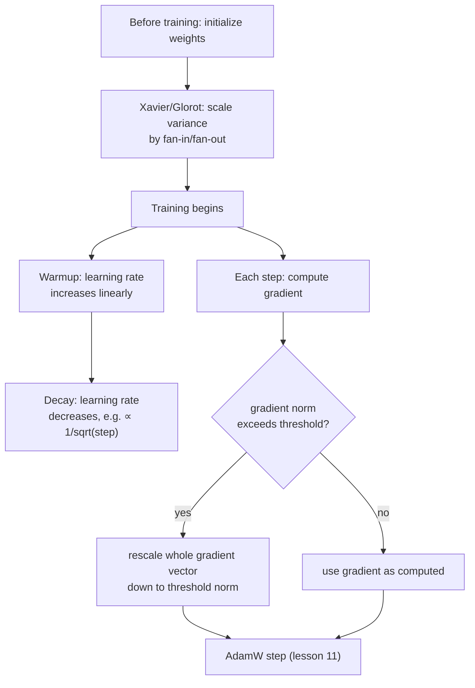

# Lesson 19. Initialization, Warmup, and Gradient Clipping

**Mission link:** Lesson 11 closed stage 4 with a working optimizer step. A real training run needs three more things around that step to actually work in practice: starting the weights at a scale that doesn't sabotage the very first forward pass, easing the learning rate in rather than applying it at full strength immediately, and capping how large a single update is allowed to be. None of these change the math lesson 9 through 11 derived; they're what keeps that math from blowing up in practice.
**Primary source:** [Paper: "On the difficulty of training Recurrent Neural Networks", Pascanu, Mikolov, and Bengio, 2013](https://arxiv.org/abs/1211.5063)
**Prerequisites:** [Lesson 5](0005-layer-norm-and-residuals.md), [Lesson 11](0011-adamw-optimizer.md)

## Warm-up

1. ▢ Why does dividing Adam's update by `sqrt(v)`, its second moment, help parameters with different typical gradient magnitudes?

Check

`v` estimates each parameter's typical squared gradient magnitude; dividing by its square root gives a parameter with usually small gradients a relatively larger effective step and one with usually large gradients a relatively smaller step, adapting per parameter instead of using one fixed step size for everything.

2. ▢ Why does a residual connection help train a deep stack of transformer blocks?

Check

It gives gradients a direct path through the identity `+ x` connection at every layer, regardless of what each sublayer's transformation does, keeping a usable training signal reaching even the earliest layers of a deep stack.

## Know this

### Initialization decides whether activations survive the first forward pass at all

Before any training happens, a network's weights start at some randomly chosen scale, and that scale alone can determine whether the network is trainable. If initial weights are too large, activations (and later, gradients flowing backward through them) can grow layer over layer; too small, and they shrink toward zero the same way. **Xavier (Glorot) initialization** addresses this directly: rather than picking one fixed variance for every weight regardless of layer size, it scales a layer's initial weight variance by that layer's fan-in and fan-out (the number of inputs and outputs the layer connects), specifically so that activation and gradient variance stays roughly consistent across layers instead of compounding smaller or larger with each one. This is the same underlying problem lesson 5's residual connections and normalization address, unstable signal magnitude across a deep stack, but it's a separate fix operating at the very start of training, before a single gradient step has been taken.

### Warmup: the learning rate starts low because the optimizer's own estimates start unreliable

A **learning rate warmup** schedule doesn't apply the target learning rate from step one; it increases the learning rate linearly (or by some other simple curve) over a fixed number of warmup steps, only reaching full strength once warmup completes. This addresses a problem specific to the very start of training: Adam's moment estimates (lesson 11's `m` and `v`) start at zero and are still being calibrated from very little data in the earliest steps, exactly the same instability lesson 11's own bias correction (`m_hat`, `v_hat`) exists to counteract. Applying a large learning rate to updates computed from these still-unreliable early estimates risks a large step in a poorly-informed direction, before the optimizer has seen enough gradients to know where it should actually be heading.

### Decay: the learning rate shrinks again once training has somewhere to go

After warmup, the learning rate doesn't stay fixed either; the original transformer paper's own schedule decreases it afterward, proportionally to the inverse square root of the step number, so the rate climbs during warmup and then falls off gradually for the rest of training. A smaller learning rate later in training allows finer, more precise updates once the model is already in a reasonable region of weight-space, rather than continuing to take steps sized for training's early, coarse progress.

### Gradient clipping: cap the size of an update, not its direction

Even with reasonable initialization and a warmed-up learning rate, a single batch can occasionally produce an unusually large gradient, an **exploding gradient**, that would otherwise cause one destructively large update. **Gradient norm clipping** is the standard fix: compute the gradient vector's overall norm (its overall magnitude, treating every parameter's gradient together as one vector), and if that norm exceeds a chosen threshold, rescale the entire gradient vector down so its norm exactly equals the threshold, leaving its direction completely unchanged. This is a deliberate design choice: clipping each parameter's gradient independently would distort the direction the combined gradient actually points in; scaling the whole vector down uniformly caps the update's size while preserving the direction the optimizer computed.

## Practice

1. ▢ Why does Xavier initialization scale a layer's initial weight variance by its fan-in and fan-out, rather than using one fixed variance for every layer in the network?

Hint

Consider what happens to activation variance across layers if every layer used the same fixed initial weight scale regardless of its size.

Check

A fixed variance regardless of layer size lets activation (and gradient) variance compound smaller or larger with each layer, since a layer's effect on variance depends on how many inputs and outputs it has. Scaling by fan-in and fan-out is specifically designed to keep that variance roughly consistent across layers instead.

2. ▢ Why does applying the full target learning rate from the very first training step risk a poorly-directed large update, specifically because of how Adam's moments work?

Check

Adam's moment estimates (`m` and `v`) start at zero and are still being calibrated from very little data in the earliest steps; a large learning rate applied to updates computed from these still-unreliable early estimates risks a large step before the optimizer has accumulated enough gradient history to know a good direction.

3. ▢ A team clips gradients by capping each individual parameter's gradient value independently, rather than scaling the whole gradient vector by its overall norm. What does this risk that norm-based clipping avoids?

Check

Clipping each parameter's gradient independently can distort the direction the combined gradient vector actually points in, since different parameters get capped by different amounts relative to their own values. Norm-based clipping rescales the entire vector uniformly, capping the update's overall size while leaving its direction completely unchanged.

4. ▢ Why does a learning rate schedule decrease again after warmup, rather than staying at its peak value for the rest of training?

Check

A smaller learning rate later in training allows finer, more precise updates once the model is already in a reasonable region of weight-space, rather than continuing to take steps sized for training's early, coarse progress, which risks overshooting as the model gets closer to a good solution.

5. ▢ Which claim correctly describes the relationship between initialization, warmup, decay, and gradient clipping?

    - a) All four techniques change how the AdamW update itself is mathematically computed
    - b) Initialization sets a stable starting scale before training begins; warmup and decay shape the learning rate over the course of training to match the optimizer's own reliability at each stage; gradient clipping caps an update's size while preserving its direction, and all four operate around the optimizer step without changing its formula
    - c) Gradient clipping and Xavier initialization solve the same problem at the same point in training
    - d) A warmup schedule exists to counteract exploding gradients, the same problem gradient clipping addresses

Check

**b)** That's the precise, complementary role each piece plays around lesson 11's optimizer step. (a) is false: none of these four change AdamW's own update formula; they operate around it. (c) is false: Xavier initialization acts once, before training starts; gradient clipping acts on every step's gradient throughout training. (d) is false: warmup addresses the optimizer's own early-training unreliability, a different problem from the occasional large gradient gradient clipping caps.

## Real-world reps

- [ ] Implement Xavier initialization for a small linear layer from raw tensor operations, and compare the variance of its output activations against a layer initialized with a fixed, layer-size-independent variance.
- [ ] Add a linear warmup followed by inverse-square-root decay to your training loop's learning rate, and plot the resulting learning rate against training step to confirm it matches the shape this lesson describes.
- [ ] Tomorrow: read the primary source's analysis of the exploding gradient problem in full, and note what geometric intuition it gives for why gradients can grow uncontrollably across a deep or recurrent computation.

## Going further

- [Paper: "On the difficulty of training Recurrent Neural Networks", Pascanu, Mikolov, and Bengio, 2013](https://arxiv.org/abs/1211.5063)
- [Paper: "Attention Is All You Need", Vaswani et al., 2017](https://arxiv.org/abs/1706.03762)
- [Resources](../RESOURCES.md)

---

Not landing? Reread the primary source at the top, since this lesson compresses it and compression is where understanding leaks. Check the [glossary](../GLOSSARY.md) for any term that felt slippery.

If the lesson itself is unclear rather than the material, that is a defect: [open an issue](https://github.com/TokenCemetery/teach/issues).
