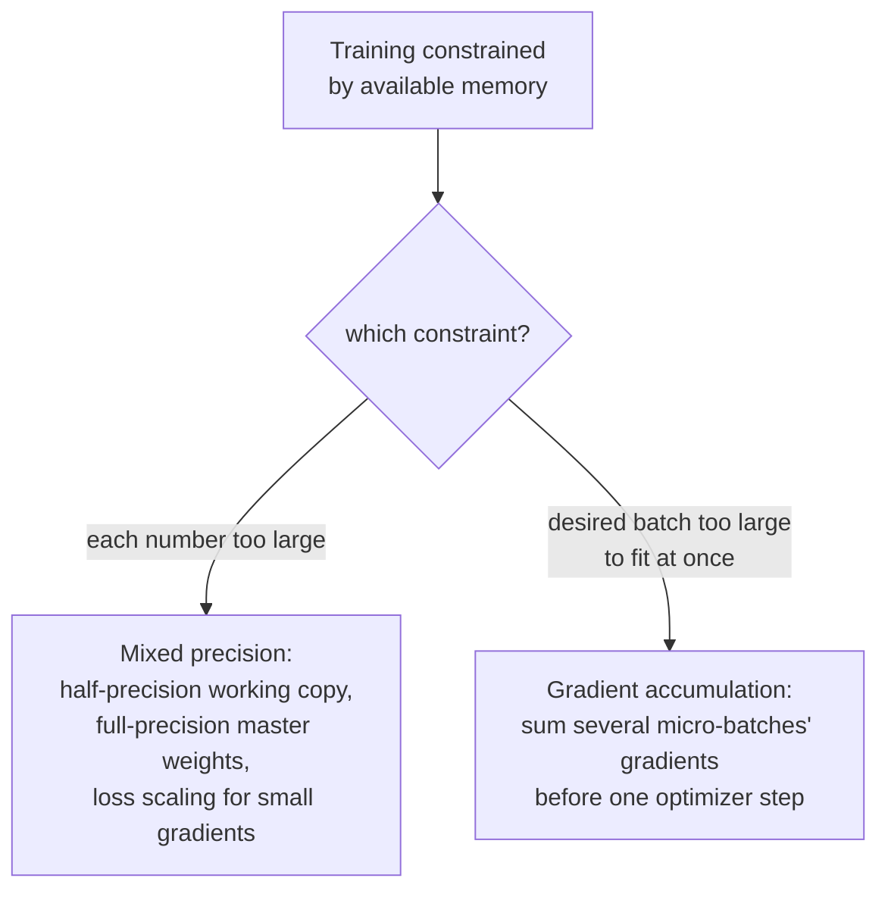

# Lesson 20. Mixed Precision and Gradient Accumulation

**Mission link:** Lesson 19 made a single training step reliable: sane initialization, an eased-in learning rate, a capped gradient. This lesson addresses a different, very practical constraint: real hardware has a fixed amount of memory, and both mixed precision and gradient accumulation exist to fit a training run that would otherwise be too large for that memory, by shrinking what each number costs to store and by simulating a batch bigger than memory could ever hold at once.
**Primary source:** [Paper: "Mixed Precision Training", Micikevicius et al., 2018](https://arxiv.org/abs/1710.03740)
**Prerequisites:** [Lesson 10](0010-backward-pass-and-autograd.md), [Lesson 19](0019-initialization-warmup-and-gradient-clipping.md)

## Warm-up

1. ▢ What does calling `loss.backward()` populate, and why must gradients typically be zeroed before the next call?

Check

It populates every trainable parameter's `.grad` attribute with the gradient of the loss with respect to that parameter. Gradients accumulate by default rather than overwrite, so without zeroing first, a new backward pass's gradient would be contaminated by the previous step's leftover values.

2. ▢ Why does gradient norm clipping rescale the entire gradient vector rather than capping each parameter's gradient independently?

Check

Capping each parameter independently would distort the direction the combined gradient actually points in. Rescaling the whole vector by its overall norm caps the update's size while leaving its direction completely unchanged.

## Know this

### Half precision cuts every number's footprint roughly in half

Ordinary training stores weights, activations, and gradients as 32-bit (single-precision) floating-point numbers. **Mixed precision training** stores them in 16-bit (half-precision) format instead for most of the computation, which the paper's own framing states plainly reduces memory consumption by nearly half, and can meaningfully speed up computation on hardware built for half-precision arithmetic. The trade is real: half-precision numbers have a much more limited numerical range than single-precision ones, and naively training entirely in half precision risks small values underflowing to exactly zero.

### A master copy in full precision, kept alongside the half-precision working copy

The paper's first fix for half precision's limited range is to maintain a **master copy of the weights in full (single) precision**, which accumulates the optimizer's updates every step; only a half-precision, rounded-down copy of these weights is actually used for the forward and backward computation. This matters because an individual weight update can be small enough to underflow to zero if applied directly to an already-rounded half-precision value, but accumulating updates in the full-precision master copy preserves those small changes across many steps, only losing precision when that master copy is rounded down for each step's actual computation.

### Loss scaling: make small gradients big enough to survive half precision

The paper's second fix addresses gradients specifically: many gradient values are small enough that they'd underflow to zero in half precision's limited range before ever reaching the optimizer. **Loss scaling** multiplies the loss by some (often large) constant factor before backpropagation, which multiplies every resulting gradient by that same factor, lifting otherwise-vanishing small gradients into half precision's representable range. After the backward pass, the gradients are divided back down by the same scaling factor before the optimizer step actually uses them, undoing the scaling's effect on the update itself while having rescued the small values from underflowing along the way.

### Gradient accumulation reuses a fact this workspace already established

Lesson 11's own warm-up already stated it: gradients accumulate by default rather than overwrite, which is exactly why they must be zeroed before a fresh backward pass. **Gradient accumulation** is simply choosing not to zero them for several batches in a row: running forward and backward passes on several smaller **micro-batches** in sequence, letting each one's gradients add onto the previous ones instead of being zeroed and stepped immediately, and only calling the optimizer step (and zeroing) after a chosen number of micro-batches have accumulated. The resulting update is computed from the sum of several micro-batches' gradients, simulating the effect of one larger batch that never actually had to fit in memory all at once.

### Both techniques solve a memory constraint, not a modeling one

Neither mixed precision nor gradient accumulation changes what the model computes or what the training objective is; a correctly implemented run using either technique (or both together) should converge to essentially the same result as one that didn't need them. What they change is entirely about fitting a training run onto hardware with less memory than the run's numbers or its desired batch size would otherwise require, one by shrinking each number's storage cost, the other by trading memory for a few extra forward and backward passes per optimizer step.

## Practice

1. ▢ Why can't a model simply train entirely in half precision with no other adjustments, given the memory savings that would provide?

Hint

Consider what happens to a small enough value once it's stored in a format with a limited numerical range.

Check

Half precision's limited numerical range means sufficiently small values, including many gradient values, can underflow to exactly zero, losing information a full training run needs; this is exactly why the paper proposes a full-precision master weight copy and loss scaling rather than training in half precision alone.

2. ▢ Why does mixed precision training keep a full-precision master copy of the weights, rather than only ever storing weights in half precision?

Check

A weight update can be small enough to underflow to zero if applied directly to an already-rounded half-precision value. Accumulating updates in a full-precision master copy preserves those small changes across many steps; only the copy used for actual forward/backward computation gets rounded down to half precision each step.

3. ▢ What does loss scaling do to the gradients during backpropagation, and why is it undone before the optimizer step actually uses them?

Check

Multiplying the loss by a scaling factor before backpropagation multiplies every resulting gradient by that same factor, lifting small gradients that would otherwise underflow to zero into half precision's representable range. Dividing back down by the same factor after the backward pass undoes the scaling's effect on the actual update, so only the underflow problem was fixed, not the update's true magnitude.

4. ▢ A team wants an effective batch size of 256 but their hardware can only fit 64 examples in memory at once. How does gradient accumulation let them achieve this, and what specifically has to change from ordinary training to make it work?

Check

They run forward and backward passes on four micro-batches of 64 examples each, without zeroing gradients or stepping the optimizer between them, letting each micro-batch's gradients accumulate onto the previous ones (the same accumulate-by-default behavior lesson 11 named). Only after all four micro-batches have run does the optimizer step use the combined, accumulated gradient, then gradients are zeroed for the next round, simulating one batch of 256 examples that never had to fit in memory all at once.

5. ▢ Which claim correctly describes what mixed precision and gradient accumulation change about training?

    - a) Both techniques change the model's computed outputs and the training objective, trading some accuracy for memory savings
    - b) Mixed precision shrinks the storage cost of weights, activations, and gradients using a full-precision master copy and loss scaling to counter half precision's limited range; gradient accumulation simulates a larger batch by summing several micro-batches' gradients before one optimizer step; neither changes what the model computes
    - c) Gradient accumulation requires zeroing gradients after every micro-batch, the same as ordinary training
    - d) Loss scaling permanently changes the magnitude of the gradients the optimizer step uses

Check

**b)** That's the precise, memory-focused role each technique plays, without altering what's being computed. (a) is false: correctly implemented, both techniques target memory and throughput, not the model's computed result. (c) is false: gradient accumulation specifically withholds zeroing between micro-batches, letting gradients build up instead. (d) is false: loss scaling's effect is undone (dividing back down) before the optimizer step, specifically so the update's true magnitude is unaffected.

## Real-world reps

- [ ] Implement gradient accumulation in your training loop: run several micro-batch forward/backward passes without zeroing gradients, then step the optimizer once, and confirm the accumulated gradient matches what one larger batch would have produced.
- [ ] If your hardware supports it, run a few training steps in half precision with a full-precision master weight copy, and compare memory usage against an ordinary full-precision run at the same batch size.
- [ ] Tomorrow: read the primary source's section on loss scaling in full, and note how it recommends choosing the scaling factor, and what signal indicates the factor is too large or too small.

## Going further

- [Paper: "Mixed Precision Training", Micikevicius et al., 2018](https://arxiv.org/abs/1710.03740)
- [Repo: nanoGPT, Karpathy](https://github.com/karpathy/nanoGPT)
- [Resources](../RESOURCES.md)

---

Not landing? Reread the primary source at the top, since this lesson compresses it and compression is where understanding leaks. Check the [glossary](../GLOSSARY.md) for any term that felt slippery.

If the lesson itself is unclear rather than the material, that is a defect: [open an issue](https://github.com/TokenCemetery/teach/issues).
