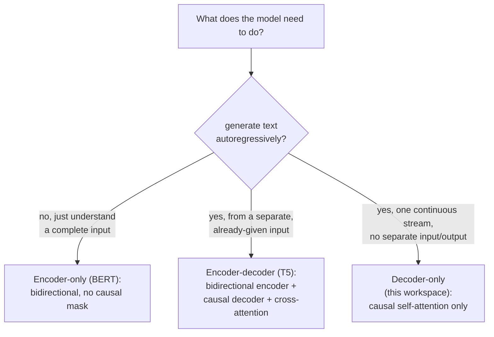

# Lesson 21. Encoder-Decoder and Encoder-Only Architectures

**Mission link:** Lesson 3 added a causal mask because "this workspace's model will eventually do" autoregressive generation, without ever saying what a transformer looks like when it *doesn't* need to. This lesson places the decoder-only architecture this entire workspace built against the two other shapes real models actually use, and derives exactly why each one needs (or doesn't need) the causal mask lesson 3 built.
**Primary source:** [Paper: "BERT: Pre-training of Deep Bidirectional Transformers for Language Understanding", Devlin et al., 2018](https://arxiv.org/abs/1810.04805)
**Prerequisites:** [Lesson 3](0003-causal-masking.md), [Lesson 20](0020-mixed-precision-and-gradient-accumulation.md)

## Warm-up

1. ▢ Why must position `i`'s attention not include any position `j` greater than `i`, given how the model will actually be used at inference time?

Check

At inference, the model generates one token at a time using only the tokens that came before it; tokens after the current position don't exist yet when it's being predicted. Letting training attend to a later position would teach the model to rely on information that's never available at actual generation time.

2. ▢ Why does mixed precision training keep a full-precision master copy of the weights, rather than only ever storing weights in half precision?

Check

A weight update can be small enough to underflow to zero if applied directly to an already-rounded half-precision value. Accumulating updates in a full-precision master copy preserves those small changes across many steps.

## Know this

### The causal mask exists specifically because generation is one-token-at-a-time

Lesson 3's entire justification for causal masking was generation: a model producing text one token at a time can only ever use tokens that already exist, so training has to match that constraint or it learns to rely on information that won't be there later. This justification only applies to a model that actually generates output autoregressively. A model whose job is to understand an already-complete piece of text, not generate one, has no such constraint to satisfy, and nothing forces it to mask anything at all.

### Encoder-only: bidirectional attention, because there's nothing to generate

**BERT** is the canonical **encoder-only** architecture, and its own paper states the design choice directly: it pre-trains deep bidirectional representations by **jointly conditioning on both left and right context in all layers**, no causal mask anywhere, every position can attend to every other position, before and after it, in the same sequence. This is possible precisely because an encoder-only model isn't generating a sequence token by token; it's building a representation of a complete, already-given input, then reading that representation off (through one added output layer) to answer a question about the whole input, classification, extraction, relevance, rather than continuing it. Lesson 3's constraint (no attending to tokens that don't exist yet) simply doesn't apply, because there's no "not yet" in the input an encoder-only model is given.

### Encoder-decoder: two stacks, and a third sublayer that connects them

The original transformer paper (this workspace's own primary source) actually describes an **encoder-decoder** architecture, and this workspace built only its decoder half. An encoder-decoder model like **T5** runs an input sequence through a bidirectional **encoder** (structured like BERT's, no causal mask, since the whole input is already given), then generates an output sequence through a **decoder** that combines three sublayers per block instead of this workspace's two: causal self-attention over the decoder's own output so far (exactly lesson 3's mechanism), a new **cross-attention** sublayer whose queries come from the decoder but whose keys and values come from the encoder's output, letting the decoder consult the full input while generating, and the feed-forward block. T5's own contribution was showing that a huge range of NLP tasks (translation, summarization, classification, question answering) can all be cast into one consistent **text-to-text** format, input text in, output text out, which is exactly the shape an encoder-decoder model is built to consume and produce.

### This workspace's decoder-only model is what's left when input and output are the same one stream

A decoder-only model has no separate encoder and no cross-attention sublayer at all, because it has no separate "input" to consult while generating something else; the sequence it's conditioning on and the sequence it's generating are the same single stream, just at different positions within it. This is precisely why lesson 3's causal mask, applied to that one stream's self-attention, was the only architectural accommodation this workspace ever needed: there was never a second sequence to attend across, only one sequence's own past.

### Why decoder-only became the dominant shape for general-purpose generation

An encoder-only model structurally cannot generate text autoregressively at all, its bidirectional attention was never trained to predict a next token from only a prefix, which is exactly what lesson 3's constraint exists to make possible. An encoder-decoder model can generate, but needs two coordinated stacks and a cross-attention mechanism, better suited to a task with a clean, fixed input-then-output split (translate this sentence, summarize this document) than to an open-ended conversation where what counts as "input" and "output" keeps shifting turn by turn. A decoder-only model's single stream handles both roles at once with one architecture and one training objective, which is why the general-purpose, open-ended generative models this workspace has been building toward converged on it.

## Practice

1. ▢ Why can't BERT's own architecture be used to generate text one token at a time, the way this workspace's decoder-only model does?

Hint

Consider what BERT's bidirectional attention was actually trained to assume about which tokens are available.

Check

BERT's bidirectional attention conditions on both left and right context in every layer, meaning it was trained assuming the full input is already available at every position; it was never trained to predict a token using only a prefix, which is exactly the constraint lesson 3's causal mask enforces and BERT's architecture doesn't have.

2. ▢ An encoder-decoder model's decoder block has three sublayers instead of this workspace's two. What does the third one do, and where do its inputs come from?

Check

Cross-attention: its queries come from the decoder's own sequence, but its keys and values come from the encoder's output, letting the decoder consult the full, already-encoded input while generating its own output sequence one token at a time.

3. ▢ Why does this workspace's decoder-only model never need a cross-attention sublayer?

Check

Because it has no separate encoder or separate input sequence to attend across; the sequence it conditions on and the sequence it generates are the same single stream, so causal self-attention over that one stream is the only attention mechanism the architecture needs.

4. ▢ Why is an encoder-decoder architecture, rather than decoder-only, well suited to a task like machine translation with a clean input-then-output split, even though a decoder-only model could in principle also learn to translate?

Check

T5's own framing shows the value of the text-to-text shape: a fixed input (the source sentence) is fully available upfront and can be processed bidirectionally by the encoder, while the decoder generates the translation with cross-attention back to that complete input. A task with this kind of clean, one-shot input-then-output split matches the encoder-decoder split directly, where an open-ended, turn-by-turn conversation doesn't have a fixed point where "input" ends and "output" begins.

5. ▢ Which claim correctly distinguishes encoder-only, encoder-decoder, and decoder-only architectures?

    - a) All three use the same causal masking this workspace built in lesson 3, just applied to different numbers of stacks
    - b) Encoder-only (BERT) uses bidirectional attention with no causal mask, since it isn't generating text autoregressively; encoder-decoder (T5) pairs a bidirectional encoder with a causal decoder connected by cross-attention; decoder-only (this workspace) uses only causal self-attention over one shared stream
    - c) Cross-attention is a sublayer decoder-only models use to attend to their own earlier layers
    - d) BERT can be used for autoregressive text generation exactly as this workspace's decoder-only model can

Check

**b)** That's the precise architectural distinction this lesson establishes. (a) is false: BERT's encoder uses no causal mask at all, since it isn't generating tokens one at a time. (c) is false: cross-attention connects a decoder to a separate encoder's output, not a model to its own earlier layers. (d) is false: BERT's bidirectional training never learned to predict a token from only a prefix, exactly the capability lesson 3's causal mask exists to provide.

## Real-world reps

- [ ] For a model library you have access to, find one encoder-only model (like a BERT variant), one encoder-decoder model (like a T5 variant), and one decoder-only model, and check each one's attention mask configuration in its code or config.
- [ ] For a task you're familiar with (classification, translation, or open-ended chat), decide which of the three architecture shapes best fits it, and explain why using this lesson's framing.
- [ ] Tomorrow: read the BERT paper's section on pre-training objectives (masked language modeling and next sentence prediction) in full, and note how they differ from this workspace's own next-token training objective (lesson 9).

## Going further

- [Paper: "BERT: Pre-training of Deep Bidirectional Transformers for Language Understanding", Devlin et al., 2018](https://arxiv.org/abs/1810.04805)
- [Paper: "Exploring the Limits of Transfer Learning with a Unified Text-to-Text Transformer" (T5), Raffel et al., 2019](https://arxiv.org/abs/1910.10683)
- [Paper: "Attention Is All You Need", Vaswani et al., 2017](https://arxiv.org/abs/1706.03762)
- [Resources](../RESOURCES.md)

---

Not landing? Reread the primary source at the top, since this lesson compresses it and compression is where understanding leaks. Check the [glossary](../GLOSSARY.md) for any term that felt slippery.

If the lesson itself is unclear rather than the material, that is a defect: [open an issue](https://github.com/TokenCemetery/teach/issues).
