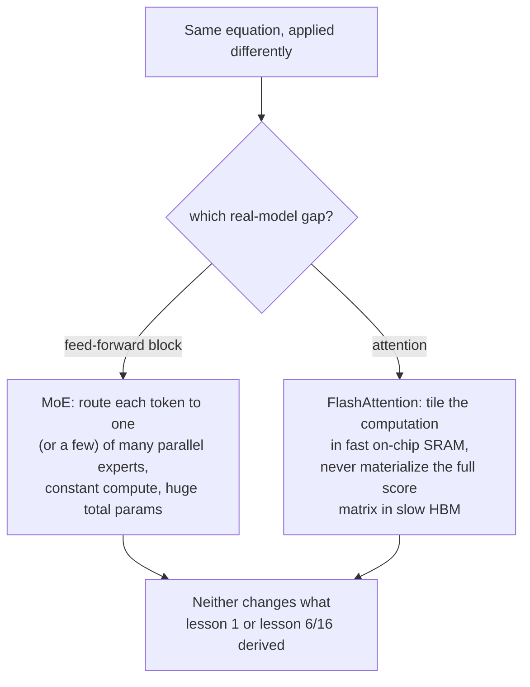

# Lesson 22. Mixture-of-Experts and FlashAttention

**Mission link:** Every lesson in this workspace derived one dense computation applied uniformly to every token, one feed-forward block, one attention computation, run identically regardless of input. Real large models break both assumptions in ways that never change the underlying mathematics this workspace built: **mixture-of-experts (MoE)** routes different tokens through different parameters instead of the same ones, and **FlashAttention** computes lesson 1's exact equation with a completely different, faster relationship to GPU memory. Neither is a new operation; both are a different way of running the operations already derived.
**Primary source:** [Paper: "FlashAttention: Fast and Memory-Efficient Exact Attention with IO-Awareness", Dao et al., 2022](https://arxiv.org/abs/2205.14135)
**Prerequisites:** [Lesson 1](0001-scaled-dot-product-attention.md), [Lesson 16](0016-swiglu-and-the-gated-feed-forward.md)

## Warm-up

1. ▢ Why does this workspace's feed-forward block apply the same weight matrices to every position's vector independently, and what does SwiGLU change about that computation?

Check

Applying the same weights to every position (with no cross-position mixing) is what makes the block position-wise, complementing attention's cross-position mixing role. SwiGLU changes the internal computation (a gated, two-up-projection design) but not this position-wise structure; it's still applied identically to every position.

2. ▢ Write the scaled dot-product attention equation from memory.

Check

`Attention(Q, K, V) = softmax(QK^T / sqrt(d_k)) V`.

## Know this

### Ordinary models spend the same compute on every token; MoE doesn't

Every feed-forward block this workspace built (lesson 6, lesson 16) reuses the exact same parameters for every token that passes through it. A **mixture-of-experts (MoE)** layer replaces that single feed-forward block with several parallel copies, called **experts**, plus a small **router** that selects which expert (or experts) actually process a given token. The Switch Transformer's own framing states the resulting trade directly: the model becomes **sparsely activated**, with an outrageous total parameter count spread across all its experts, but a roughly **constant computational cost per token**, since only the router's chosen expert(s) actually run for that token, not all of them.

### More parameters without more compute per token is a different scaling lever entirely

This decouples two things that are normally locked together: a dense model's total parameter count and the compute cost of processing one token scale together, since every parameter touches every token. An MoE model can grow its total parameter count by adding more experts without growing what any single token costs to process, because adding an expert only adds another option the router might pick, not more work every token has to do. The Switch Transformer's specific simplification, routing each token to exactly one expert rather than combining several, was chosen specifically to reduce the communication and training-stability costs earlier, more complex MoE designs ran into, and the paper reports this let sparse models scale into the trillion-parameter range with several-fold pretraining speedups over an equivalent dense model.

### FlashAttention doesn't change attention's equation, it changes how that equation touches memory

Self-attention's time and memory cost grows quadratically with sequence length, since every position's query has to compare against every key. The paper's own diagnosis of why this makes real implementations slow isn't the equation itself, it's that a naive implementation materializes the full, quadratically-large matrix of attention scores in the GPU's large-but-slow main memory (HBM), then reads it back for softmax and the final weighted sum, and those reads and writes to slow memory, not the arithmetic, dominate wall-clock time. **FlashAttention** is explicitly **IO-aware**: it restructures the same computation using **tiling**, processing small chunks of the sequence at a time entirely within the GPU's small-but-fast on-chip memory (SRAM), so the full score matrix is never written out to slow memory at all.

### Exact, not approximate: same output, a different route to it

The paper is specific that FlashAttention computes **exact** attention, lesson 1's precise equation, `softmax(QK^T / sqrt(d_k)) V`, with no mathematical shortcut or quality trade-off, unlike prior approximate-attention methods the paper contrasts itself against, which the authors note often failed to produce a real wall-clock speedup despite reducing the nominal compute complexity. FlashAttention's actual contribution is purely about IO: fewer memory reads and writes between HBM and SRAM for the identical mathematical result, which is exactly why reading real model code shows an attention implementation that looks structurally different from lesson 1's straightforward version, while still needing to produce the same output lesson 1 derived.

## Practice

1. ▢ A dense model doubles its feed-forward block's parameter count, and every token's compute cost through that block roughly doubles too. An MoE model doubles its total expert parameter count by adding more experts. Does every token's compute cost double as well?

Hint

Consider what the router actually selects for a given token, regardless of how many total experts exist.

Check

No. Adding more experts only adds more options the router might select from; a token's compute cost depends on how many experts it's actually routed to (one, for Switch Transformer), not on the total number of experts that exist. Total parameters and per-token compute cost are decoupled in a way a dense model's aren't.

2. ▢ Why does the Switch Transformer route each token to exactly one expert, rather than combining several, as earlier MoE designs did?

Check

The paper's own framing states this was chosen specifically to reduce the communication and computational costs, and the training instability, that more complex multi-expert routing had run into, simplifying the routing algorithm while still keeping the sparsely-activated, constant-per-token-cost property.

3. ▢ Why does a naive attention implementation become slow specifically at long sequence lengths, according to FlashAttention's own diagnosis?

Check

The full attention score matrix grows quadratically with sequence length, and a naive implementation materializes that whole matrix in the GPU's large but slow main memory (HBM), then reads it back for softmax and the weighted sum; those memory reads and writes, not the arithmetic itself, dominate wall-clock time as the matrix grows.

4. ▢ Does FlashAttention compute a different, approximate version of attention to achieve its speedup, the way some prior methods did?

Check

No. FlashAttention is explicitly exact, computing the identical mathematical result as lesson 1's equation; its speedup comes entirely from being IO-aware, tiling the computation to stay in fast on-chip memory and avoid materializing the full score matrix in slow memory, not from any approximation or quality trade-off.

5. ▢ Which claim correctly describes what MoE and FlashAttention each change about the mathematics this workspace derived?

    - a) MoE changes attention's equation, and FlashAttention changes the feed-forward block's equation
    - b) MoE decouples total parameter count from per-token compute cost by routing tokens to a subset of parallel expert feed-forward blocks; FlashAttention computes attention's exact, unchanged equation but restructures memory access to avoid materializing the full score matrix in slow GPU memory
    - c) FlashAttention approximates attention to trade quality for speed, the same way earlier methods it improves on did
    - d) Neither MoE nor FlashAttention changes anything about how much total compute a training run requires

Check

**b)** That's the precise, non-overlapping change each technique makes. (a) is false: MoE affects the feed-forward block, not attention; FlashAttention affects attention, not the feed-forward block. (c) is false: FlashAttention is explicitly exact, unlike the approximate methods it's contrasted against. (d) is false: MoE changes per-token compute relative to total parameters, and FlashAttention changes wall-clock cost via memory efficiency; both meaningfully affect real compute costs, just not the mathematical result.

## Real-world reps

- [ ] For a model you have access to (or its published architecture details), check whether it uses a dense feed-forward block or a mixture-of-experts layer, and if MoE, how many experts and how many are activated per token.
- [ ] Check whether a library you use (like `transformers`) exposes a FlashAttention implementation as an option, and what it reports as the speed or memory benefit compared to a standard attention implementation at long sequence lengths.
- [ ] Tomorrow: read the FlashAttention paper's IO-complexity analysis in full, and note how the number of HBM accesses it requires compares mathematically to standard attention's.

## Going further

- [Paper: "FlashAttention: Fast and Memory-Efficient Exact Attention with IO-Awareness", Dao et al., 2022](https://arxiv.org/abs/2205.14135)
- [Paper: "Switch Transformers: Scaling to Trillion Parameter Models with Simple and Efficient Sparsity", Fedus, Zoph, and Shazeer, 2021](https://arxiv.org/abs/2101.03961)
- [Paper: "Attention Is All You Need", Vaswani et al., 2017](https://arxiv.org/abs/1706.03762)
- [Resources](../RESOURCES.md)

---

Not landing? Reread the primary source at the top, since this lesson compresses it and compression is where understanding leaks. Check the [glossary](../GLOSSARY.md) for any term that felt slippery.

If the lesson itself is unclear rather than the material, that is a defect: [open an issue](https://github.com/TokenCemetery/teach/issues).
