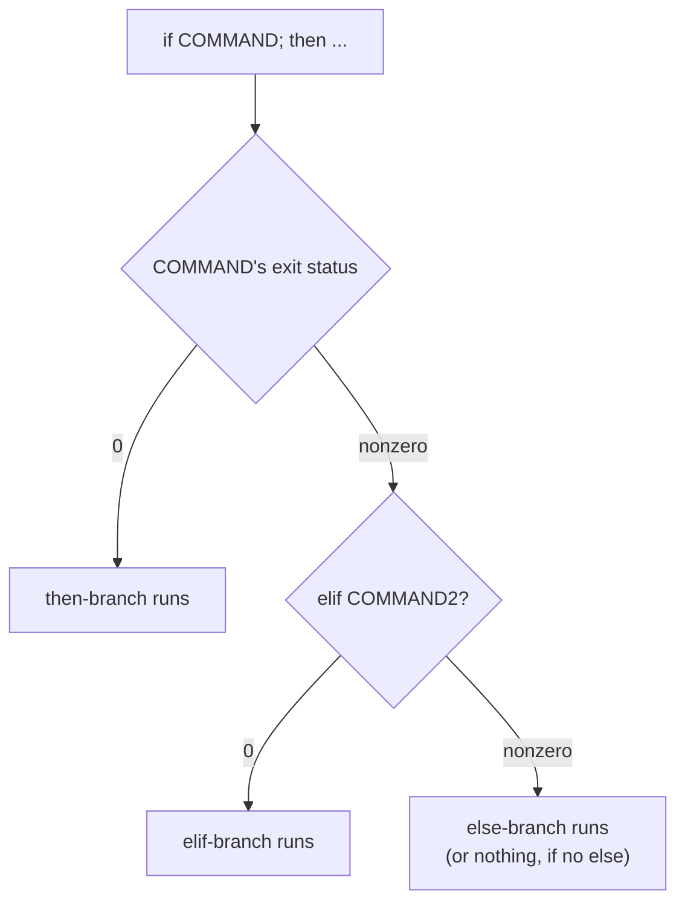

# Lesson 8. Variables, Command Substitution, and Control Flow

**Mission link:** Stage 7 opens the language itself. Stages 1-6 taught the habits that keep a script from breaking (quoting, exit status, portability), but none of them taught the vocabulary those habits actually apply to. This lesson is that vocabulary: holding a value, capturing a command's output, and branching or looping over it.
**Primary source:** [Docs: "Shell Command Language", POSIX.1-2017, The Open Group](https://pubs.opengroup.org/onlinepubs/9699919799/utilities/V3_chap02.html)
**Prerequisites:** [Lesson 7](0007-knowing-when-to-stop.md), [Word splitting](../GLOSSARY.md)

## Warm-up

1. ▢ State the concrete line-count and complexity signal Google's Shell Style Guide gives for when to write a script in a different language from the start.

Check

If a script written from scratch would exceed 100 lines, or its logic becomes non-trivial (real data structures, error handling beyond exit-status checks, complex control flow), it should be written in a more structured language instead of shell.

2. ▢ Why can a script that assumes bash but uses `#!/bin/sh` fail silently on some systems, rather than failing loudly and immediately?

Check

On systems where `/bin/sh` is a different POSIX-compliant shell (dash on many Debian-derived systems, for instance), the script actually runs under that shell instead of bash, with no warning that a mismatch occurred. Bash-only syntax then either produces a confusing parse error or behaves subtly differently rather than failing to even start.

## Know this

### A variable is assignment with no spaces, and expansion with the quoting habit already earned

**Assignment** is `name=value`, with no space on either side of the `=`; a space there makes the shell parse `name` as a command to run instead. Every variable is a string; the shell attaches no other type to it, regardless of whether its contents look like a number. **Expansion** reads a variable back with `$name` or `${name}` (the braces disambiguate where the name ends, needed the moment another character could be read as part of it, as in `${name}_suffix`). Lesson 1's habit still applies at full strength here: an unquoted expansion undergoes word splitting and globbing exactly like an unquoted command substitution does, so `"$name"` is the default, not the exception. A variable assigned inside a script is local to that shell and its children only if explicitly `export`ed; without `export`, a child process (another script this one calls) never sees it.

### Command substitution: running a command for its output, not its side effect

**Command substitution**, `$(command)`, runs `command` and replaces the whole expression with what it wrote to standard output, trailing newlines stripped. This is how a script captures a value it didn't already have: `today=$(date +%F)` runs `date`, takes its output, and assigns it. `$(...)` nests cleanly (`$(dirname "$(readlink -f "$0")")`); the older backtick form (`` `command` ``) does not, needing escaped backticks for any nesting, which is why `$(...)` is the form to reach for by default. Capturing output and checking the command's own exit status are two separate concerns: `result=$(cmd)` only ever gets `cmd`'s output; if a script needs to know whether `cmd` also succeeded, that's `if result=$(cmd); then` (lesson 2's `$?` mechanism, checked directly by the `if`), not something the substitution reports on its own.

### Branching: `if`/`elif`/`else` and `case` both test an exit status

**`if`** doesn't test a boolean; it runs a command and branches on that command's exit status, exactly the status lesson 2 introduced: `if [ -f "$file" ]; then` runs `[` (a command, despite the bracket syntax) and takes the `then` branch when `[`'s exit status is `0`. `elif` chains additional exit-status checks; `else` catches anything the prior branches didn't. **`case`** matches one value against a list of glob-style patterns (`*.txt)`, `-h|--help)`) instead of running a separate test per branch, which reads more directly than a long `elif` chain once there are more than two or three patterns to check. Each `case` branch ends with `;;`; POSIX stops there, while bash also allows `;;&` to fall through and keep testing further patterns, a bash-only extension worth calling out explicitly per lesson 5's portability discipline.

### Looping: `for` over words, `while`/`until` over a repeated test

**`for var in list; do ... done`** iterates once per word in `list`, after that list undergoes the same word splitting and globbing as any unquoted expansion, which is exactly why `for f in $(ls *.txt)` breaks on a filename with a space (lesson 4's warm-up). **`while COMMAND; do ... done`** repeats the body for as long as `COMMAND`'s exit status is `0`; **`until`** is `while`'s negation, repeating for as long as the status is nonzero. The most common production shape is `while read -r line; do ... done < file`, reading a file one line at a time without word-splitting each line first, `-r` specifically to stop backslashes in the input from being interpreted as escapes. A `for (( i=0; i<n; i++ ))` C-style loop exists in bash but has no POSIX equivalent, the same shape of bash-only extension `[[ ]]` and arrays already are (lesson 5).

## Practice

1. ▢ A line reads `name = "value"`. What actually happens, and why?

Hint

Consider what the shell does with the first word on a line before it ever reaches the `=`.

Check

The shell parses `name` as a command to run (since there's a space before the `=`), not as the start of an assignment, and it almost certainly fails with a "command not found" error. Assignment requires no space on either side of `=`; `name="value"` is the correct form.

2. ▢ `count=$(grep -c "ERROR" logfile.txt)`. What does `count` hold afterward, and what, separately, would a script need to check to know whether `grep` itself succeeded?

Check

`count` holds whatever `grep -c` printed to standard output (the count, as text, trailing newline stripped). Whether `grep` succeeded is a separate question, answered by `$?` or by writing `if count=$(grep -c "ERROR" logfile.txt); then`, since command substitution only ever captures output, never exit status, on its own.

3. ▢ Rewrite `if [ "$type" = "a" ]; then ...; elif [ "$type" = "b" ]; then ...; elif [ "$type" = "c" ]; then ...; fi` as a `case` statement, in words, and say why `case` reads more directly here.

Check

`case "$type" in a) ...;; b) ...;; c) ...;; esac`: one value tested once against a list of patterns, rather than the same variable re-tested with `=` three separate times. `case` reads more directly specifically because the repeated subject (`$type`) and comparison operator disappear, leaving just the values that matter.

4. ▢ Why does `while read -r line; do ... done < file` avoid the word-splitting problem `for f in $(cat file)` would have on a file whose lines contain spaces?

Hint

Consider what each mechanism actually does with a line's contents before the loop body runs.

Check

`read -r line` assigns the entire line to `line` as one string, no splitting involved; the loop body then decides what to do with it, quoted. `for f in $(cat file)` instead command-substitutes the whole file's contents and then splits that unquoted result on `$IFS`, turning every space-containing line into multiple, wrongly-separated words before the loop even starts.

5. ▢ Which claim correctly describes how `if` and `case` decide which branch to take?

    - a) `if` evaluates a boolean expression built into the shell; `case` matches values using regular expressions
    - b) `if` branches on the exit status of the command it runs; `case` matches one value against glob-style patterns, both testing status or pattern rather than a true boolean type
    - c) `if` and `case` both require an external `test` binary and cannot use shell builtins
    - d) `elif` and `;;&` are both POSIX-standard, portable ways to chain additional conditions

Check

**b)** `if` runs a command and branches on its exit status; `case` matches a value against glob patterns, not regular expressions or a boolean type shell doesn't have. (a) is false: shell has no native boolean, only exit status. (c) is false: `[` is commonly a shell builtin as well as an external binary, and `case` needs no external command at all. (d) is false: `;;&` (fall-through) is a bash-only extension, not part of POSIX `sh`, unlike `elif` which is portable.

## Real-world reps

- [ ] Find a script you have access to that uses `elif` three or more times against the same variable, and rewrite that section as a `case` statement.
- [ ] Find a `for var in $(cmd)` loop in a real script (or write one), and check whether `cmd`'s output could ever contain a space or a glob character; if so, rewrite it as a `while read -r` loop instead.
- [ ] Tomorrow: read the primary source's sections on parameter assignment and the compound commands (`if`, `case`, `for`, `while`, `until`) in full, and note any exact wording that differs from how you'd have described the rule yourself.

## Going further

- [Docs: "Shell Command Language", POSIX.1-2017, The Open Group](https://pubs.opengroup.org/onlinepubs/9699919799/utilities/V3_chap02.html)
- [Site: "Bash Pitfalls", Greg's Wiki](https://mywiki.wooledge.org/BashPitfalls)
- [Resources](../RESOURCES.md)

---

Not landing? Reread the primary source at the top, since this lesson compresses it and compression is where understanding leaks. Check the [glossary](../GLOSSARY.md) for any term that felt slippery.

If the lesson itself is unclear rather than the material, that is a defect: [open an issue](https://github.com/TokenCemetery/teach/issues).
