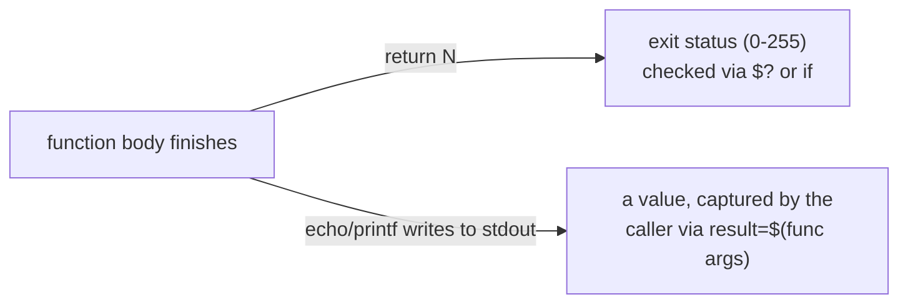

# Lesson 9. Functions, local, and Return Status vs Output

**Mission link:** This is stage 7's capstone. Lesson 8 gave the shell a vocabulary for holding and branching on values; this lesson is how a script organizes repeated work into a function, and the single sharpest surprise waiting there for anyone coming from another language: a shell function's `return` is an exit status, not a value.
**Primary source:** [Docs: "Bash Reference Manual", GNU](https://www.gnu.org/software/bash/manual/bash.html)
**Prerequisites:** [Lesson 8](0008-variables-command-substitution-and-control-flow.md), [Word splitting](../GLOSSARY.md)

## Warm-up

1. ▢ `count=$(grep -c "ERROR" logfile.txt)`. What does `count` hold afterward, and what would a script need to check separately to know whether `grep` itself succeeded?

Check

`count` holds whatever `grep -c` printed to standard output, as text. Whether `grep` succeeded is separate, checked via `$?` or `if count=$(grep -c "ERROR" logfile.txt); then`, since command substitution only ever captures output, never exit status.

2. ▢ Why does `while read -r line; do ... done < file` avoid the word-splitting problem a `for f in $(cat file)` loop would have on a file whose lines contain spaces?

Check

`read -r line` assigns an entire line to `line` as one string with no splitting; `for f in $(cat file)` command-substitutes the whole file and then splits that unquoted result on `$IFS`, turning any space-containing line into multiple, wrongly-separated words.

## Know this

### Defining a function: a name, a body, and arguments exactly like a script's own

`name() { commands; }` defines a function (the POSIX-portable form; bash also accepts `function name { ... }`, a bash-only alternative worth calling out per lesson 5's discipline rather than mixing the two). Calling it, `name arg1 arg2`, hands the function its own `$1`, `$2`, `$@`, and `$#`, exactly the same positional-parameter mechanism a script gets from its own command-line arguments; a function is, from the inside, a mini-script that happens to run in the calling shell's process rather than a new one.

### `local`: without it, every variable a function touches is global

Assign a variable inside a function with a plain `name=value`, and it is **global** by default: it persists after the function returns and can silently clobber a variable of the same name the caller was already using. **`local name=value`** scopes the assignment to the current function call; the variable reverts to whatever it was (or disappears entirely) once the function returns. This is the single most common shell-function surprise for anyone used to a language where a function's local variables are local by default: `count=0` inside `process_file()` is not a local counter, it is `count` in whatever scope called `process_file`, silently overwritten. `local` is not part of POSIX `sh` (dash and other portable shells commonly support it as a widely-adopted extension, but the POSIX specification itself does not define it), so a strictly portable script either accepts the extension explicitly, the same way lesson 5 treats arrays and `[[ ]]`, or works around it by using distinctly-named variables instead.

### Return status vs output: the surprise this lesson is named for

**`return N`** sets the function's own exit status to `N` (0-255), checked by the caller exactly the way any command's exit status is checked, via `$?` or directly in an `if`. It does **not** hand a value back to the caller the way `return` does in most other languages; `return "some string"` either errors or gets silently coerced into a number, never the string itself. To get an actual value out of a function, the function **prints** it to standard output, and the caller captures that output with lesson 8's command substitution: `result=$(compute_thing "$input")`. A function can do both at once, printing its answer and separately returning a real status, `0` for success or a specific nonzero code for a specific failure the caller might want to branch on: `if result=$(compute_thing "$input"); then use "$result"; else handle_failure; fi`.

## Practice

1. ▢ A function `parse_config()` does `count=0` (no `local`) inside a loop, incrementing it as it parses. The calling script also happens to use a variable named `count` for an unrelated purpose, before and after calling `parse_config`. What breaks?

Hint

Consider what scope a plain assignment inside a function actually belongs to.

Check

Without `local`, `parse_config`'s `count=0` assigns to the caller's own `count`, the same variable the calling script was already using, not to a private counter of its own. After `parse_config` returns, the caller's `count` holds whatever `parse_config` last set it to, silently overwriting whatever value the caller expected to still be there.

2. ▢ A function is written as `add() { return $(($1 + $2)); }`, intended to add two numbers and hand back the sum. Called as `sum=$(add 3 4)`, what does `sum` actually hold, and why doesn't this work the way it looks like it should?

Check

`sum` holds nothing useful (an empty string, since `add` never wrote anything to standard output); `return` only sets the function's exit status, not a value a command substitution can capture. `$(($1 + $2))` becomes the exit status instead (and would be silently wrong or erroring for any sum outside 0-255), while the actual sum is never printed anywhere `$(...)` could see it. The fix is `add() { echo $(($1 + $2)); }`, called as `sum=$(add 3 4)`.

3. ▢ Why is `local` worth flagging explicitly in a script meant to be POSIX `sh`-portable, the same way lesson 5 flags bash arrays and `[[ ]]`?

Check

`local` is a widely-supported extension, not something the POSIX `sh` specification itself defines; most portable shells (including dash) implement it, but a script that assumes it's universally guaranteed is making the same kind of unstated assumption lesson 5 warns against for arrays or `[[ ]]`. Calling it out (in a comment, or by choosing distinctly-scoped variable names instead) keeps the script honest about what it actually depends on.

4. ▢ Write, in words, a function `to_upper()` that both prints its input converted to uppercase and returns a nonzero status if no argument was given at all.

Check

Something like: check `$#` first; if it's `0`, `return 1` immediately without printing anything. Otherwise, print `$1` converted to uppercase (via `tr` or a bash-only `${1^^}`) to standard output, and fall through to an implicit `return 0`. A caller then does `if result=$(to_upper "$word"); then use "$result"; else handle_missing_arg; fi`, checking the status and capturing the printed value in the same call.

5. ▢ Which claim correctly describes what a shell function's `return` does?

    - a) `return` hands a value of any type back to the caller, the same way `return` works in Python or JavaScript
    - b) `return N` sets the function's exit status to `N` (checked via `$?` or `if`); a value has to be printed to stdout and captured separately via command substitution
    - c) A function cannot both print output and return a meaningful status in the same call
    - d) `local` is part of the POSIX `sh` specification and behaves identically across every shell without exception

Check

**b)** That's the precise, checkable distinction this lesson is named for. (a) is false: that's exactly the assumption that produces the broken `add()` example above. (c) is false: printing a value and returning a distinct status in the same call is the normal, correct pattern. (d) is false: `local` is a widely-supported extension, not a POSIX `sh`-specified feature.

## Real-world reps

- [ ] Find a function in a script you have access to that assigns a variable without `local`. Check whether that variable's name could plausibly collide with something the caller uses, and add `local` if it's missing.
- [ ] Find (or write) a function meant to compute and hand back a value. Confirm it does so by printing to stdout and being called via command substitution, not via `return`.
- [ ] Tomorrow: read the primary source's section on shell functions in full, and note what it says about a function's exit status when no explicit `return` is given at all.

## Going further

- [Docs: "Bash Reference Manual", GNU](https://www.gnu.org/software/bash/manual/bash.html)
- [Docs: "Shell Command Language", POSIX.1-2017, The Open Group](https://pubs.opengroup.org/onlinepubs/9699919799/utilities/V3_chap02.html)
- [Resources](../RESOURCES.md)

---

Not landing? Reread the primary source at the top, since this lesson compresses it and compression is where understanding leaks. Check the [glossary](../GLOSSARY.md) for any term that felt slippery.

If the lesson itself is unclear rather than the material, that is a defect: [open an issue](https://github.com/TokenCemetery/teach/issues).
