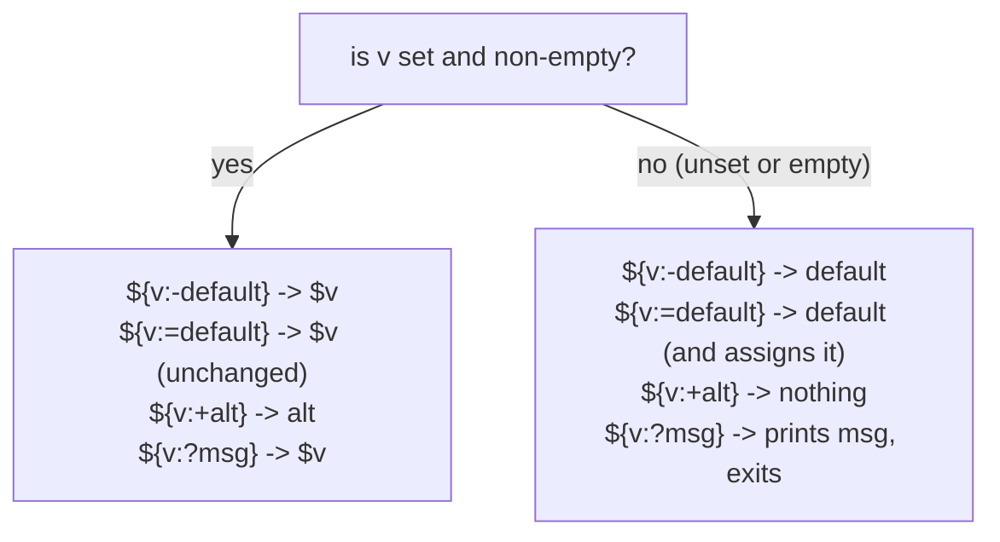

# Lesson 10. Parameter Expansion

**Mission link:** Stage 8 opens where lesson 8 left variables off. `${v}` alone answers "what does this variable hold"; parameter expansion answers the next four questions a real script actually asks: what if it's unset, what if it's empty, and how do I trim a prefix or suffix off it without calling `sed` for something this small.
**Primary source:** [Docs: "Shell Command Language", POSIX.1-2017, The Open Group](https://pubs.opengroup.org/onlinepubs/9699919799/utilities/V3_chap02.html)
**Prerequisites:** [Lesson 9](0009-functions-local-and-return-status-vs-output.md), [Word splitting](../GLOSSARY.md)

## Warm-up

1. ▢ A function is written as `add() { return $(($1 + $2)); }`, called as `sum=$(add 3 4)`. What does `sum` actually hold, and why doesn't this work the way it looks like it should?

Check

`sum` holds nothing useful; `return` only sets the function's exit status, not a value a command substitution can capture. The actual sum is never printed anywhere `$(...)` could see it. The fix is `add() { echo $(($1 + $2)); }`.

2. ▢ Why is `local` worth flagging explicitly in a script meant to be POSIX `sh`-portable, the same way lesson 5 flags bash arrays and `[[ ]]`?

Check

`local` is a widely-supported extension, not something the POSIX `sh` specification itself defines; a script that assumes it's universally guaranteed is making the same kind of unstated assumption lesson 5 warns against for arrays or `[[ ]]`.

## Know this

### Defaulting and erroring: four forms, and whether "empty" counts as "unset"

`${v:-default}` expands to `$v` if it's set and non-empty, otherwise to `default`, without changing `v` itself; `${v:=default}` does the same but also assigns `default` to `v` when it falls through. `${v:?message}` expands to `$v` if set and non-empty, otherwise prints `message` to standard error and exits the script (or the function, inside one) with a nonzero status, useful for a required value with no sane default at all. `${v:+alt}` inverts the test: it expands to `alt` when `v` **is** set and non-empty, and to nothing otherwise, useful for conditionally adding a flag only when a value is actually present. Every one of these has a colon-free variant (`${v-default}`, `${v=default}`, `${v?message}`, `${v+alt}`) that tests only whether `v` is unset, treating an explicitly empty `v=""` as already having a value; the colon forms treat unset and empty the same way. Which one a script needs depends entirely on whether an empty string is meant to be a valid value or not.

### Stripping a prefix or suffix: shortest match first, `#`/`%`, greedy with two

`${v#pattern}` removes the shortest match of `pattern` from the front of `v`; `${v##pattern}` removes the longest match from the front instead. `${v%pattern}` and `${v%%pattern}` do the same from the back, shortest and longest respectively. `pattern` is a glob pattern (`*`, `?`, `[...]`), not a regular expression. The classic use: `${path##*/}` strips everything up to and including the last `/`, giving the filename alone; `${filename%.*}` strips the last `.` and everything after it, giving the name without its extension. Reaching for `basename`/`dirname` (external commands) for exactly this job works too, but the parameter-expansion form avoids a subprocess for something this small, and `#`/`%` are POSIX, unlike the bash-only forms below.

### Substitution and case conversion: useful, and bash-only

`${v/pattern/replacement}` replaces the first match of `pattern` in `v`; `${v//pattern/replacement}` replaces every match. `${v^^}` and `${v,,}` uppercase and lowercase `v` respectively (`${v^}`/`${v,}` do the same to only the first character). None of these four have a POSIX `sh` equivalent at all; a portable script reaches for `tr` or `sed` for the same job instead, exactly the trade-off lesson 5 already named for bash's other extensions. Using them is fine in a script that's honestly `#!/bin/bash`; using them under a `#!/bin/sh` shebang is the same silent-mismatch risk lesson 5 warned about.

### Length: `${#v}`, not `${v}#`

`${#v}` expands to the number of characters in `v`, a common guard before an operation that assumes a minimum length (checking a password's length, confirming an argument isn't suspiciously short). It's easy to mistype as `${v#}` or `#${v}`, neither of which does what's intended: the `#` has to sit directly inside the braces, before the variable name, to mean "length of" rather than "strip a pattern from."

## Practice

1. ▢ A script does `port=${PORT:-8080}`. If the environment has `PORT=""` (set, but empty), what does `port` end up holding?

Check

`8080`. The colon form treats an explicitly empty value the same as unset, so `PORT=""` still falls through to the default. Only the colon-free `${PORT-8080}` would have kept `port` empty, since `PORT` is technically set.

2. ▢ Given `path="/var/log/app.log"`, what does `${path##*/}` expand to, and what does `${path%.*}` expand to (applied to the original `path`, not to the result of the first expansion)?

Hint

`##` strips the longest match from the front; `%` strips the shortest match from the back.

Check

`${path##*/}` expands to `app.log` (the longest `*/` match from the front removes everything through the last `/`). `${path%.*}` expands to `/var/log/app` (the shortest `.*` match from the back removes only the final `.log`).

3. ▢ A script requires `API_KEY` to be set, with no sensible default. Which parameter expansion form is built for exactly this, and what does it do differently from `${API_KEY:-}`?

Check

`${API_KEY:?API_KEY must be set}`: if `API_KEY` is unset or empty, it prints that message to standard error and exits immediately with a nonzero status, rather than silently substituting an empty string the way `${API_KEY:-}` would and letting the script continue with a value that was never actually valid.

4. ▢ Why does `${v/pattern/replacement}` need calling out the same way `local` did in lesson 9, if a script is meant to stay POSIX `sh`-portable?

Check

`${v/pattern/replacement}` (and `${v//...}`, `${v^^}`, `${v,,}`) have no POSIX `sh` equivalent at all; they're bash-only extensions, so a script declaring `#!/bin/sh` while using one of them is making the same false claim about its requirements lesson 5 and lesson 9 both warn against, silently breaking wherever `/bin/sh` isn't bash.

5. ▢ Which claim correctly distinguishes `${v:-default}` from `${v-default}`?

    - a) They are identical; the colon is purely stylistic and changes nothing
    - b) `${v:-default}` treats an unset or empty `v` the same way, falling through to `default` in both cases; `${v-default}` only falls through when `v` is unset, treating an explicitly empty value as already set
    - c) `${v:-default}` permanently assigns `default` to `v`; `${v-default}` never assigns anything
    - d) `${v-default}` is bash-only; `${v:-default}` is the only POSIX-portable form

Check

**b)** That's the exact distinction the colon makes: unset-or-empty versus unset-only. (a) is false: the colon changes what counts as "needs the default." (c) is false: neither form assigns anything; that's what `${v:=default}` is for specifically. (d) is false: both the colon and colon-free forms are POSIX `sh`-portable.

## Real-world reps

- [ ] Find a script you have access to that reaches for `basename`/`dirname` or a `sed` one-liner to strip a path or an extension, and rewrite it using `##`/`%%`.
- [ ] Find (or write) a script that reads a required environment variable with no default. Check whether it uses `${v:?message}` or silently continues with an empty value on a typo'd variable name.
- [ ] Tomorrow: read the primary source's section on parameter expansion in full, and note the exact wording distinguishing the colon and colon-free forms, alongside any expansion this lesson didn't cover.

## Going further

- [Docs: "Shell Command Language", POSIX.1-2017, The Open Group](https://pubs.opengroup.org/onlinepubs/9699919799/utilities/V3_chap02.html)
- [Docs: "Bash Reference Manual", GNU](https://www.gnu.org/software/bash/manual/bash.html)
- [Resources](../RESOURCES.md)

---

Not landing? Reread the primary source at the top, since this lesson compresses it and compression is where understanding leaks. Check the [glossary](../GLOSSARY.md) for any term that felt slippery.

If the lesson itself is unclear rather than the material, that is a defect: [open an issue](https://github.com/TokenCemetery/teach/issues).
