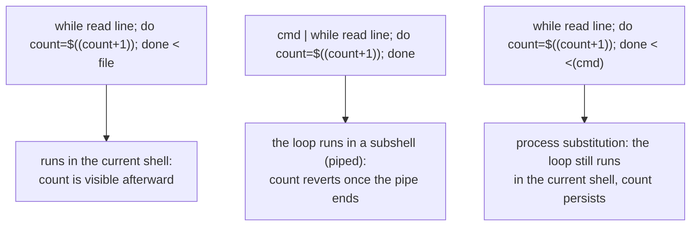

# Lesson 13. Pipes, Subshells, and Process Substitution

**Mission link:** This is stage 9's capstone. Lesson 12 covered redirecting one command's streams; this lesson is composing several commands together, and the single sharpest surprise that composition creates: a pipe silently runs part of the pipeline in a subshell, so a variable it sets doesn't survive the pipe.
**Primary source:** [Site: "Bash Pitfalls", Greg's Wiki](https://mywiki.wooledge.org/BashPitfalls)
**Prerequisites:** [Lesson 12](0012-redirection-file-descriptors-and-here-docs.md), [Word splitting](../GLOSSARY.md)

## Warm-up

1. ▢ A script runs `cmd 2>&1 > file`. Where do the command's stdout and stderr each end up, and why isn't this the same as `cmd > file 2>&1`?

Check

`2>&1` runs first, pointing stderr at wherever stdout currently points (the terminal, since nothing has redirected it yet); `> file` then moves only stdout to `file`, leaving stderr on the terminal. `cmd > file 2>&1` redirects stdout to `file` first, so `2>&1` then points stderr at that same file, capturing both streams together.

2. ▢ What does `cmd <<< "$value"` do, and why is it more concise than a here-doc for the same job?

Check

It feeds `$value` (plus a trailing newline) directly to `cmd`'s standard input, in one line, since `$value` is already held in a variable rather than needing to be written out as a multi-line block between here-doc delimiters.

## Know this

### A pipe runs each side in its own process, and bash runs those in subshells

`cmd1 | cmd2` connects `cmd1`'s standard output directly to `cmd2`'s standard input; both commands run as separate processes, at the same time, communicating through that connection rather than through a temporary file. In bash, every stage of a pipeline runs in its own **subshell**, a copy of the current shell's environment that a variable assignment inside it cannot write back into. This is invisible until a script pipes into something that's supposed to accumulate state: `cmd | while read -r line; do count=$((count + 1)); done; echo "$count"` reliably prints an empty or zero count, because the `while` loop, and every `count` it set, ran inside a subshell created for the pipeline that vanished the instant the pipe finished; the parent shell's `count` was never touched at all.

### A subshell more generally: `( )` forks, `{ }` doesn't

`( commands )` explicitly runs `commands` in a subshell: a `cd` or a variable assignment inside the parentheses has no effect once the subshell exits, useful specifically when that isolation is wanted (temporarily changing directory for one command without affecting the rest of the script). `{ commands; }` (note the required space after `{` and the semicolon before `}`) groups the same commands but runs them in the *current* shell, so a `cd` or an assignment inside it persists exactly like it would without the braces at all. Confusing the two, reaching for `( )` out of habit when the whole point was to keep an assignment, is the same shape of mistake the piped-`while`-loop problem is, just spelled differently.

### Process substitution: treating a command's output as if it were a file, without a subshell in the way

**`<(command)`** (bash-only **process substitution**) runs `command` and expands to a path bash arranges to read as though it were a file containing `command`'s output; redirecting a loop's input from it, `while read -r line; do count=$((count + 1)); done < <(cmd)`, feeds the loop from `cmd`'s output the same way a pipe would, but the `while` loop itself is redirected via `<`, not connected via `|`, so it never runs in a pipeline subshell at all and `count` survives intact. `diff <(cmd1) <(cmd2)` is the other common shape, comparing two commands' output directly without writing either to a temporary file first. **`>(command)`** is the mirror image, expanding to a path that, when written to, feeds what's written into `command`'s standard input, used less often but available the same way.

### `shopt -s lastpipe`: a narrower, bash-specific alternative

Bash also offers `shopt -s lastpipe`, which runs the *last* command in a pipeline in the current shell rather than a subshell (with a caveat: it has no effect in an interactive shell with job control enabled, only in scripts). This fixes the specific `cmd | while ...` shape without switching to process substitution, but it's a shell option that has to be set before the pipeline runs, easy to forget, and it's bash-only in a way process substitution already is too; reaching for `<(cmd)` directly is usually the more explicit, more portable-feeling habit even though neither option is POSIX `sh`.

## Practice

1. ▢ `grep "ERROR" logfile.txt | while read -r line; do count=$((count + 1)); done; echo "Found: $count"`. What does this actually print, and why?

Hint

Consider which shell the `while` loop, and the `count` it sets, actually runs in.

Check

It prints `Found: ` with an empty (or, under `set -u`, an error for unset) `count`, regardless of how many matching lines `grep` found. The `while` loop runs in a subshell created for the pipe, so every `count=$((count + 1))` inside it updates only that subshell's copy, which disappears once the pipeline finishes; the parent shell's own `count` was never assigned at all.

2. ▢ Rewrite the previous script so `count` correctly reflects the number of matching lines after the loop, using process substitution.

Check

`while read -r line; do count=$((count + 1)); done < <(grep "ERROR" logfile.txt); echo "Found: $count"`. The loop is now fed via `<` from a process substitution rather than connected via `|`, so it runs in the current shell and `count` persists after the loop ends.

3. ▢ Contrast `( cd /tmp && rm -f scratch.txt )` with `{ cd /tmp && rm -f scratch.txt; }`. After either one runs, what directory is the script actually in?

Check

After `( cd /tmp && ... )`, the script is still in whatever directory it was in before, since the `cd` happened inside a subshell that exited without affecting the parent shell. After `{ cd /tmp && ...; }`, the script is now actually in `/tmp`, since `{ }` runs in the current shell and the `cd` takes effect there directly.

4. ▢ Why does `diff <(sort file1.txt) <(sort file2.txt)` avoid needing two temporary files, compared to `sort file1.txt > /tmp/a; sort file2.txt > /tmp/b; diff /tmp/a /tmp/b`?

Check

Each `<(...)` expands to a path bash arranges to behave like a readable file containing that command's output, so `diff` can read both sorted outputs directly without either one ever being written to an actual temporary file on disk, and without the separate cleanup a temp-file version would need.

5. ▢ Which claim correctly explains why `cmd | while read -r line; do total=$((total + 1)); done` fails to update `total` in the calling script?

    - a) `read -r` doesn't support arithmetic inside a `while` loop
    - b) Every stage of a pipeline in bash runs in its own subshell, so the `while` loop's `total` is a copy that disappears once the pipe ends, never reaching the parent shell's own `total`
    - c) `total` needs to be declared with `local` first, or the assignment silently fails
    - d) Pipes in bash don't support variable assignment inside a loop at all

Check

**b)** That's the exact mechanism: pipeline subshells, not a limitation of `read` or assignment itself. (a) is false: arithmetic works fine inside the loop; the problem is where the loop's variables end up. (c) is false: `local` only matters inside a function; it doesn't fix or worsen the subshell issue. (d) is false: assignment works inside the loop, it just doesn't survive past the subshell it ran in.

## Real-world reps

- [ ] Find a script you have access to that pipes into a `while read` loop and accumulates a count or a variable afterward. Check whether it's actually correct, or silently affected by this lesson's subshell problem.
- [ ] Rewrite one such loop (found above, or written fresh) using process substitution instead of a pipe, and confirm the variable now survives past the loop.
- [ ] Tomorrow: read the primary source's entry on this exact pitfall in full, and note which other fixes it lists besides process substitution and `lastpipe`.

## Going further

- [Site: "Bash Pitfalls", Greg's Wiki](https://mywiki.wooledge.org/BashPitfalls)
- [Docs: "Bash Reference Manual", GNU](https://www.gnu.org/software/bash/manual/bash.html)
- [Resources](../RESOURCES.md)

---

Not landing? Reread the primary source at the top, since this lesson compresses it and compression is where understanding leaks. Check the [glossary](../GLOSSARY.md) for any term that felt slippery.

If the lesson itself is unclear rather than the material, that is a defect: [open an issue](https://github.com/TokenCemetery/teach/issues).
